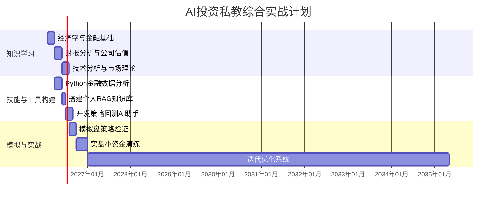

作为一名有编程基础的计算机硕士，利用大模型构建一个专业、智能的投资学习助手是完全可行的。这不仅能让你系统学习，还能将技术能力直接转化为投资分析工具。

目前，AI在教育和投资分析领域已相当成熟。例如，一些专业机构已利用大模型自动解析海量市场信息，生成投资报告；教育领域也出现了能够规划学习进度、进行一对一高频互动的“超拟人AI老师”。

### 🤖 AI如何成为你的投资私教
一个高效的AI私教系统，通常需要融合几种关键技术来模拟专业导师的完整职能：

| 技术模块 | 核心作用 | 模拟的导师职能 |
| :--- | :--- | :--- |
| **检索增强生成** | 从专业资料库中获取精准、时效性强的知识回答你。 | **知识库**：提供权威、准确的教材与案例。 |
| **智能体框架** | 协调不同专业“模型”分工合作，制定并执行你的学习计划。 | **学习教练**：诊断水平、规划路径、布置任务、检查成果。 |
| **多模型协同** | 让擅长文字、数据分析、图表生成的模型各司其职，提供多维度辅导。 | **分析导师**：带你解读财报、分析K线图、拆解投资策略。 |

### 📚 金融投资入门学习路径规划
结合你的技术背景和入门目标，可以分为以下四个阶段来推进：

**阶段一：建立核心知识框架**
*   **目标**：理解金融市场的基本概念、参与主体和运行规则。
*   **关键知识**：宏观经济学基础、公司财务入门、股票、债券、基金等投资工具。
*   **AI实践**：使用对话模型（如ChatGPT、DeepSeek）作为“百科问答”老师，快速厘清概念。让AI用比喻帮你理解，例如：“请用互联网公司的架构比喻，解释一下中央银行、商业银行和金融市场之间的关系。”

**阶段二：掌握主流分析方法**
*   **目标**：学会评估公司价值（基本面分析）和判断市场趋势（技术分析）。
*   **关键知识**：财务报表分析（利润表、资产负债表、现金流量表）、估值模型、常见技术指标与图形。
*   **AI实践**：
    *   **基本面**：将上市公司的财报PDF或网页链接给AI，让它帮你提取关键数据、计算财务比率，并初步分析公司的健康状况。
    *   **技术分析**：让擅长数据分析的模型（如ChatGPT的代码解释器）帮你计算移动平均线、RSI等指标，甚至可视化K线图。

**阶段三：构建与回测投资策略**
*   **目标**：将想法转化为可验证的交易逻辑，并用历史数据检验。
*   **关键知识**：策略逻辑（如均线交叉、动量效应）、Python（Pandas, NumPy）、回测框架（如Backtrader）。
*   **AI实践**：这是你的编程优势所在。可以直接让AI（如GitHub Copilot）辅助你编写策略代码和回测程序。例如：“用Python写一个双均线（金叉买入，死叉卖出）策略的回测代码，数据源使用`yfinance`。”

**阶段四：跟踪市场与实战演练**
*   **目标**：关注实时信息，在模拟或小资金实盘中将知识内化。
*   **关键知识**：信息渠道、仓位管理、风险管理、交易心理。
*   **AI实践**：
    *   **信息处理**：利用RAG技术，让AI自动阅读你关注的新闻、研报，并生成每日摘要。
    *   **决策辅助**：构建一个Agent，当某只股票价格触发你的策略条件时，让它自动整理出该公司的近期利好/利空消息，辅助你决策。

### 🛠️ 可用的工具与平台
除了从零开始，也可以利用现有工具提高效率：
*   **AI投资分析平台**：国外有**Trade Ideas**、**QuantConnect**等平台，国内一些券商和金融数据终端也在集成AI分析功能。它们能提供选股、回测、信号预警等服务。
*   **教育类AI应用**：像“豆包爱学”、“夸克学习”等应用，其互动辅导模式值得借鉴。一些专业课程平台也提供结合AI的股票投资课程。

### 💡 综合学习与实战计划
为了将以上内容整合成一个可执行的方案，你可以参考下表的路径，借助工具从学习逐步过渡到实战：

这个方案的要点在于**以项目驱动学习**，例如在第一阶段就可以开始用Python抓取简单的金融数据。你的计算机背景是巨大优势，可以让你深入定制AI私教，而不仅仅是使用它。

### ⚠️ 重要风险提示
在开始前，必须清醒认识几点：
1.  **AI并非先知**：所有模型都存在“幻觉”（生成错误信息），金融预测尤其不准。务必交叉验证关键信息。
2.  **警惕数据陷阱**：回测表现优异绝不等于未来能赚钱。过拟合、幸存者偏差等问题需时刻警惕。
3.  **合规与隐私**：使用公开数据，避免触及内幕交易。个人搭建的系统要注意数据安全。
4.  **心态第一**：市场专治各种不服。AI是强大的信息处理和策略执行工具，但**不能替代你的独立判断和情绪管理**。投资成功最终取决于你的认知和心性。

如果你想深入某个具体环节，例如如何用LangChain搭建一个金融知识RAG系统，或者有哪些高质量的免费金融数据API，我可以提供更详细的信息。