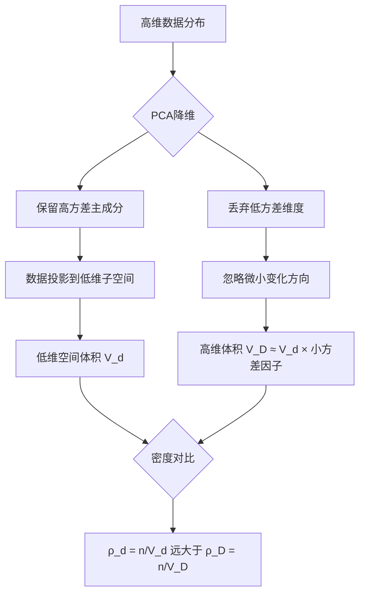

# PCA降维导致采样密度增大的现象解析

PCA（主成分分析）降维导致采样密度增大的现象，本质上与高维空间到低维空间的投影变换、数据分布压缩及几何体积变化有关。以下从数学原理、几何直观和实际案例三个层面展开解析：

## 一、数学原理：降维投影与数据压缩

### 1. **PCA的降维本质**
PCA通过线性变换将高维数据$\mathbf{x} \in \mathbb{R}^D$投影到低维子空间$\mathbf{z} \in \mathbb{R}^d$（$d < D$），投影矩阵由原数据的前$d$个主成分（方差最大的方向）构成。  
- 投影过程可表示为：

$$
\mathbf{z} = \mathbf{W}^T\mathbf{x}
$$

其中$\mathbf{W} \in \mathbb{R}^{D \times d}$的列向量是数据协方差矩阵的前$d$个特征向量。

### 2. **采样密度的数学定义**
采样密度可理解为单位空间体积内的数据点数量。在$D$维空间中，若$n$个点均匀分布在体积为$V_D$的区域内，则密度为：

$$
\rho_D = \frac{n}{V_D}
$$

降维到$d$维后，投影区域的体积为$V_d$，密度变为：

$$
\rho_d = \frac{n}{V_d}
$$

### 3. **体积压缩导致密度增大**
高维空间中，数据的有效分布通常局限于低维流形（如超平面），PCA丢弃的低方差维度对应数据变化很小的方向。当投影到$d$维主成分空间时：  
- 原数据在丢弃维度上的变化被忽略（方差趋近于0），导致投影后的区域体积$V_d$远小于原高维空间体积$V_D$；  
- 由于点数$n$不变，根据$\rho \propto \frac{1}{V}$，密度$\rho_d$显著增大。

## 二、几何直观：从高维稀疏到低维紧凑

### 1. **二维→一维投影示例**
- **场景**：二维平面上的点呈椭圆分布（长轴为第一主成分，短轴为第二主成分），如图所示：  

```
|  o o o o o 
| o         o 
|o           o 
|______________________> 第一主成分（长轴）
```


- **降维效果**：将点投影到长轴（第一主成分），短轴方向的微小变化被忽略，原本分散在二维平面的点在一维轴上形成密集投影：


```
| o o o o o o o o o o 
|______________________> 投影后的一维轴
```

### 2. **三维→二维投影的体积变化**
- 三维空间中，若数据分布在近似二维的平面（如薄饼状），第三维方差很小。PCA降维丢弃第三维后：  
- 原三维空间中占据的体积是“薄饼”的体积（面积×厚度），降维后二维平面的体积是“薄饼”的面积；  
- 由于厚度（第三维方差）很小，降维后的体积远小于原体积，导致密度$\rho = \frac{n}{\text{面积}}$远大于原三维密度$\frac{n}{\text{面积} \times \text{厚度}}$。

## 三、数学推导：方差与密度的关联

### 1. **协方差矩阵与投影方差**
设原数据协方差矩阵为$\Sigma \in \mathbb{R}^{D \times D}$，特征值分解为$\Sigma = \mathbf{U}\Lambda\mathbf{U}^T$，其中$\Lambda = \text{diag}(\lambda_1, \dots, \lambda_D)$（$\lambda_1 \geq \lambda_2 \geq \dots \geq \lambda_D \geq 0$）。  
- 前$d$个主成分对应的特征值之和$\sum_{i=1}^d \lambda_i$占总方差的比例为：

$$
\frac{\sum_{i=1}^d \lambda_i}{\sum_{i=1}^D \lambda_i}
$$

通常接近1（如95%）。

### 2. **投影区域的体积估算**
在PCA降维中，数据投影到前$d$个主成分张成的子空间后，近似分布在一个$d$维超椭球内，其体积与各主成分方向的标准差（$\sqrt{\lambda_i}$）相关：  
- $d$维超椭球体积公式：

$$
V_d = \frac{\pi^{d/2}}{\Gamma(d/2 + 1)} \prod_{i=1}^d \sqrt{\lambda_i}
$$

，其中$\Gamma$为伽马函数；  
- 原$D$维空间中，若忽略后$D-d$个小方差特征值（$\lambda_{d+1}, \dots, \lambda_D \approx 0$），则原数据分布体积$V_D \approx V_d \times \prod_{i=d+1}^D \sqrt{\lambda_i} \approx 0$（因小特征值趋近于0），但实际计算中，$V_D$是高维空间的体积，而降维后的$V_d$是低维空间的有效体积，两者维度不同，需通过“体积压缩比”理解密度变化。

### 3. **密度增大的量化表达**
假设原数据在$D$维空间中分布在体积为$V_D$的区域，降维到$d$维后体积为$V_d$，则密度比为：

$$
\frac{\rho_d}{\rho_D} = \frac{V_D}{V_d} = \frac{\text{高维体积}}{\text{低维投影体积}}
$$

由于$V_D$在高维空间中通常远大于$V_d$（尤其当丢弃的维度方差极小时），故$\rho_d \gg \rho_D$。

## 四、实际应用中的体现

### 1. **图像降维案例**
- 原图：$28 \times 28$像素（784维），像素间存在强相关性（如相邻像素亮度相似）；  
- PCA降维到100维：保留前100个主成分（对应图像的主要轮廓特征），丢弃的684维多为噪声或细微纹理（方差小）；  
- 降维后，原本在784维空间中稀疏分布的图像特征（如手写数字）投影到100维空间，形成更密集的聚类，便于后续分类。

### 2. **高维数据可视化**
- 当将1000维数据降维到2维（如t-SNE或PCA）时，原本在高维空间中因“维度灾难”导致的稀疏分布（点间距离普遍增大），在2维平面上表现为密集的点云，便于观察数据簇结构。

## 五、关键结论与注意事项

1. **密度增大的本质原因**  
 PCA降维通过丢弃低方差维度，将高维数据压缩到低维有效子空间，导致投影区域体积大幅减小，从而使单位体积内的样本点数（采样密度）显著增加。

2. **与“维度灾难”的关联**  
 高维空间中，数据采样密度随维度增加呈指数级降低（体积膨胀导致稀疏），而PCA降维通过“提取有效维度”缓解了这一问题，使数据在低维空间中更接近“密集采样”状态。

3. **局限性**  
 - 密度增大仅在PCA保留的主成分空间中成立，若原数据在高维空间中分布无明显低维结构（如各维度方差均匀），PCA降维可能无法显著提升密度；  
 - 采样密度增大不代表信息无损失，而是通过舍弃次要信息（低方差维度）换取数据的紧凑表示。

4. **工程实践意义**  
 - 降维后密度增大有利于后续算法（如K-means、SVM）的训练，因密集数据可减少距离计算中的噪声影响；  
 - 需注意：若降维过度（保留维度过少），可能因信息丢失导致“密度虚增”（数据失真），需通过方差保留比例（如90%）平衡维度与信息。

## 总结图示：PCA降维的密度变化机理


