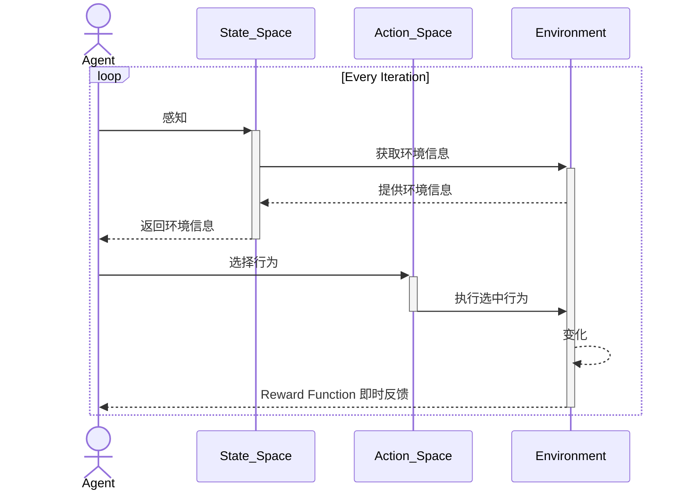

[[Reinforce Learning]]
# 1. 问题建模

## 1.1. 状态空间（State Space, S）
智能体（Agent）能感知的环境信息。
## 1.2. 动作空间（Action Space, A）
智能体可执行的操作集合。
## 1.3. 奖励函数（Reward Function, R）
环境对智能体行为的即时反馈（如得分增加、距离目标接近的奖励）。
## 1.4. 环境动态（Environment Dynamics）
状态转移概率（即 `P(s′|s,a)`），描述执行动作后环境如何变化。
# 2. 环境交互
## 2.1. 生成轨迹（Trajectories）

## 2.2. 探索（Exploration）
## 2.3. 利用（Exploitation）
# 3. 算法选择与策略优化
## 3.1. 主流算法分类
## 3.2. 优化步骤
# 4. 训练与调参
## 4.1. 超参数调整
## 4.2. 稳定性控制
## 4.3. 分布式训练
# 5. 评估与部署
## 5.1. 离线评估
## 5.2. 鲁棒性测试
## 5.3. 实际部署
# 6. 典型流程——RPO
# 7. 挑战与应对策略
## 7.1. 稀疏奖励（Sparse Reward）
## 7.2. 高危状态空间
## 7.3. 样本效率低
