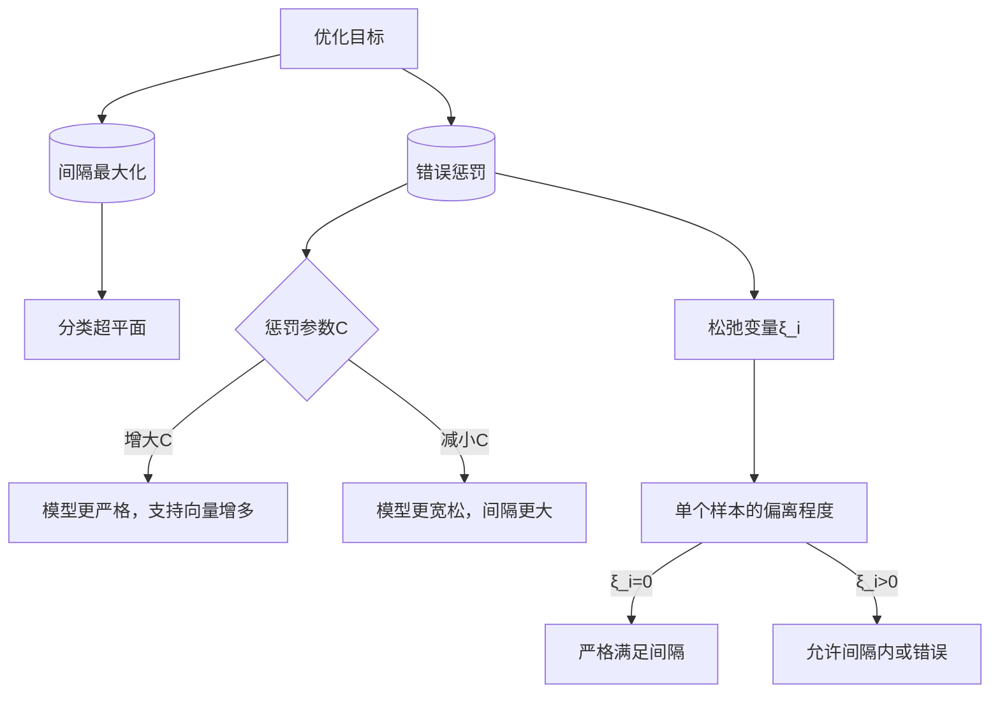

在训练集特征非常多但样本非常少的情况下，推荐使用不带任何核函数的支持向量机（SVM），主要原因如下：

### 1. **特征数量多，样本数量少**
- **线性可分性**：当特征数量远大于样本数量时，数据在高维空间中更容易线性可分。在这种情况下，使用线性核（即不带核函数的SVM）通常能够很好地处理数据。
- **计算效率**：不带核函数的SVM计算复杂度相对较低，尤其是在特征数量较多时。核函数（如高斯核）需要计算样本之间的相似度，这在特征数量多且样本数量少的情况下会显著增加计算成本。

### 2. **避免过拟合**
- **正则化参数C的作用**：在样本数量少的情况下，模型容易过拟合。通过调整正则化参数C，可以控制模型的复杂度，避免过拟合。
- **线性模型的简洁性**：线性模型（不带核函数的SVM）通常比非线性模型（带核函数的SVM）更简洁，能够更好地泛化到新的数据。

### 3. **核函数的局限性**
- **核函数的适用性**：核函数（如高斯核）主要用于处理非线性问题，但在特征数量远大于样本数量时，数据已经具有足够的维度来实现线性可分，因此核函数的优势不明显。
- **核函数的计算复杂性**：核函数需要计算每个样本之间的相似度，这在样本数量少但特征数量多的情况下会增加计算复杂度。

### 4. **实际应用中的经验**
- **特征多于样本时的选择**：在特征数量远大于样本数量的情况下，通常推荐使用线性核的SVM，因为它能够高效地处理高维数据，并且在小样本情况下表现良好。

### 总结
在特征数量多而样本数量少的情况下，不带核函数的SVM（线性核）能够高效地处理数据，避免过拟合，并且计算复杂度较低。因此，这是在这种情况下的一种理想选择。

# 核的选择
特征数与样本数是核函数选择的 “量化标尺”：
高维小样本选线性核以抗过拟合，低维大样本选 RBF 核以捕捉非线性关系。
实际应用中需结合特征稀疏性、计算资源和交叉验证结果，形成 “数据规模分析→初始核选择→参数优化→效果验证” 的完整流程，避免因盲目选择核函数导致模型偏差。


# 支持向量机中的松弛变量和惩罚参数解析

松弛变量和惩罚参数是支持向量机（SVM）中两个不同但紧密相关的概念，二者在解决分类问题时的作用和含义存在本质区别。以下从定义、功能、数学表达及实际影响四个维度展开解析：

## 一、核心定义与数学表达

### 1. **松弛变量（$\xi_i$）**
- **定义**：用于衡量样本点对“硬间隔”约束的偏离程度，是软间隔SVM中引入的非负变量。
- **数学表达**：对每个样本点$(x_i, y_i)$，约束条件为：

  $$
  y_i(\omega \cdot x_i + b) \geq 1 - \xi_i \quad (\xi_i \geq 0)
  $$

  当$\xi_i = 0$时，样本严格满足硬间隔条件；当$\xi_i > 0$时，样本允许在间隔内或分类错误（如$\xi_i \geq 1$时分类错误）。

### 2. **惩罚参数（$C$）**
- **定义**：控制模型对分类错误的“容忍度”，是优化目标中的正则化系数。
- **数学表达**：软间隔SVM的优化目标为：

  $$
  \min_{\omega, b, \xi} \frac{1}{2}\|\omega\|^2 + C\sum_{i=1}^n \xi_i
  $$

  其中$C > 0$，用于平衡“最大化间隔”（第一项）和“最小化分类错误”（第二项）。

## 二、功能与作用机制对比

| **维度**       | **松弛变量（$\xi_i$）**                          | **惩罚参数（$C$）**                          |
|----------------|------------------------------------------------|---------------------------------------------|
| **本质**       | 样本级别的约束松弛量，描述单个样本的偏离程度    | 全局模型参数，控制所有样本的总偏离权重      |
| **作用对象**   | 单个样本点，衡量其是否违反间隔约束              | 整个优化目标，调节模型对分类错误的敏感程度    |
| **取值范围**   | $\xi_i \geq 0$，无上限（但受优化目标限制）       | $C > 0$，通常通过交叉验证确定最优值          |
| **几何意义**   | 样本到分类超平面的“允许误差”                    | 模型对“误差容忍度”的全局控制：<br>$C$越大，越不允许分类错误；<br>$C$越小，越倾向于最大化间隔 |

## 三、二者的关联与交互

### 1. **优化目标中的耦合关系**  
惩罚参数$C$是松弛变量$\xi_i$的权重系数：  
- 当$C \to +\infty$时，优化目标强制$\sum \xi_i \to 0$，等价于硬间隔SVM（不允许任何分类错误）；  
- 当$C \to 0$时，模型更关注最大化间隔，允许大量分类错误（此时松弛变量$\xi_i$可自由增大）。

### 2. **对支持向量的影响**  
- 松弛变量$\xi_i > 0$的样本可能成为支持向量（如当$0 < \alpha_i < C$时，对应$\xi_i < 1$；当$\alpha_i = C$时，对应$\xi_i \geq 0$）；  
- 惩罚参数$C$越大，被选中的支持向量越多（模型为减少分类错误，会保留更多边缘样本）。

## 四、实际应用中的典型场景

### 1. **松弛变量的应用**
- **处理噪声数据**：若样本中存在少量离群点，松弛变量允许其$\xi_i$增大，避免模型因个别噪声点过度拟合。  
- **软间隔分类**：例如文本分类中，少量文本可能同时属于多个类别，松弛变量允许其在间隔内，提升模型泛化能力。

### 2. **惩罚参数的调优**
- **参数选择示例**：  
  - 当数据线性可分但含少量噪声时，选择中等$C$值（如$C=10$），平衡间隔与容错；  
  - 当数据高度非线性或噪声严重时，选择较小$C$值（如$C=1$），避免过拟合；  
  - 当需要严格分类（如医疗诊断）时，选择较大$C$值（如$C=100$），减少分类错误。

## 五、常见误区与注意事项

### 1. **误区1：“松弛变量和惩罚参数可以互相替代”**  
错误。松弛变量是样本级的约束松弛，惩罚参数是全局的优化权重，二者缺一不可：  
- 无松弛变量时，模型无法处理非线性或含噪声数据（硬间隔限制）；  
- 无惩罚参数时，模型无法平衡间隔与错误（优化目标无正则项）。

### 2. **误区2：“松弛变量越大，模型效果越好”**  
错误。松弛变量$\xi_i$反映样本偏离程度，过大的$\xi_i$意味着分类错误或严重违反间隔约束，需通过惩罚参数$C$控制总偏离量。

### 3. **工程实践建议**  
- 在scikit-learn中，`SVC`类的`C`参数即惩罚参数，松弛变量无需手动设置，由模型自动计算；  
- 调优时，可通过网格搜索（如`GridSearchCV`）结合交叉验证确定最优$C$值，通常搜索范围为$[10^{-3}, 10^3]$，步长取10的幂次。[[模型评估方法#交叉验证法（Cross Validation）]]

## 六、总结：二者的关系图解


松弛变量和惩罚参数是 SVM 中互补的两个概念：**松弛变量量化单个样本的约束偏离，惩罚参数全局控制偏离的总代价**。二者共同作用，使 SVM 在处理非线性、含噪声数据时具备灵活性 —— 通过调整C可平衡模型的 “严格性” 与 “泛化能力”，而松弛变量则为每个样本提供了适应数据分布的弹性空间。


# 支持向量机中的核系数解析

在支持向量机（SVM）中，核系数 $\gamma$ 是核函数（如RBF核、多项式核）的关键参数，直接控制模型的**局部拟合能力**与**泛化性能**。以下从数学定义、几何意义、实际影响及调优策略展开解析：

## 一、核系数 $\gamma$ 的数学定义

### 1. **RBF核（高斯核）中的 $\gamma$**
RBF核是最常用的核函数，其表达式为：

$$
K(x, y) = \exp\left(-\gamma \|x - y\|^2\right)
$$

其中：
- $\|x - y\|^2$ 是样本 $x$ 和 $y$ 的欧氏距离平方；
- $\gamma > 0$ 是核系数，决定距离对相似度的影响程度。

### 2. **与带宽参数 $\sigma$ 的关系**
部分文献中，RBF核写作：

$$
K(x, y) = \exp\left(-\frac{\|x - y\|^2}{2\sigma^2}\right)
$$

此时，$\gamma = \frac{1}{2\sigma^2}$，即 $\sigma = \frac{1}{\sqrt{2\gamma}}$。
- $\sigma$ 称为**带宽参数**，直接对应高斯分布的标准差；
- $\gamma$ 越大，$\sigma$ 越小，高斯分布越“尖”。

## 二、$\gamma$ 的几何意义：控制决策边界的复杂度

### 1. **$\gamma$ 对支持向量影响范围的控制**
- **小 $\gamma$ 值**（如 $\gamma = 0.01$）：
  - 高斯分布“宽”，样本点的影响范围大（$\sigma$ 大）；
  - 决策边界平滑，近似线性，泛化性强但可能欠拟合。
- **大 $\gamma$ 值**（如 $\gamma = 10$）：
  - 高斯分布“尖”，样本点的影响范围小（$\sigma$ 小）；
  - 决策边界复杂，可精确拟合局部数据，但易过拟合。

### 2. **直观类比**
- 想象每个支持向量是一个“光源”，$\gamma$ 控制光源的亮度衰减速度：
  - 小 $\gamma$：光源亮度衰减慢，照亮大片区域，决策边界平滑；
  - 大 $\gamma$：光源亮度衰减快，仅照亮局部，决策边界曲折。

## 三、$\gamma$ 对模型性能的实际影响

### 1. **过拟合与欠拟合的权衡**
- **$\gamma$ 过大**：
  - 模型对噪声敏感，支持向量仅影响邻近区域；
  - 决策边界紧贴训练数据，测试误差激增（过拟合）。
- **$\gamma$ 过小**：
  - 模型对所有样本“一视同仁”，支持向量影响范围过大；
  - 决策边界过于平滑，无法捕捉数据的非线性特征（欠拟合）。

### 2. **与惩罚参数 $C$ 的协同作用**
- $C$ 控制分类错误的惩罚力度，$\gamma$ 控制核函数的局部性：
  - 高 $C$ + 高 $\gamma$：严格分类 + 复杂边界，过拟合风险极高；
  - 低 $C$ + 低 $\gamma$：宽松分类 + 平滑边界，易欠拟合。

## 四、$\gamma$ 的调优策略与最佳实践

### 1. **网格搜索（Grid Search）**
- 常用搜索范围：$\gamma \in \{0.001, 0.01, 0.1, 1, 10\}$（或对数尺度）。
- 结合交叉验证（如5折），选择测试性能最优的 $\gamma$。

### 2. **经验法则**
- **数据维度高**（如文本特征）：优先选择小 $\gamma$（如 $\gamma = 0.01$），因高维空间中样本自然稀疏，过大 $\gamma$ 易过拟合。
- **数据维度低且样本量大**：尝试较大 $\gamma$（如 $\gamma = 1$），以捕捉非线性关系。

### 3. **自动调参工具**
- 在 scikit-learn 中，使用 `GridSearchCV` 或 `RandomizedSearchCV`：

```python
from sklearn.model_selection import GridSearchCV
from sklearn.svm import SVC

param_grid = {'C': [0.1, 1, 10], 'gamma': [0.001, 0.01, 0.1, 1]}
grid_search = GridSearchCV(SVC(kernel='rbf'), param_grid, cv=5)
grid_search.fit(X_train, y_train)
print(f"Best parameters: {grid_search.best_params_}")
```

## 五、常见误区与注意事项

### 1. **$\gamma$ 与核矩阵的关系**
- $\gamma$ 直接影响核矩阵的特征值分布：
  - 大 $\gamma$：核矩阵特征值衰减快，对应高维映射的复杂结构；
  - 小 $\gamma$：特征值衰减慢，映射后结构简单。

### 2. **其他核函数中的 $\gamma$**
- **多项式核**：$K(x, y) = (\gamma \cdot x^T y + r)^d$，$\gamma$ 控制线性项的缩放，影响边界曲率。
- **Sigmoid核**：$K(x, y) = \tanh(\gamma \cdot x^T y + r)$，$\gamma$ 需谨慎选择（不当值可能导致核矩阵非半正定）。

## 六、总结：$\gamma$ 的核心作用

| **$\gamma$ 值** | **决策边界** | **支持向量影响范围** | **过拟合风险** | **适用场景**           |
|----------------|------------|------------------|------------|----------------------|
| 小（如 0.01）   | 平滑       | 全局             | 低         | 高维数据、噪声多、线性近似问题 |
| 中等（如 1）    | 适中       | 局部与全局平衡     | 适中       | 一般非线性问题         |
| 大（如 10）     | 复杂       | 极局部           | 高         | 低维数据、样本充足、强非线性关系 |

**核心结论**：$\gamma$ 是SVM中控制模型复杂度的“旋钮”，需结合数据特性（维度、噪声、样本量）和惩罚参数 $C$ 协同调优，以平衡模型的拟合能力与泛化性能。


# 支持向量回归（SVR）解析

支持向量机（SVM）用于回归任务时被称为**支持向量回归（Support Vector Regression, SVR）**。与分类任务不同，SVR的目标是找到一个能拟合数据的连续函数，同时容忍一定范围内的误差。以下从核心原理、关键概念、数学推导及算法流程等方面详细解析：

## 一、SVR与SVM分类的本质区别

| **维度**       | **SVM分类**                          | **SVR回归**                          |
|----------------|-------------------------------------|-------------------------------------|
| **目标**       | 寻找超平面最大化类别间隔               | 寻找函数使预测值与真实值偏差不超过ε，同时函数平滑 |
| **损失函数**   | 铰链损失（Hinge Loss）               | ε-不敏感损失（ε-Insensitive Loss）       |
| **核心假设**   | 样本可被超平面分隔                    | 大部分样本落在“ε-管”内，仅少数点影响模型   |
| **支持向量**   | 离超平面最近的样本点                  | 落在ε-管外或管边界上的样本点            |

## 二、SVR的核心概念：ε-不敏感损失与ε-管

### 1. **ε-不敏感损失函数**
- **定义**：若预测值 $f(x)$ 与真实值 $y$ 的偏差不超过阈值 $\varepsilon$，则视为“无损失”；超过 $\varepsilon$ 时，损失与偏差成正比。  
  数学表达式：

  $$
  L_\varepsilon(y, f(x)) = 
  \begin{cases} 
  0, & \text{若 } |y - f(x)| \leq \varepsilon \\
  |y - f(x)| - \varepsilon, & \text{否则}
  \end{cases}
  $$

- **直观理解**：构建一个以预测函数为中心、宽度为 $2\varepsilon$ 的“ε-管”，管内的点不计算损失，仅管外的点产生损失。

### 2. **优化目标：兼顾拟合精度与模型复杂度**
- **目标函数**：

  $$
  \min_{w,b,\xi,\xi^*} \frac{1}{2}\|w\|^2 + C \sum_{i=1}^n (\xi_i + \xi_i^*)
  $$

  其中：
  - $\frac{1}{2}\|w\|^2$ 为正则项，控制模型复杂度；
  - $C$ 为惩罚参数，平衡正则项与拟合误差；
  - $\xi_i, \xi_i^*$ 为松弛变量，允许样本超出ε-管（$\xi_i \geq 0$ 表示预测值大于真实值+ε，$\xi_i^* \geq 0$ 表示预测值小于真实值-ε）。

## 三、SVR的数学推导与对偶问题

### 1. **原始优化问题**
给定训练集 $\{(x_i, y_i)\}_{i=1}^n$，SVR的原始问题可表示为：

$$
\begin{align*}
\min_{w,b,\xi,\xi^*} &\ \frac{1}{2}\|w\|^2 + C \sum_{i=1}^n (\xi_i + \xi_i^*) \\
\text{s.t.} &\ y_i - f(x_i) \leq \varepsilon + \xi_i, \\
&\ f(x_i) - y_i \leq \varepsilon + \xi_i^*, \\
&\ \xi_i, \xi_i^* \geq 0,\ i=1,2,\dots,n.
\end{align*}
$$

其中 $f(x) = w^T x + b$ 为线性回归函数。

### 2. **引入拉格朗日乘数转化为对偶问题**
通过拉格朗日乘数法，构造拉格朗日函数：

$$
L = \frac{1}{2}\|w\|^2 + C\sum_{i=1}^n (\xi_i + \xi_i^*) - \sum_{i=1}^n \alpha_i (\varepsilon + \xi_i - y_i + w^T x_i + b) - \sum_{i=1}^n \alpha_i^* (\varepsilon + \xi_i^* + y_i - w^T x_i - b) - \sum_{i=1}^n (\mu_i \xi_i + \mu_i^* \xi_i^*)
$$

其中 $\alpha_i, \alpha_i^*, \mu_i, \mu_i^* \geq 0$ 为拉格朗日乘数。

对 $w, b, \xi_i, \xi_i^*$ 求偏导并令其为0，消去原始变量后得到对偶问题：

$$
\begin{align*}
\max_{\alpha,\alpha^*} &\ \sum_{i=1}^n y_i (\alpha_i^* - \alpha_i) - \varepsilon \sum_{i=1}^n (\alpha_i^* + \alpha_i) - \frac{1}{2} \sum_{i,j=1}^n (\alpha_i^* - \alpha_i)(\alpha_j^* - \alpha_j) x_i^T x_j \\
\text{s.t.} &\ \sum_{i=1}^n (\alpha_i^* - \alpha_i) = 0, \\
&\ 0 \leq \alpha_i, \alpha_i^* \leq C,\ i=1,2,\dots,n.
\end{align*}
$$

### 3. **核函数的引入（处理非线性回归）**
与SVM分类类似，通过核函数 $\kappa(x_i, x_j) = \phi(x_i)^T \phi(x_j)$ 将数据映射到高维空间，此时对偶问题中的内积 $x_i^T x_j$ 替换为 $\kappa(x_i, x_j)$，回归函数变为：

$$
f(x) = \sum_{i=1}^n (\alpha_i^* - \alpha_i) \kappa(x_i, x) + b
$$

常用核函数包括：
- **线性核**：$\kappa(x_i, x_j) = x_i^T x_j$
- **径向基函数（RBF）核**：$\kappa(x_i, x_j) = \exp(-\gamma \|x_i - x_j\|^2)$，$\gamma > 0$
- **多项式核**：$\kappa(x_i, x_j) = (x_i^T x_j + r)^d$，$r \geq 0, d \geq 1$

## 四、SVR算法流程

1. **数据预处理**：
   - 标准化或归一化特征（避免不同量纲影响模型）；
   - 划分训练集与测试集。
2. **选择核函数与参数**：
   - 核函数：根据数据分布选择（如非线性数据选RBF核）；
   - 调优参数：$C$（控制误差容忍度）、$\varepsilon$（管宽度）、核函数参数（如RBF的$\gamma$）。
3. **构建并训练SVR模型**：
   - 求解对偶问题，得到拉格朗日乘数 $\alpha_i, \alpha_i^*$；
   - 确定支持向量（满足 $0 < \alpha_i < C$ 或 $0 < \alpha_i^* < C$ 的样本点）。
4. **预测与评估**：
   - 用训练好的模型对新样本计算 $f(x)$；
   - 评估指标：均方误差（MSE）、平均绝对误差（MAE）、决定系数（$R^2$）等。

## 五、关键参数的影响

| **参数** | **作用**                                                                 | **调优方向**                                                                 |
|----------|--------------------------------------------------------------------------|-----------------------------------------------------------------------------|
| $C$      | 惩罚参数，控制对ε-管外误差的重视程度：$C$ 越大，模型越不允许误差，易过拟合；$C$ 越小，模型越容忍误差，易欠拟合。 | 小数据集优先尝试中等值（如 $C=1$），再通过交叉验证调整。                          |
| $\varepsilon$ | 误差容忍阈值：$\varepsilon$ 越大，管越宽，包含的样本越多，模型越简单，但拟合精度可能下降。 | 根据数据噪声水平设置：噪声大时增大$\varepsilon$，反之减小。                        |
| $\gamma$（RBF核） | 控制核函数的作用范围：$\gamma$ 越大，高维空间中样本的距离越敏感，模型越复杂；$\gamma$ 越小，模型越平滑。 | 与$C$ 联合调优，常用网格搜索（如 $\gamma \in \{10^{-3}, 10^{-2}, \dots, 10^3\}$）。    |

## 六、SVR的优缺点与应用场景

### 1. **优点**
- **小样本学习**：依赖少量支持向量，适合样本量有限的场景；
- **高维适应性**：通过核函数处理高维数据，无需特征降维；
- **抗噪声能力**：ε-不敏感损失对 outliers 不敏感。

### 2. **缺点**
- **计算复杂度高**：求解二次规划问题的时间复杂度随样本量增加呈立方级增长；
- **参数调优困难**：需同时优化 $C$、$\varepsilon$ 和核函数参数，计算成本高；
- **对大规模数据不友好**：内存需求大，不适用于百万级以上样本。

### 3. **应用场景**
- **回归预测**：房价预测、股票价格趋势、传感器数据平滑；
- **时间序列分析**：流量预测、天气数据建模；
- **工程与科学**：物理实验数据拟合、化学性质预测。

## 七、总结

SVR通过**ε-不敏感损失函数**和**核函数技术**，将SVM的分类思想拓展到回归任务中，核心是在“模型复杂度”与“拟合误差”之间寻找平衡。其本质是构建一个允许一定误差的“预测管”，仅用管外的支持向量确定回归函数。实际应用中，合理选择核函数与调优参数是提升SVR性能的关键，而对于大规模数据，可考虑近似算法（如SVR-GPU）或替代模型（如随机森林回归）。