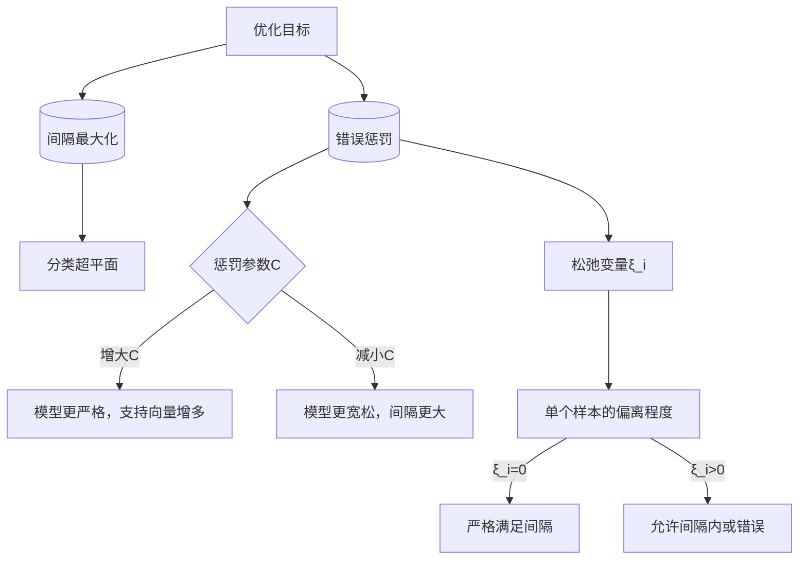

# 支持向量机中的松弛变量和惩罚参数解析

松弛变量和惩罚参数是支持向量机（[[SVM]]）中两个不同但紧密相关的概念，二者在解决分类问题时的作用和含义存在本质区别。以下从定义、功能、数学表达及实际影响四个维度展开解析：

## 一、核心定义与数学表达

### 1. **松弛变量（$\xi_i$）**
- **定义**：用于衡量样本点对“硬间隔”约束的偏离程度，是软间隔SVM中引入的非负变量。
- **数学表达**：对每个样本点$(x_i, y_i)$，约束条件为：

  $$
  y_i(\omega \cdot x_i + b) \geq 1 - \xi_i \quad (\xi_i \geq 0)
  $$

  当$\xi_i = 0$时，样本严格满足硬间隔条件；当$\xi_i > 0$时，样本允许在间隔内或分类错误（如$\xi_i \geq 1$时分类错误）。

### 2. **惩罚参数（$C$）**
- **定义**：控制模型对分类错误的“容忍度”，是优化目标中的正则化系数。
- **数学表达**：软间隔SVM的优化目标为：

  $$
  \min_{\omega, b, \xi} \frac{1}{2}\|\omega\|^2 + C\sum_{i=1}^n \xi_i
  $$

  其中$C > 0$，用于平衡“最大化间隔”（第一项）和“最小化分类错误”（第二项）。

## 二、功能与作用机制对比

| **维度**       | **松弛变量（$\xi_i$）**                          | **惩罚参数（$C$）**                          |
|----------------|------------------------------------------------|---------------------------------------------|
| **本质**       | 样本级别的约束松弛量，描述单个样本的偏离程度    | 全局模型参数，控制所有样本的总偏离权重      |
| **作用对象**   | 单个样本点，衡量其是否违反间隔约束              | 整个优化目标，调节模型对分类错误的敏感程度    |
| **取值范围**   | $\xi_i \geq 0$，无上限（但受优化目标限制）       | $C > 0$，通常通过交叉验证确定最优值          |
| **几何意义**   | 样本到分类超平面的“允许误差”                    | 模型对“误差容忍度”的全局控制： $C$越大，越不允许分类错误； $C$越小，越倾向于最大化间隔 |

## 三、二者的关联与交互

### 1. **优化目标中的耦合关系**  
惩罚参数$C$是松弛变量$\xi_i$的权重系数：  
- 当$C \to +\infty$时，优化目标强制$\sum \xi_i \to 0$，等价于硬间隔SVM（不允许任何分类错误）；  
- 当$C \to 0$时，模型更关注最大化间隔，允许大量分类错误（此时松弛变量$\xi_i$可自由增大）。

### 2. **对支持向量的影响**  
- 松弛变量$\xi_i > 0$的样本可能成为支持向量（如当$0 < \alpha_i < C$时，对应$\xi_i < 1$；当$\alpha_i = C$时，对应$\xi_i \geq 0$）；  
- 惩罚参数$C$越大，被选中的支持向量越多（模型为减少分类错误，会保留更多边缘样本）。

## 四、实际应用中的典型场景

### 1. **松弛变量的应用**
- **处理噪声数据**：若样本中存在少量离群点，松弛变量允许其$\xi_i$增大，避免模型因个别噪声点过度拟合。  
- **软间隔分类**：例如文本分类中，少量文本可能同时属于多个类别，松弛变量允许其在间隔内，提升模型泛化能力。

### 2. **惩罚参数的调优**
- **参数选择示例**：  
  - 当数据线性可分但含少量噪声时，选择中等$C$值（如$C=10$），平衡间隔与容错；  
  - 当数据高度非线性或噪声严重时，选择较小$C$值（如$C=1$），避免过拟合；  
  - 当需要严格分类（如医疗诊断）时，选择较大$C$值（如$C=100$），减少分类错误。

## 五、常见误区与注意事项

### 1. **误区1：“松弛变量和惩罚参数可以互相替代”**  
错误。松弛变量是样本级的约束松弛，惩罚参数是全局的优化权重，二者缺一不可：  
- 无松弛变量时，模型无法处理非线性或含噪声数据（硬间隔限制）；  
- 无惩罚参数时，模型无法平衡间隔与错误（优化目标无正则项）。

### 2. **误区2：“松弛变量越大，模型效果越好”**  
错误。松弛变量$\xi_i$反映样本偏离程度，过大的$\xi_i$意味着分类错误或严重违反间隔约束，需通过惩罚参数$C$控制总偏离量。

### 3. **工程实践建议**  
- 在scikit-learn中，`SVC`类的`C`参数即惩罚参数，松弛变量无需手动设置，由模型自动计算；  
- 调优时，可通过网格搜索（如`GridSearchCV`）结合交叉验证确定最优$C$值，通常搜索范围为$[10^{-3}, 10^3]$，步长取10的幂次。[[模型评估方法#交叉验证法（Cross Validation）]]

## 六、总结：二者的关系图解

松弛变量和惩罚参数是 SVM 中互补的两个概念：**松弛变量量化单个样本的约束偏离，惩罚参数全局控制偏离的总代价**。二者共同作用，使 SVM 在处理非线性、含噪声数据时具备灵活性 —— 通过调整C可平衡模型的 “严格性” 与 “泛化能力”，而松弛变量则为每个样本提供了适应数据分布的弹性空间。

