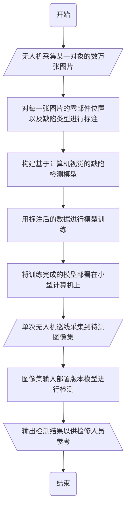

# 缺陷检测图片要求与初步计划

# 引言

我们希望能够针对配网线路的各个部件进行自动化缺陷检测，

流程是：

## 数据采集与标注

我们希望针对每一类配电线路上的目标对象，这里以瓷制白色绝缘子串为例，采集到上万张清晰的大图，如下图所示：

标注示例：

这些标注不是专业的，我们还需要师傅们配合和指导。

我们希望图片能足够清晰，清晰到我们可以看到所有的待测对象，即绝缘子串。

对于图像的尺寸，因为同一款无人机摄像头的成像尺寸是一致的，所以图像的尺寸也就是分辨率也是统一的，不需要额外裁剪。

如果在原画幅中未能清晰显示绝缘子串细节，请无人机摄像师在保持安全距离的前提下尽可能近地拍摄。

此外我们希望对同一对象能够有多个不同角度的图像，从而教会模型不同角度情况下需要重点关注的特征有哪些。

例如下面这根杆的拍摄就是两个不同的角度，可以拍摄到瓷瓶的底部和球面，大量的如下图片会让模型了解带有纹路的碗底也是绝缘子串的特征，从而分辨出带有缺陷的特征：

## 模型设计与训练

随后我们会在此基础上为图片进行标注，构建训练集、验证集和测试集。

打个比方：

模型相当于一个高中生。

训练集相当于带有参考答案的练习题，供学生自己以练促学。

验证集相当于阶段测验，让学生在训练的每个阶段了解自己的掌握程度。

测试集相当于高考，是学生上阵战斗的战场。

而我们这名学生将会在代码程序的控制下学会检查绝缘子串的缺陷。

这也是我们这个项目的第一个阶段性成果。

后续我们将用类似的方法，为不同类待测对象进行灵活调整，得到多个类似的小模型。

共同集成部署在一台计算机中，用于日常巡检工作中给师傅们以参考。

这能极大减少师傅们的巡线负担，提高巡线效率。

具体的模型将会是什么结构我们这里先不讨论，将其视为一个黑盒，现阶段只关注数据集本身。

