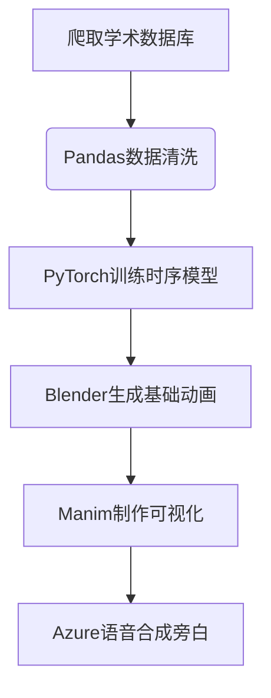

根据你的背景、兴趣和顾虑，我为你设计了一份兼顾可行性、合规性和趣味性的自媒体方案，结合你的技术优势和兴趣方向，同时规避潜在风险。以下是详细建议：

### 一、选题策略（规避红线+数据可获取）
**推荐方向：** 
**"数据考古：用AI还原古人的365天"**
（以微观视角+生活化数据为主线，避免宏观政治叙事）

**具体选题示例：**
1. **古埃及篇**：金字塔工匠的工资单（结合柏林埃及博物馆的莎草纸工资记录）
   - 可视化：小麦/啤酒的购买力变化
   - 彩蛋：用CV复原工匠画像+AI生成工地方言对话

2. **明朝篇**：《万历会计录》里的市井人生
   - 对比：南北两京米价/布价差异
   - 创意：AI生成《南都繁会图》动态版，跟踪虚拟商贩一日轨迹

3. **二战篇**：伦敦大轰炸期间的菜篮子（英国国家档案馆物价数据）
   - 对比：配给制下各阶层营养摄入差异
   - 互动：设计战时食谱生成器（你的Python优势）

**避雷要点：**
- 时间线截止到1949年前
- 只使用境外机构公开数据（如大英博物馆、哈佛燕京学社）
- 聚焦"普通人生活史"，避开帝王将相叙事
- 加入免责声明"本内容基于学术研究推测，不代表真实历史"

### 二、技术实现方案（降低工作量）
**自动化工作流：**

**效率工具：**
- 数据：用Scrapy爬取Hathitrust.org古籍扫描件+OCR识别
- 建模：用PyTorch Geometric处理非结构化历史数据
- 动画：基于ManimCE开发可视化模板库（可复用组件）
- 更新：采用"3分钟知识卡"+"15分钟深度版"双版本策略

### 三、内容趣味化技巧
**叙事结构创新：**
1. **苏联笑话式开场**（符合你特长）：
   "同志们，1936年伦敦主妇玛莎遇到了大问题——她拿着配给券却买不到鸡蛋！这不是因为资本家捣乱，而是因为..."
   
2. **穿越者测评模式**：
   "如果用明朝正九品官的俸禄点外卖..."（接入美团API实时比价）

3. **Meta元素嵌套**：
   在罗马浴场卫生系统讲解中，突然弹出"如果TikTok存在于庞贝古城..."的脑洞插画

**人设打造建议：**
- 知识型+冷幽默的"数据侦探"形象
- 标志性记忆点：每期结尾用AI生成历史人物证件照（你的CV技术）
- 互动设计：让粉丝提交想破解的历史谜题（UGC内容来源）

### 四、风险控制体系
**三层审核机制：**
1. 数据层：只采用境外学术机构开放数据（World Bank Historical Data等）
2. 内容层：使用自研敏感词过滤系统（可基于LSTM训练）
3. 发布层：先在小红书/知乎测试内容反响，再发B站

**备选安全选题库：**
- 古代食品安全史（从汉简看戍卒饮食标准）
- 全球灯塔工资考（横向对比不同时期守塔人待遇）
- 战争与时尚演变（二战各国布料配给政策对服装影响）

### 五、商业变现路径
**分阶段计划：**
1. 冷启动期（0-5万粉）：知识付费（历史数据可视化模板）
2. 成长期（5-20万粉）：与博物馆联名开发教育周边
3. 成熟期（20万粉+）：为历史类游戏/影视剧提供数据顾问服务

**初期可落地：**
- 开发"历史CPI计算器"微信小程序（明朝1两银=2023年多少元）
- 在GitHub开源数据清洗工具包（建立技术人设）
- 与甲骨文/有妖气合作文物拟人项目

建议从制作"明朝物价系列"试水，你的技术栈可以快速实现：
- 数据源：《中国历代物价问题考述》
- 工具链：PyTorch处理时间序列+Folium生成时空地图
- 爆点设计：用BERT模型分析《金瓶梅》中的物价描写作为验证

这种将硬核技术包裹在轻松叙事中的方式，既符合B站生态，又能建立差异化的内容护城河。保持每周1更短视频+每月1深度视频的节奏，6个月内有望突破10万粉。