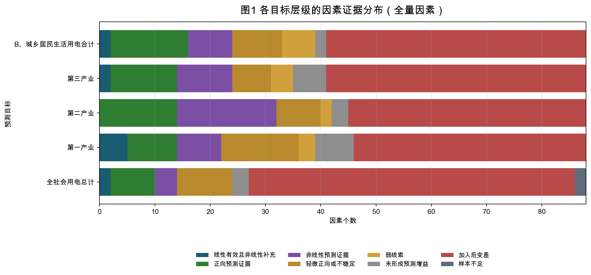
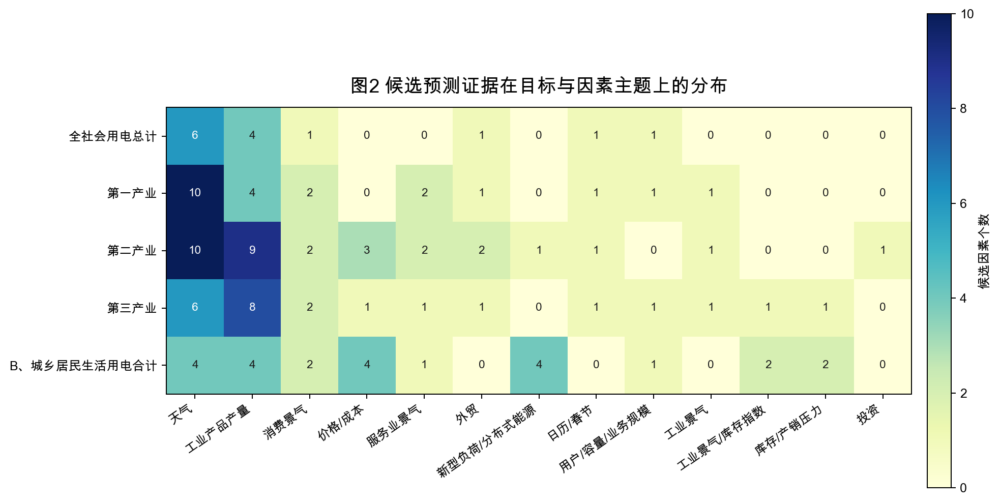
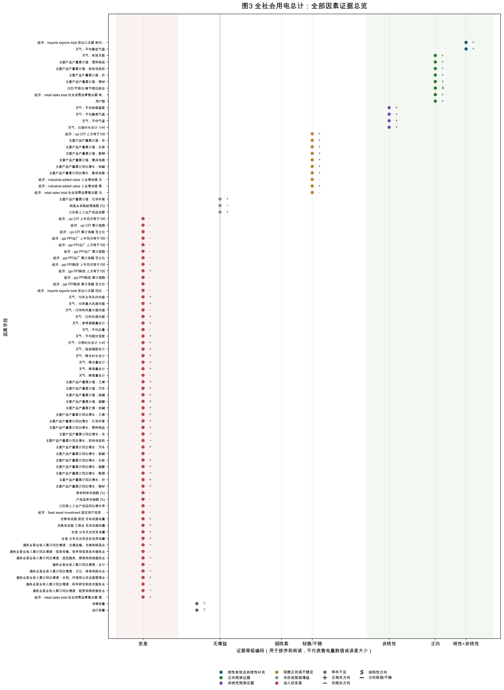
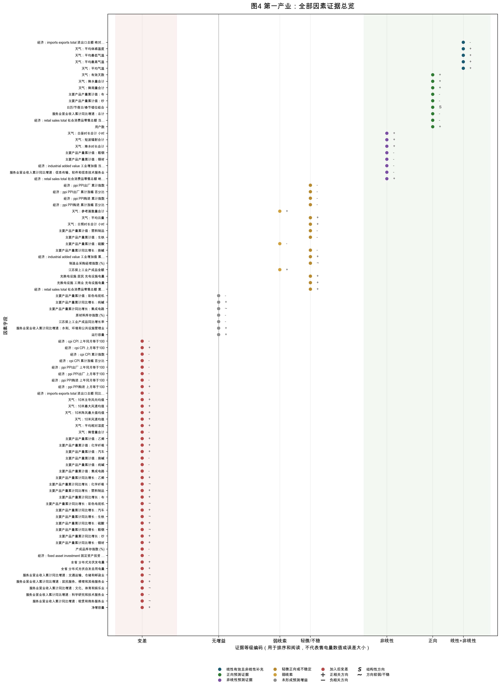
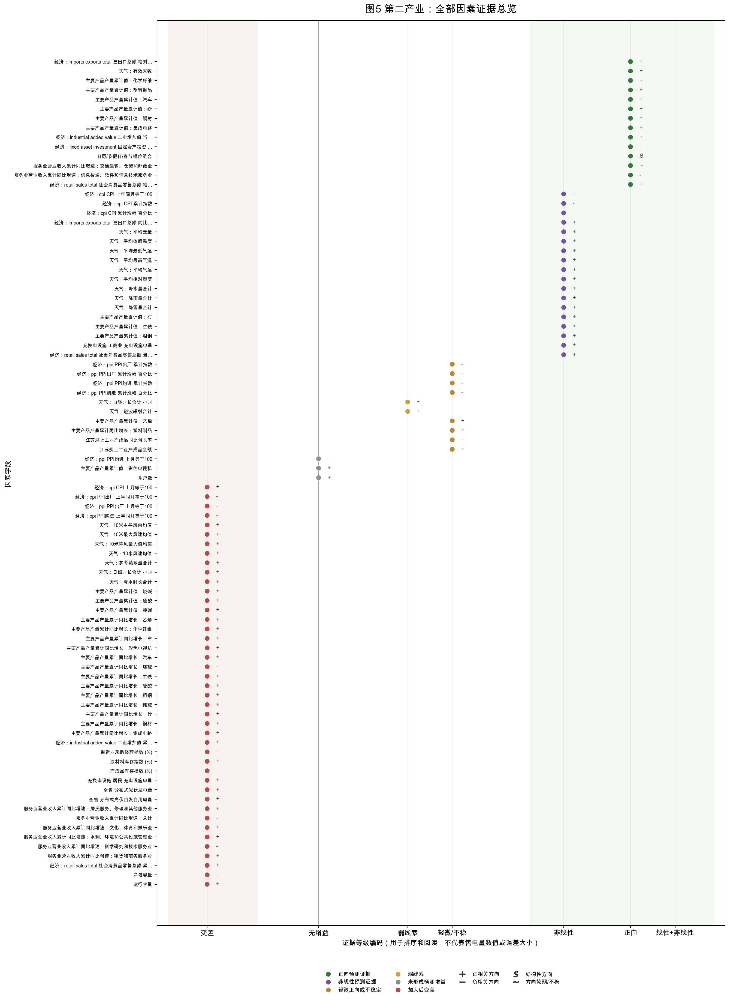
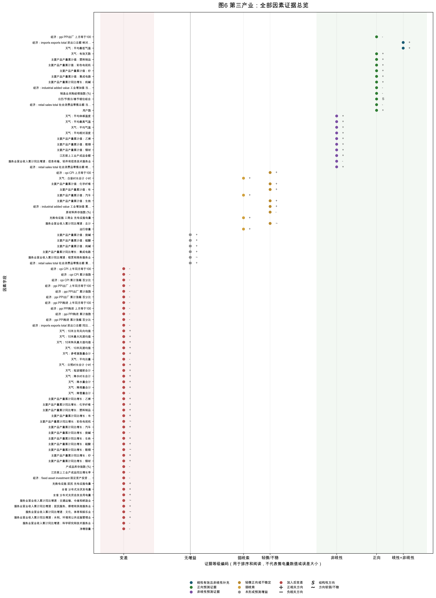
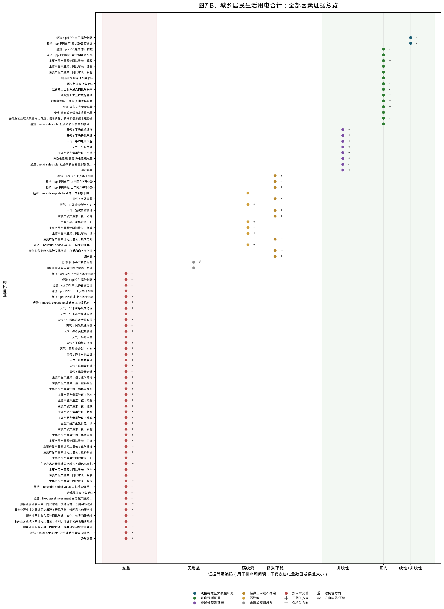

# 因素-目标整合证据报告 v1

日期：2026-05-25
角色：预测建模工程师 / 算法实验员

## 1. 为什么要重写成这份报告

之前的解释文档按实验批次组织，适合内部复盘，但不适合作为汇总报告。
正式汇报应按“预测目标 × 因素”组织：甲方关心的是哪些因素对哪些售电量目标有用、可能如何影响、证据强弱和边界是什么，而不是这些因素是哪一天加入实验的。

因此，本报告把首版宽表因素、日历因素和后续补入的公开外生变量放到同一套证据矩阵中。

## 2. 读法

- `正向预测证据`：加入该因素滞后项后，预测误差相对历史基线改善。
- `非线性预测证据`：线性不明显，但样条或低成本非线性模型出现改善。
- `弱线索`：有一定迹象，但强度不足以入主结论。
- `未形成预测增益`：当前样本和模型下没有超过历史基线。
- `加入后变差`：加入因素后预测表现反而更差，不建议作为当前输入。
- `relationship_direction` 来自滞后相关方向，只作为关系方向参考；非线性因素可能不存在单一正负方向。

完整矩阵写入受保护目录：

- `output/modeling/mvp/integrated_factor_target_evidence/factor_target_integrated_evidence_matrix.csv`

本 Markdown 是面向汇总报告的摘要版：每个目标展示最值得解释的因素和典型边界；全量 440 条“目标 × 因素”记录以 CSV 矩阵保存，便于后续筛选、排序、重画图或入稿。

## 3. 全局图表

### 3.1 全量因素证据分布

这张图先回答“每个目标层级有多少因素形成了正向证据、非线性证据、弱线索、无增益或变差”。它不展示售电量原始数值，也不展示完整误差矩阵，只统计整合矩阵中的派生证据等级。

### 3.2 候选证据在因素主题上的分布

这张图只统计已经形成“正向预测证据、线性有效且非线性补充、非线性预测证据”的因素。颜色越深，表示该目标层级下该主题中候选因素越多；它用于发现哪些目标更依赖天气、日历、工业产品产量、库存或其他公开外生变量。

## 4. 按目标层级的整合结论

### 4.1 全社会用电总计

#### 因素证据总览图

下图把该目标层级的全部因素放在同一张图里。横轴是证据等级编码，只用于阅读排序：越靠右代表越值得优先解释，越靠左代表当前加入后变差或未形成增益；点右侧的 `+`、`-`、`S`、`~` 分别表示正相关方向、负相关方向、结构性方向和方向较弱/不稳。

#### 优先解释/可进入候选输入池

| 因素 | 主题 | 预测证据 | 关系方向 | 机制解释 | 边界 |
| --- | --- | --- | --- | --- | --- |
| econ_imports_exports_total_进出口总额_绝对量_亿元 | 外贸 | 线性有效且非线性补充 | 正相关倾向 | 进出口反映外贸订单、制造生产、港口物流、仓储和贸易服务活动。 | 公开经济数据存在发布时间和累计/同比口径限制，真实预测默认使用滞后项。 |
| weather_avg_平均最低气温 | 天气 | 线性有效且非线性补充 | 正相关倾向 | 温度和体感温度影响制冷、采暖、厂房环境控制和农业生产条件，关系常呈 U 型或阈值型。 | 当前多为滞后天气观测；真实预测需天气预报或预测时点可得气象信息。 |
| weather_avg_有效天数 | 天气 | 正向预测证据 | 正相关倾向 | 天气条件影响生活舒适度、生产环境、农业条件和极端天气扰动。 | 当前多为滞后天气观测；真实预测需天气预报或预测时点可得气象信息。 |
| 主要产品产量累计值：塑料制品 | 工业产品产量 | 正向预测证据 | 正相关倾向 | 具体产品产量可作为对应制造行业生产强度代理变量，需保留产品名和单位。 | 不同产品单位不同，累计值和累计同比不能混合，不能泛化为产品产量整体有效。 |
| 主要产品产量累计值：彩色电视机 | 工业产品产量 | 正向预测证据 | 正相关倾向 | 具体产品产量可作为对应制造行业生产强度代理变量，需保留产品名和单位。 | 不同产品单位不同，累计值和累计同比不能混合，不能泛化为产品产量整体有效。 |
| 主要产品产量累计值：纱 | 工业产品产量 | 正向预测证据 | 正相关倾向 | 具体产品产量可作为对应制造行业生产强度代理变量，需保留产品名和单位。 | 不同产品单位不同，累计值和累计同比不能混合，不能泛化为产品产量整体有效。 |
| 主要产品产量累计值：钢材 | 工业产品产量 | 正向预测证据 | 正相关倾向 | 具体产品产量可作为对应制造行业生产强度代理变量，需保留产品名和单位。 | 不同产品单位不同，累计值和累计同比不能混合，不能泛化为产品产量整体有效。 |
| 日历/节假日/春节错位组合 | 日历/春节 | 正向预测证据 | 结构性影响，方向随工作日/节假日/春节位置变化 | 工作日、节假日和春节错位会改变生产开工、商业活动、居民出行与复工节奏。 | 预测时点已知；但不同产业方向可能不同，不能用同一方向解释所有目标。 |
| econ_retail_sales_total_社会消费品零售总额_绝对量_亿元 | 消费景气 | 正向预测证据 | 正相关倾向 | 社零反映消费和商业活动，可能影响第三产业、居民消费场景和消费品制造。 | 公开经济数据存在发布时间和累计/同比口径限制，真实预测默认使用滞后项。 |
| 用户数 | 用户/容量/业务规模 | 正向预测证据 | 正相关倾向 | 用户数和运行容量反映用电主体规模、接入容量和长期需求底座，但需确认预测时点可得性。 | 需确认预测时点可得性，避免同月统计或目标组成口径泄漏。 |
| weather_avg_平均体感温度 | 天气 | 非线性预测证据 | 正相关倾向 | 温度和体感温度影响制冷、采暖、厂房环境控制和农业生产条件，关系常呈 U 型或阈值型。 | 当前多为滞后天气观测；真实预测需天气预报或预测时点可得气象信息。 |
| weather_avg_平均最高气温 | 天气 | 非线性预测证据 | 正相关倾向 | 温度和体感温度影响制冷、采暖、厂房环境控制和农业生产条件，关系常呈 U 型或阈值型。 | 当前多为滞后天气观测；真实预测需天气预报或预测时点可得气象信息。 |
| weather_avg_平均气温 | 天气 | 非线性预测证据 | 正相关倾向 | 温度和体感温度影响制冷、采暖、厂房环境控制和农业生产条件，关系常呈 U 型或阈值型。 | 当前多为滞后天气观测；真实预测需天气预报或预测时点可得气象信息。 |
| weather_avg_白昼时长合计_小时 | 天气 | 非线性预测证据 | 正相关倾向 | 光照、云量和辐射影响温度、照明、农业生产和分布式光伏出力。 | 当前多为滞后天气观测；真实预测需天气预报或预测时点可得气象信息。 |

#### 弱线索/需要复核

- econ_cpi_CPI_上月等于100（价格/成本）：轻微正向或不稳定；CPI/PPI 反映消费价格、工业品价格和成本压力，传导链条较长且方向可能不稳定。 边界：公开经济数据存在发布时间和累计/同比口径限制，真实预测默认使用滞后项。
- 主要产品产量累计值：布（工业产品产量）：轻微正向或不稳定；具体产品产量可作为对应制造行业生产强度代理变量，需保留产品名和单位。 边界：不同产品单位不同，累计值和累计同比不能混合，不能泛化为产品产量整体有效。
- 主要产品产量累计值：生铁（工业产品产量）：轻微正向或不稳定；具体产品产量可作为对应制造行业生产强度代理变量，需保留产品名和单位。 边界：不同产品单位不同，累计值和累计同比不能混合，不能泛化为产品产量整体有效。
- 主要产品产量累计值：粗钢（工业产品产量）：轻微正向或不稳定；具体产品产量可作为对应制造行业生产强度代理变量，需保留产品名和单位。 边界：不同产品单位不同，累计值和累计同比不能混合，不能泛化为产品产量整体有效。
- 主要产品产量累计值：集成电路（工业产品产量）：轻微正向或不稳定；具体产品产量可作为对应制造行业生产强度代理变量，需保留产品名和单位。 边界：不同产品单位不同，累计值和累计同比不能混合，不能泛化为产品产量整体有效。
- 主要产品产量累计同比增长：纯碱（工业产品产量）：轻微正向或不稳定；具体产品产量可作为对应制造行业生产强度代理变量，需保留产品名和单位。 边界：不同产品单位不同，累计值和累计同比不能混合，不能泛化为产品产量整体有效。
- 主要产品产量累计同比增长：集成电路（工业产品产量）：轻微正向或不稳定；具体产品产量可作为对应制造行业生产强度代理变量，需保留产品名和单位。 边界：不同产品单位不同，累计值和累计同比不能混合，不能泛化为产品产量整体有效。
- econ_industrial_added_value_工业增加值_当月同比_百分比（工业景气）：轻微正向或不稳定；工业增加值等指标反映工业生产景气，通常与第二产业售电具有较直接机制。 边界：公开经济数据存在发布时间和累计/同比口径限制，真实预测默认使用滞后项。
- econ_industrial_added_value_工业增加值_累计同比_百分比（工业景气）：轻微正向或不稳定；工业增加值等指标反映工业生产景气，通常与第二产业售电具有较直接机制。 边界：公开经济数据存在发布时间和累计/同比口径限制，真实预测默认使用滞后项。
- econ_retail_sales_total_社会消费品零售总额_当月同比_百分比（消费景气）：轻微正向或不稳定；社零反映消费和商业活动，可能影响第三产业、居民消费场景和消费品制造。 边界：公开经济数据存在发布时间和累计/同比口径限制，真实预测默认使用滞后项。

#### 当前不宜作为主输入

- 当前未形成预测增益或加入后变差的因素主要集中在：工业产品产量 18 个；天气 13 个；价格/成本 11 个；服务业景气 8 个；新型负荷/分布式能源 4 个；库存/产销压力 3 个；工业景气/库存指数 2 个；外贸 1 个。
- 这不等于这些因素理论上无用，只表示当前样本、滞后口径和模型下没有形成稳定预测辅助价值。
- 例子：econ_cpi_CPI_上年同月等于100、econ_cpi_CPI_累计指数、econ_cpi_CPI_累计涨幅_百分比、econ_ppi_PPI出厂_上年同月等于100、econ_ppi_PPI出厂_上月等于100、econ_ppi_PPI出厂_累计指数、econ_ppi_PPI出厂_累计涨幅_百分比、econ_ppi_PPI购进_上年同月等于100。

### 4.2 第一产业

#### 因素证据总览图

下图把该目标层级的全部因素放在同一张图里。横轴是证据等级编码，只用于阅读排序：越靠右代表越值得优先解释，越靠左代表当前加入后变差或未形成增益；点右侧的 `+`、`-`、`S`、`~` 分别表示正相关方向、负相关方向、结构性方向和方向较弱/不稳。

#### 优先解释/可进入候选输入池

| 因素 | 主题 | 预测证据 | 关系方向 | 机制解释 | 边界 |
| --- | --- | --- | --- | --- | --- |
| econ_imports_exports_total_进出口总额_绝对量_亿元 | 外贸 | 线性有效且非线性补充 | 负相关倾向 | 进出口反映外贸订单、制造生产、港口物流、仓储和贸易服务活动。 | 公开经济数据存在发布时间和累计/同比口径限制，真实预测默认使用滞后项。 |
| weather_avg_平均体感温度 | 天气 | 线性有效且非线性补充 | 正相关倾向 | 温度和体感温度影响制冷、采暖、厂房环境控制和农业生产条件，关系常呈 U 型或阈值型。 | 当前多为滞后天气观测；真实预测需天气预报或预测时点可得气象信息。 |
| weather_avg_平均最低气温 | 天气 | 线性有效且非线性补充 | 正相关倾向 | 温度和体感温度影响制冷、采暖、厂房环境控制和农业生产条件，关系常呈 U 型或阈值型。 | 当前多为滞后天气观测；真实预测需天气预报或预测时点可得气象信息。 |
| weather_avg_平均最高气温 | 天气 | 线性有效且非线性补充 | 正相关倾向 | 温度和体感温度影响制冷、采暖、厂房环境控制和农业生产条件，关系常呈 U 型或阈值型。 | 当前多为滞后天气观测；真实预测需天气预报或预测时点可得气象信息。 |
| weather_avg_平均气温 | 天气 | 线性有效且非线性补充 | 正相关倾向 | 温度和体感温度影响制冷、采暖、厂房环境控制和农业生产条件，关系常呈 U 型或阈值型。 | 当前多为滞后天气观测；真实预测需天气预报或预测时点可得气象信息。 |
| weather_avg_有效天数 | 天气 | 正向预测证据 | 正相关倾向 | 天气条件影响生活舒适度、生产环境、农业条件和极端天气扰动。 | 当前多为滞后天气观测；真实预测需天气预报或预测时点可得气象信息。 |
| weather_avg_降水量合计 | 天气 | 正向预测证据 | 正相关倾向 | 降水和降雪影响灌溉、排涝、物流、施工和极端天气扰动，方向可能非线性。 | 当前多为滞后天气观测；真实预测需天气预报或预测时点可得气象信息。 |
| weather_avg_降雨量合计 | 天气 | 正向预测证据 | 正相关倾向 | 降水和降雪影响灌溉、排涝、物流、施工和极端天气扰动，方向可能非线性。 | 当前多为滞后天气观测；真实预测需天气预报或预测时点可得气象信息。 |
| 主要产品产量累计值：布 | 工业产品产量 | 正向预测证据 | 负相关倾向 | 具体产品产量可作为对应制造行业生产强度代理变量，需保留产品名和单位。 | 不同产品单位不同，累计值和累计同比不能混合，不能泛化为产品产量整体有效。 |
| 主要产品产量累计值：纱 | 工业产品产量 | 正向预测证据 | 负相关倾向 | 具体产品产量可作为对应制造行业生产强度代理变量，需保留产品名和单位。 | 不同产品单位不同，累计值和累计同比不能混合，不能泛化为产品产量整体有效。 |
| 日历/节假日/春节错位组合 | 日历/春节 | 正向预测证据 | 结构性影响，方向随工作日/节假日/春节位置变化 | 工作日、节假日和春节错位会改变生产开工、商业活动、居民出行与复工节奏。 | 预测时点已知；但不同产业方向可能不同，不能用同一方向解释所有目标。 |
| 服务业营业收入累计同比增速：总计 | 服务业景气 | 正向预测证据 | 负相关倾向 | 服务业营业收入增速反映服务活动强弱，尤其适合解释第三产业和城市运行相关用电。 | 公开经济数据存在发布时间和累计/同比口径限制，真实预测默认使用滞后项。 |
| econ_retail_sales_total_社会消费品零售总额_当月同比_百分比 | 消费景气 | 正向预测证据 | 负相关倾向 | 社零反映消费和商业活动，可能影响第三产业、居民消费场景和消费品制造。 | 公开经济数据存在发布时间和累计/同比口径限制，真实预测默认使用滞后项。 |
| 用户数 | 用户/容量/业务规模 | 正向预测证据 | 正相关倾向 | 用户数和运行容量反映用电主体规模、接入容量和长期需求底座，但需确认预测时点可得性。 | 需确认预测时点可得性，避免同月统计或目标组成口径泄漏。 |
| weather_avg_白昼时长合计_小时 | 天气 | 非线性预测证据 | 正相关倾向 | 光照、云量和辐射影响温度、照明、农业生产和分布式光伏出力。 | 当前多为滞后天气观测；真实预测需天气预报或预测时点可得气象信息。 |
| weather_avg_短波辐射合计 | 天气 | 非线性预测证据 | 正相关倾向 | 光照、云量和辐射影响温度、照明、农业生产和分布式光伏出力。 | 当前多为滞后天气观测；真实预测需天气预报或预测时点可得气象信息。 |
| weather_avg_降水时长合计 | 天气 | 非线性预测证据 | 正相关倾向 | 降水和降雪影响灌溉、排涝、物流、施工和极端天气扰动，方向可能非线性。 | 当前多为滞后天气观测；真实预测需天气预报或预测时点可得气象信息。 |
| 主要产品产量累计值：粗钢 | 工业产品产量 | 非线性预测证据 | 负相关倾向 | 具体产品产量可作为对应制造行业生产强度代理变量，需保留产品名和单位。 | 不同产品单位不同，累计值和累计同比不能混合，不能泛化为产品产量整体有效。 |

#### 弱线索/需要复核

- econ_ppi_PPI出厂_累计指数（价格/成本）：轻微正向或不稳定；CPI/PPI 反映消费价格、工业品价格和成本压力，传导链条较长且方向可能不稳定。 边界：公开经济数据存在发布时间和累计/同比口径限制，真实预测默认使用滞后项。
- econ_ppi_PPI出厂_累计涨幅_百分比（价格/成本）：轻微正向或不稳定；CPI/PPI 反映消费价格、工业品价格和成本压力，传导链条较长且方向可能不稳定。 边界：公开经济数据存在发布时间和累计/同比口径限制，真实预测默认使用滞后项。
- econ_ppi_PPI购进_累计指数（价格/成本）：轻微正向或不稳定；CPI/PPI 反映消费价格、工业品价格和成本压力，传导链条较长且方向可能不稳定。 边界：公开经济数据存在发布时间和累计/同比口径限制，真实预测默认使用滞后项。
- econ_ppi_PPI购进_累计涨幅_百分比（价格/成本）：轻微正向或不稳定；CPI/PPI 反映消费价格、工业品价格和成本压力，传导链条较长且方向可能不稳定。 边界：公开经济数据存在发布时间和累计/同比口径限制，真实预测默认使用滞后项。
- weather_avg_参考蒸散量合计（天气）：弱线索；天气条件影响生活舒适度、生产环境、农业条件和极端天气扰动。 边界：当前多为滞后天气观测；真实预测需天气预报或预测时点可得气象信息。
- weather_avg_平均云量（天气）：轻微正向或不稳定；光照、云量和辐射影响温度、照明、农业生产和分布式光伏出力。 边界：当前多为滞后天气观测；真实预测需天气预报或预测时点可得气象信息。
- weather_avg_日照时长合计_小时（天气）：轻微正向或不稳定；光照、云量和辐射影响温度、照明、农业生产和分布式光伏出力。 边界：当前多为滞后天气观测；真实预测需天气预报或预测时点可得气象信息。
- 主要产品产量累计值：塑料制品（工业产品产量）：轻微正向或不稳定；具体产品产量可作为对应制造行业生产强度代理变量，需保留产品名和单位。 边界：不同产品单位不同，累计值和累计同比不能混合，不能泛化为产品产量整体有效。
- 主要产品产量累计值：生铁（工业产品产量）：轻微正向或不稳定；具体产品产量可作为对应制造行业生产强度代理变量，需保留产品名和单位。 边界：不同产品单位不同，累计值和累计同比不能混合，不能泛化为产品产量整体有效。
- 主要产品产量累计值：硫酸（工业产品产量）：弱线索；具体产品产量可作为对应制造行业生产强度代理变量，需保留产品名和单位。 边界：不同产品单位不同，累计值和累计同比不能混合，不能泛化为产品产量整体有效。

#### 当前不宜作为主输入

- 当前未形成预测增益或加入后变差的因素主要集中在：工业产品产量 20 个；价格/成本 8 个；天气 6 个；服务业景气 6 个；库存/产销压力 2 个；新型负荷/分布式能源 2 个；用户/容量/业务规模 2 个；外贸 1 个。
- 这不等于这些因素理论上无用，只表示当前样本、滞后口径和模型下没有形成稳定预测辅助价值。
- 例子：econ_cpi_CPI_上年同月等于100、econ_cpi_CPI_上月等于100、econ_cpi_CPI_累计指数、econ_cpi_CPI_累计涨幅_百分比、econ_ppi_PPI出厂_上年同月等于100、econ_ppi_PPI出厂_上月等于100、econ_ppi_PPI购进_上年同月等于100、econ_ppi_PPI购进_上月等于100。

### 4.3 第二产业

#### 因素证据总览图

下图把该目标层级的全部因素放在同一张图里。横轴是证据等级编码，只用于阅读排序：越靠右代表越值得优先解释，越靠左代表当前加入后变差或未形成增益；点右侧的 `+`、`-`、`S`、`~` 分别表示正相关方向、负相关方向、结构性方向和方向较弱/不稳。

#### 优先解释/可进入候选输入池

| 因素 | 主题 | 预测证据 | 关系方向 | 机制解释 | 边界 |
| --- | --- | --- | --- | --- | --- |
| econ_imports_exports_total_进出口总额_绝对量_亿元 | 外贸 | 正向预测证据 | 正相关倾向 | 进出口反映外贸订单、制造生产、港口物流、仓储和贸易服务活动。 | 公开经济数据存在发布时间和累计/同比口径限制，真实预测默认使用滞后项。 |
| weather_avg_有效天数 | 天气 | 正向预测证据 | 正相关倾向 | 天气条件影响生活舒适度、生产环境、农业条件和极端天气扰动。 | 当前多为滞后天气观测；真实预测需天气预报或预测时点可得气象信息。 |
| 主要产品产量累计值：化学纤维 | 工业产品产量 | 正向预测证据 | 正相关倾向 | 具体产品产量可作为对应制造行业生产强度代理变量，需保留产品名和单位。 | 不同产品单位不同，累计值和累计同比不能混合，不能泛化为产品产量整体有效。 |
| 主要产品产量累计值：塑料制品 | 工业产品产量 | 正向预测证据 | 正相关倾向 | 具体产品产量可作为对应制造行业生产强度代理变量，需保留产品名和单位。 | 不同产品单位不同，累计值和累计同比不能混合，不能泛化为产品产量整体有效。 |
| 主要产品产量累计值：汽车 | 工业产品产量 | 正向预测证据 | 正相关倾向 | 具体产品产量可作为对应制造行业生产强度代理变量，需保留产品名和单位。 | 不同产品单位不同，累计值和累计同比不能混合，不能泛化为产品产量整体有效。 |
| 主要产品产量累计值：纱 | 工业产品产量 | 正向预测证据 | 正相关倾向 | 具体产品产量可作为对应制造行业生产强度代理变量，需保留产品名和单位。 | 不同产品单位不同，累计值和累计同比不能混合，不能泛化为产品产量整体有效。 |
| 主要产品产量累计值：钢材 | 工业产品产量 | 正向预测证据 | 正相关倾向 | 具体产品产量可作为对应制造行业生产强度代理变量，需保留产品名和单位。 | 不同产品单位不同，累计值和累计同比不能混合，不能泛化为产品产量整体有效。 |
| 主要产品产量累计值：集成电路 | 工业产品产量 | 正向预测证据 | 正相关倾向 | 具体产品产量可作为对应制造行业生产强度代理变量，需保留产品名和单位。 | 不同产品单位不同，累计值和累计同比不能混合，不能泛化为产品产量整体有效。 |
| econ_industrial_added_value_工业增加值_当月同比_百分比 | 工业景气 | 正向预测证据 | 正相关倾向 | 工业增加值等指标反映工业生产景气，通常与第二产业售电具有较直接机制。 | 公开经济数据存在发布时间和累计/同比口径限制，真实预测默认使用滞后项。 |
| econ_fixed_asset_investment_固定资产投资_累计同比_百分比 | 投资 | 正向预测证据 | 负相关倾向 | 固定资产投资反映建设、设备购置、扩产和基础设施活动，对工业链条和未来容量有影响。 | 公开经济数据存在发布时间和累计/同比口径限制，真实预测默认使用滞后项。 |
| 日历/节假日/春节错位组合 | 日历/春节 | 正向预测证据 | 结构性影响，方向随工作日/节假日/春节位置变化 | 工作日、节假日和春节错位会改变生产开工、商业活动、居民出行与复工节奏。 | 预测时点已知；但不同产业方向可能不同，不能用同一方向解释所有目标。 |
| 服务业营业收入累计同比增速：交通运输、仓储和邮政业 | 服务业景气 | 正向预测证据 | 弱相关，方向不稳 | 服务业营业收入增速反映服务活动强弱，尤其适合解释第三产业和城市运行相关用电。 | 公开经济数据存在发布时间和累计/同比口径限制，真实预测默认使用滞后项。 |
| 服务业营业收入累计同比增速：信息传输、软件和信息技术服务业 | 服务业景气 | 正向预测证据 | 负相关倾向 | 服务业营业收入增速反映服务活动强弱，尤其适合解释第三产业和城市运行相关用电。 | 公开经济数据存在发布时间和累计/同比口径限制，真实预测默认使用滞后项。 |
| econ_retail_sales_total_社会消费品零售总额_绝对量_亿元 | 消费景气 | 正向预测证据 | 正相关倾向 | 社零反映消费和商业活动，可能影响第三产业、居民消费场景和消费品制造。 | 公开经济数据存在发布时间和累计/同比口径限制，真实预测默认使用滞后项。 |
| econ_cpi_CPI_上年同月等于100 | 价格/成本 | 非线性预测证据 | 负相关倾向 | CPI/PPI 反映消费价格、工业品价格和成本压力，传导链条较长且方向可能不稳定。 | 公开经济数据存在发布时间和累计/同比口径限制，真实预测默认使用滞后项。 |
| econ_cpi_CPI_累计指数 | 价格/成本 | 非线性预测证据 | 负相关倾向 | CPI/PPI 反映消费价格、工业品价格和成本压力，传导链条较长且方向可能不稳定。 | 公开经济数据存在发布时间和累计/同比口径限制，真实预测默认使用滞后项。 |
| econ_cpi_CPI_累计涨幅_百分比 | 价格/成本 | 非线性预测证据 | 负相关倾向 | CPI/PPI 反映消费价格、工业品价格和成本压力，传导链条较长且方向可能不稳定。 | 公开经济数据存在发布时间和累计/同比口径限制，真实预测默认使用滞后项。 |
| econ_imports_exports_total_进出口总额_同比_百分比 | 外贸 | 非线性预测证据 | 正相关倾向 | 进出口反映外贸订单、制造生产、港口物流、仓储和贸易服务活动。 | 公开经济数据存在发布时间和累计/同比口径限制，真实预测默认使用滞后项。 |

#### 弱线索/需要复核

- econ_ppi_PPI出厂_累计指数（价格/成本）：轻微正向或不稳定；CPI/PPI 反映消费价格、工业品价格和成本压力，传导链条较长且方向可能不稳定。 边界：公开经济数据存在发布时间和累计/同比口径限制，真实预测默认使用滞后项。
- econ_ppi_PPI出厂_累计涨幅_百分比（价格/成本）：轻微正向或不稳定；CPI/PPI 反映消费价格、工业品价格和成本压力，传导链条较长且方向可能不稳定。 边界：公开经济数据存在发布时间和累计/同比口径限制，真实预测默认使用滞后项。
- econ_ppi_PPI购进_累计指数（价格/成本）：轻微正向或不稳定；CPI/PPI 反映消费价格、工业品价格和成本压力，传导链条较长且方向可能不稳定。 边界：公开经济数据存在发布时间和累计/同比口径限制，真实预测默认使用滞后项。
- econ_ppi_PPI购进_累计涨幅_百分比（价格/成本）：轻微正向或不稳定；CPI/PPI 反映消费价格、工业品价格和成本压力，传导链条较长且方向可能不稳定。 边界：公开经济数据存在发布时间和累计/同比口径限制，真实预测默认使用滞后项。
- weather_avg_白昼时长合计_小时（天气）：弱线索；光照、云量和辐射影响温度、照明、农业生产和分布式光伏出力。 边界：当前多为滞后天气观测；真实预测需天气预报或预测时点可得气象信息。
- weather_avg_短波辐射合计（天气）：弱线索；光照、云量和辐射影响温度、照明、农业生产和分布式光伏出力。 边界：当前多为滞后天气观测；真实预测需天气预报或预测时点可得气象信息。
- 主要产品产量累计值：乙烯（工业产品产量）：轻微正向或不稳定；具体产品产量可作为对应制造行业生产强度代理变量，需保留产品名和单位。 边界：不同产品单位不同，累计值和累计同比不能混合，不能泛化为产品产量整体有效。
- 主要产品产量累计同比增长：塑料制品（工业产品产量）：轻微正向或不稳定；具体产品产量可作为对应制造行业生产强度代理变量，需保留产品名和单位。 边界：不同产品单位不同，累计值和累计同比不能混合，不能泛化为产品产量整体有效。
- 江苏规上工业产成品同比增长率（库存/产销压力）：轻微正向或不稳定；产成品金额、增长率或库存指数反映库存和产销压力，可能代表生产活跃或销售不畅。 边界：金额、增长率和库存指数需分开解释，不能混成同一变量。
- 江苏规上工业产成品金额（库存/产销压力）：轻微正向或不稳定；产成品金额、增长率或库存指数反映库存和产销压力，可能代表生产活跃或销售不畅。 边界：金额、增长率和库存指数需分开解释，不能混成同一变量。

#### 当前不宜作为主输入

- 当前未形成预测增益或加入后变差的因素主要集中在：工业产品产量 17 个；天气 7 个；服务业景气 6 个；价格/成本 5 个；新型负荷/分布式能源 3 个；用户/容量/业务规模 3 个；工业景气/库存指数 2 个；工业景气 1 个。
- 这不等于这些因素理论上无用，只表示当前样本、滞后口径和模型下没有形成稳定预测辅助价值。
- 例子：econ_cpi_CPI_上月等于100、econ_ppi_PPI出厂_上年同月等于100、econ_ppi_PPI出厂_上月等于100、econ_ppi_PPI购进_上年同月等于100、econ_ppi_PPI购进_上月等于100、weather_avg_10米主导风向均值、weather_avg_10米最大风速均值、weather_avg_10米阵风最大值均值。

### 4.4 第三产业

#### 因素证据总览图

下图把该目标层级的全部因素放在同一张图里。横轴是证据等级编码，只用于阅读排序：越靠右代表越值得优先解释，越靠左代表当前加入后变差或未形成增益；点右侧的 `+`、`-`、`S`、`~` 分别表示正相关方向、负相关方向、结构性方向和方向较弱/不稳。

#### 优先解释/可进入候选输入池

| 因素 | 主题 | 预测证据 | 关系方向 | 机制解释 | 边界 |
| --- | --- | --- | --- | --- | --- |
| econ_ppi_PPI出厂_上月等于100 | 价格/成本 | 正向预测证据 | 负相关倾向 | CPI/PPI 反映消费价格、工业品价格和成本压力，传导链条较长且方向可能不稳定。 | 公开经济数据存在发布时间和累计/同比口径限制，真实预测默认使用滞后项。 |
| econ_imports_exports_total_进出口总额_绝对量_亿元 | 外贸 | 线性有效且非线性补充 | 正相关倾向 | 进出口反映外贸订单、制造生产、港口物流、仓储和贸易服务活动。 | 公开经济数据存在发布时间和累计/同比口径限制，真实预测默认使用滞后项。 |
| weather_avg_平均最低气温 | 天气 | 线性有效且非线性补充 | 正相关倾向 | 温度和体感温度影响制冷、采暖、厂房环境控制和农业生产条件，关系常呈 U 型或阈值型。 | 当前多为滞后天气观测；真实预测需天气预报或预测时点可得气象信息。 |
| weather_avg_有效天数 | 天气 | 正向预测证据 | 正相关倾向 | 天气条件影响生活舒适度、生产环境、农业条件和极端天气扰动。 | 当前多为滞后天气观测；真实预测需天气预报或预测时点可得气象信息。 |
| 主要产品产量累计值：塑料制品 | 工业产品产量 | 正向预测证据 | 正相关倾向 | 具体产品产量可作为对应制造行业生产强度代理变量，需保留产品名和单位。 | 不同产品单位不同，累计值和累计同比不能混合，不能泛化为产品产量整体有效。 |
| 主要产品产量累计值：彩色电视机 | 工业产品产量 | 正向预测证据 | 正相关倾向 | 具体产品产量可作为对应制造行业生产强度代理变量，需保留产品名和单位。 | 不同产品单位不同，累计值和累计同比不能混合，不能泛化为产品产量整体有效。 |
| 主要产品产量累计值：纱 | 工业产品产量 | 正向预测证据 | 正相关倾向 | 具体产品产量可作为对应制造行业生产强度代理变量，需保留产品名和单位。 | 不同产品单位不同，累计值和累计同比不能混合，不能泛化为产品产量整体有效。 |
| 主要产品产量累计值：集成电路 | 工业产品产量 | 正向预测证据 | 正相关倾向 | 具体产品产量可作为对应制造行业生产强度代理变量，需保留产品名和单位。 | 不同产品单位不同，累计值和累计同比不能混合，不能泛化为产品产量整体有效。 |
| 主要产品产量累计同比增长：纯碱 | 工业产品产量 | 正向预测证据 | 正相关倾向 | 具体产品产量可作为对应制造行业生产强度代理变量，需保留产品名和单位。 | 不同产品单位不同，累计值和累计同比不能混合，不能泛化为产品产量整体有效。 |
| econ_industrial_added_value_工业增加值_当月同比_百分比 | 工业景气 | 正向预测证据 | 负相关倾向 | 工业增加值等指标反映工业生产景气，通常与第二产业售电具有较直接机制。 | 公开经济数据存在发布时间和累计/同比口径限制，真实预测默认使用滞后项。 |
| 制造业采购经理指数 (%) | 工业景气/库存指数 | 正向预测证据 | 负相关倾向 | 制造业 PMI 反映订单、采购、开工和生产预期，可作为制造业景气代理。 | 国家指标需按单指标解释；PMI、原材料库存、产成品库存不能合并成整体结论。 |
| 日历/节假日/春节错位组合 | 日历/春节 | 正向预测证据 | 结构性影响，方向随工作日/节假日/春节位置变化 | 工作日、节假日和春节错位会改变生产开工、商业活动、居民出行与复工节奏。 | 预测时点已知；但不同产业方向可能不同，不能用同一方向解释所有目标。 |
| econ_retail_sales_total_社会消费品零售总额_当月同比_百分比 | 消费景气 | 正向预测证据 | 负相关倾向 | 社零反映消费和商业活动，可能影响第三产业、居民消费场景和消费品制造。 | 公开经济数据存在发布时间和累计/同比口径限制，真实预测默认使用滞后项。 |
| 用户数 | 用户/容量/业务规模 | 正向预测证据 | 正相关倾向 | 用户数和运行容量反映用电主体规模、接入容量和长期需求底座，但需确认预测时点可得性。 | 需确认预测时点可得性，避免同月统计或目标组成口径泄漏。 |
| weather_avg_平均体感温度 | 天气 | 非线性预测证据 | 正相关倾向 | 温度和体感温度影响制冷、采暖、厂房环境控制和农业生产条件，关系常呈 U 型或阈值型。 | 当前多为滞后天气观测；真实预测需天气预报或预测时点可得气象信息。 |
| weather_avg_平均最高气温 | 天气 | 非线性预测证据 | 正相关倾向 | 温度和体感温度影响制冷、采暖、厂房环境控制和农业生产条件，关系常呈 U 型或阈值型。 | 当前多为滞后天气观测；真实预测需天气预报或预测时点可得气象信息。 |
| weather_avg_平均气温 | 天气 | 非线性预测证据 | 正相关倾向 | 温度和体感温度影响制冷、采暖、厂房环境控制和农业生产条件，关系常呈 U 型或阈值型。 | 当前多为滞后天气观测；真实预测需天气预报或预测时点可得气象信息。 |
| weather_avg_平均相对湿度 | 天气 | 非线性预测证据 | 正相关倾向 | 天气条件影响生活舒适度、生产环境、农业条件和极端天气扰动。 | 当前多为滞后天气观测；真实预测需天气预报或预测时点可得气象信息。 |

#### 弱线索/需要复核

- econ_cpi_CPI_上月等于100（价格/成本）：轻微正向或不稳定；CPI/PPI 反映消费价格、工业品价格和成本压力，传导链条较长且方向可能不稳定。 边界：公开经济数据存在发布时间和累计/同比口径限制，真实预测默认使用滞后项。
- weather_avg_白昼时长合计_小时（天气）：弱线索；光照、云量和辐射影响温度、照明、农业生产和分布式光伏出力。 边界：当前多为滞后天气观测；真实预测需天气预报或预测时点可得气象信息。
- 主要产品产量累计值：化学纤维（工业产品产量）：轻微正向或不稳定；具体产品产量可作为对应制造行业生产强度代理变量，需保留产品名和单位。 边界：不同产品单位不同，累计值和累计同比不能混合，不能泛化为产品产量整体有效。
- 主要产品产量累计值：布（工业产品产量）：轻微正向或不稳定；具体产品产量可作为对应制造行业生产强度代理变量，需保留产品名和单位。 边界：不同产品单位不同，累计值和累计同比不能混合，不能泛化为产品产量整体有效。
- 主要产品产量累计值：汽车（工业产品产量）：弱线索；具体产品产量可作为对应制造行业生产强度代理变量，需保留产品名和单位。 边界：不同产品单位不同，累计值和累计同比不能混合，不能泛化为产品产量整体有效。
- 主要产品产量累计值：生铁（工业产品产量）：轻微正向或不稳定；具体产品产量可作为对应制造行业生产强度代理变量，需保留产品名和单位。 边界：不同产品单位不同，累计值和累计同比不能混合，不能泛化为产品产量整体有效。
- econ_industrial_added_value_工业增加值_累计同比_百分比（工业景气）：轻微正向或不稳定；工业增加值等指标反映工业生产景气，通常与第二产业售电具有较直接机制。 边界：公开经济数据存在发布时间和累计/同比口径限制，真实预测默认使用滞后项。
- 原材料库存指数 (%)（工业景气/库存指数）：轻微正向或不稳定；库存指数反映生产准备或产销压力，方向可能随库存周期变化。 边界：国家指标需按单指标解释；PMI、原材料库存、产成品库存不能合并成整体结论。
- 充换电设施_工商业_充电设施电量（新型负荷/分布式能源）：弱线索；充电设施电量代表新能源汽车和工商业交通电气化等新增用电场景。 边界：需确认是否与售电目标存在组成关系；光伏和自发自用口径可能改变售电量方向。
- 服务业营业收入累计同比增速：总计（服务业景气）：轻微正向或不稳定；服务业营业收入增速反映服务活动强弱，尤其适合解释第三产业和城市运行相关用电。 边界：公开经济数据存在发布时间和累计/同比口径限制，真实预测默认使用滞后项。

#### 当前不宜作为主输入

- 当前未形成预测增益或加入后变差的因素主要集中在：工业产品产量 16 个；天气 12 个；价格/成本 10 个；服务业景气 6 个；新型负荷/分布式能源 3 个；库存/产销压力 2 个；外贸 1 个；投资 1 个。
- 这不等于这些因素理论上无用，只表示当前样本、滞后口径和模型下没有形成稳定预测辅助价值。
- 例子：econ_cpi_CPI_上年同月等于100、econ_cpi_CPI_累计指数、econ_cpi_CPI_累计涨幅_百分比、econ_ppi_PPI出厂_上年同月等于100、econ_ppi_PPI出厂_累计指数、econ_ppi_PPI出厂_累计涨幅_百分比、econ_ppi_PPI购进_上年同月等于100、econ_ppi_PPI购进_上月等于100。

### 4.5 B、城乡居民生活用电合计

#### 因素证据总览图

下图把该目标层级的全部因素放在同一张图里。横轴是证据等级编码，只用于阅读排序：越靠右代表越值得优先解释，越靠左代表当前加入后变差或未形成增益；点右侧的 `+`、`-`、`S`、`~` 分别表示正相关方向、负相关方向、结构性方向和方向较弱/不稳。

#### 优先解释/可进入候选输入池

| 因素 | 主题 | 预测证据 | 关系方向 | 机制解释 | 边界 |
| --- | --- | --- | --- | --- | --- |
| econ_ppi_PPI出厂_累计指数 | 价格/成本 | 线性有效且非线性补充 | 负相关倾向 | CPI/PPI 反映消费价格、工业品价格和成本压力，传导链条较长且方向可能不稳定。 | 公开经济数据存在发布时间和累计/同比口径限制，真实预测默认使用滞后项。 |
| econ_ppi_PPI出厂_累计涨幅_百分比 | 价格/成本 | 线性有效且非线性补充 | 负相关倾向 | CPI/PPI 反映消费价格、工业品价格和成本压力，传导链条较长且方向可能不稳定。 | 公开经济数据存在发布时间和累计/同比口径限制，真实预测默认使用滞后项。 |
| econ_ppi_PPI购进_累计指数 | 价格/成本 | 正向预测证据 | 负相关倾向 | CPI/PPI 反映消费价格、工业品价格和成本压力，传导链条较长且方向可能不稳定。 | 公开经济数据存在发布时间和累计/同比口径限制，真实预测默认使用滞后项。 |
| econ_ppi_PPI购进_累计涨幅_百分比 | 价格/成本 | 正向预测证据 | 负相关倾向 | CPI/PPI 反映消费价格、工业品价格和成本压力，传导链条较长且方向可能不稳定。 | 公开经济数据存在发布时间和累计/同比口径限制，真实预测默认使用滞后项。 |
| 主要产品产量累计同比增长：硫酸 | 工业产品产量 | 正向预测证据 | 正相关倾向 | 具体产品产量可作为对应制造行业生产强度代理变量，需保留产品名和单位。 | 不同产品单位不同，累计值和累计同比不能混合，不能泛化为产品产量整体有效。 |
| 主要产品产量累计同比增长：纯碱 | 工业产品产量 | 正向预测证据 | 正相关倾向 | 具体产品产量可作为对应制造行业生产强度代理变量，需保留产品名和单位。 | 不同产品单位不同，累计值和累计同比不能混合，不能泛化为产品产量整体有效。 |
| 主要产品产量累计同比增长：钢材 | 工业产品产量 | 正向预测证据 | 弱相关，方向不稳 | 具体产品产量可作为对应制造行业生产强度代理变量，需保留产品名和单位。 | 不同产品单位不同，累计值和累计同比不能混合，不能泛化为产品产量整体有效。 |
| 制造业采购经理指数 (%) | 工业景气/库存指数 | 正向预测证据 | 负相关倾向 | 制造业 PMI 反映订单、采购、开工和生产预期，可作为制造业景气代理。 | 国家指标需按单指标解释；PMI、原材料库存、产成品库存不能合并成整体结论。 |
| 原材料库存指数 (%) | 工业景气/库存指数 | 正向预测证据 | 负相关倾向 | 库存指数反映生产准备或产销压力，方向可能随库存周期变化。 | 国家指标需按单指标解释；PMI、原材料库存、产成品库存不能合并成整体结论。 |
| 江苏规上工业产成品同比增长率 | 库存/产销压力 | 正向预测证据 | 负相关倾向 | 产成品金额、增长率或库存指数反映库存和产销压力，可能代表生产活跃或销售不畅。 | 金额、增长率和库存指数需分开解释，不能混成同一变量。 |
| 江苏规上工业产成品金额 | 库存/产销压力 | 正向预测证据 | 正相关倾向 | 产成品金额、增长率或库存指数反映库存和产销压力，可能代表生产活跃或销售不畅。 | 金额、增长率和库存指数需分开解释，不能混成同一变量。 |
| 充换电设施_工商业_充电设施电量 | 新型负荷/分布式能源 | 正向预测证据 | 正相关倾向 | 充电设施电量代表新能源汽车和工商业交通电气化等新增用电场景。 | 需确认是否与售电目标存在组成关系；光伏和自发自用口径可能改变售电量方向。 |
| 全省_分布式光伏发电量 | 新型负荷/分布式能源 | 正向预测证据 | 正相关倾向 | 分布式光伏和自发自用会改变用户侧购电、发电和售电统计口径，方向可能正负并存。 | 需确认是否与售电目标存在组成关系；光伏和自发自用口径可能改变售电量方向。 |
| 全省_分布式光伏自发自用电量 | 新型负荷/分布式能源 | 正向预测证据 | 正相关倾向 | 分布式光伏和自发自用会改变用户侧购电、发电和售电统计口径，方向可能正负并存。 | 需确认是否与售电目标存在组成关系；光伏和自发自用口径可能改变售电量方向。 |
| 服务业营业收入累计同比增速：信息传输、软件和信息技术服务业 | 服务业景气 | 正向预测证据 | 负相关倾向 | 服务业营业收入增速反映服务活动强弱，尤其适合解释第三产业和城市运行相关用电。 | 公开经济数据存在发布时间和累计/同比口径限制，真实预测默认使用滞后项。 |
| econ_retail_sales_total_社会消费品零售总额_当月同比_百分比 | 消费景气 | 正向预测证据 | 负相关倾向 | 社零反映消费和商业活动，可能影响第三产业、居民消费场景和消费品制造。 | 公开经济数据存在发布时间和累计/同比口径限制，真实预测默认使用滞后项。 |
| weather_avg_平均体感温度 | 天气 | 非线性预测证据 | 正相关倾向 | 温度和体感温度影响制冷、采暖、厂房环境控制和农业生产条件，关系常呈 U 型或阈值型。 | 当前多为滞后天气观测；真实预测需天气预报或预测时点可得气象信息。 |
| weather_avg_平均最低气温 | 天气 | 非线性预测证据 | 正相关倾向 | 温度和体感温度影响制冷、采暖、厂房环境控制和农业生产条件，关系常呈 U 型或阈值型。 | 当前多为滞后天气观测；真实预测需天气预报或预测时点可得气象信息。 |

#### 弱线索/需要复核

- econ_cpi_CPI_上月等于100（价格/成本）：轻微正向或不稳定；CPI/PPI 反映消费价格、工业品价格和成本压力，传导链条较长且方向可能不稳定。 边界：公开经济数据存在发布时间和累计/同比口径限制，真实预测默认使用滞后项。
- econ_ppi_PPI出厂_上年同月等于100（价格/成本）：轻微正向或不稳定；CPI/PPI 反映消费价格、工业品价格和成本压力，传导链条较长且方向可能不稳定。 边界：公开经济数据存在发布时间和累计/同比口径限制，真实预测默认使用滞后项。
- econ_ppi_PPI购进_上年同月等于100（价格/成本）：轻微正向或不稳定；CPI/PPI 反映消费价格、工业品价格和成本压力，传导链条较长且方向可能不稳定。 边界：公开经济数据存在发布时间和累计/同比口径限制，真实预测默认使用滞后项。
- econ_imports_exports_total_进出口总额_同比_百分比（外贸）：弱线索；进出口反映外贸订单、制造生产、港口物流、仓储和贸易服务活动。 边界：公开经济数据存在发布时间和累计/同比口径限制，真实预测默认使用滞后项。
- weather_avg_有效天数（天气）：轻微正向或不稳定；天气条件影响生活舒适度、生产环境、农业条件和极端天气扰动。 边界：当前多为滞后天气观测；真实预测需天气预报或预测时点可得气象信息。
- weather_avg_白昼时长合计_小时（天气）：弱线索；光照、云量和辐射影响温度、照明、农业生产和分布式光伏出力。 边界：当前多为滞后天气观测；真实预测需天气预报或预测时点可得气象信息。
- weather_avg_短波辐射合计（天气）：轻微正向或不稳定；光照、云量和辐射影响温度、照明、农业生产和分布式光伏出力。 边界：当前多为滞后天气观测；真实预测需天气预报或预测时点可得气象信息。
- 主要产品产量累计值：乙烯（工业产品产量）：轻微正向或不稳定；具体产品产量可作为对应制造行业生产强度代理变量，需保留产品名和单位。 边界：不同产品单位不同，累计值和累计同比不能混合，不能泛化为产品产量整体有效。
- 主要产品产量累计值：布（工业产品产量）：弱线索；具体产品产量可作为对应制造行业生产强度代理变量，需保留产品名和单位。 边界：不同产品单位不同，累计值和累计同比不能混合，不能泛化为产品产量整体有效。
- 主要产品产量累计同比增长：烧碱（工业产品产量）：弱线索；具体产品产量可作为对应制造行业生产强度代理变量，需保留产品名和单位。 边界：不同产品单位不同，累计值和累计同比不能混合，不能泛化为产品产量整体有效。

#### 当前不宜作为主输入

- 当前未形成预测增益或加入后变差的因素主要集中在：工业产品产量 19 个；天气 12 个；服务业景气 6 个；价格/成本 5 个；外贸 1 个；工业景气 1 个；库存/产销压力 1 个；投资 1 个。
- 这不等于这些因素理论上无用，只表示当前样本、滞后口径和模型下没有形成稳定预测辅助价值。
- 例子：econ_cpi_CPI_上年同月等于100、econ_cpi_CPI_累计指数、econ_cpi_CPI_累计涨幅_百分比、econ_ppi_PPI出厂_上月等于100、econ_ppi_PPI购进_上月等于100、econ_imports_exports_total_进出口总额_绝对量_亿元、weather_avg_10米主导风向均值、weather_avg_10米最大风速均值。

## 5. 面向正式报告的总判断

- 日历/春节因素具备预测时点可得性，是最干净的一类外生结构变量。
- 天气因素，特别是温度、体感温度、最低/最高气温、降水和辐射，具有明确负荷机制和非线性特征。
- 经济因素必须逐字段解释：工业增加值、外贸、投资、社零、CPI/PPI 的机制不同，不能合并成经济因素整体有效或无效。
- 用户数、运行容量等内部业务变量机制清楚，但需确认预测时点可得性和是否存在目标口径重叠。
- 充电设施和分布式光伏是新型负荷/供需结构变量，业务价值高，但口径敏感。
- PMI、库存、服务业收入、产品产量和产成品变量应与既有因素平等进入证据矩阵，不应作为附带材料。

## 6. 代码来源

- 整合脚本：`scripts/mvp/17_build_integrated_factor_target_evidence.py`
- 首版因素结果：`output/modeling/mvp/d2_7_spline_single_factor_review/d2_7_spline_single_factor_comparison.csv`
- 首版方向证据：`output/modeling/mvp/d1_factor_screening/d1_correlation_and_lag_screen.csv`
- 日历结果：`output/modeling/mvp/d2_5_calendar_holiday_ablation/calendar_holiday_ablation_results.csv`
- 公开外生变量结果：`output/modeling/mvp/d4_8_exogenous_gap_factor_analysis/d4_8_single_factor_comparison.csv`
- 公开外生变量方向证据：`output/modeling/mvp/d4_8_exogenous_gap_factor_analysis/d4_8_correlation_lag_screen.csv`
- 图表索引：`output/modeling/mvp/integrated_factor_target_evidence/integrated_chart_review_index.csv`
