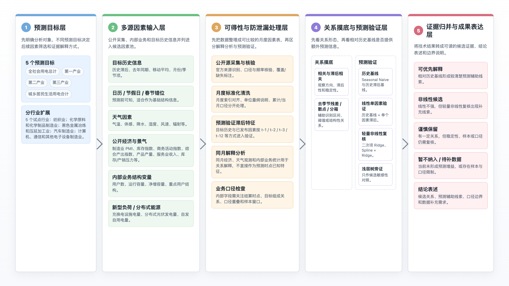
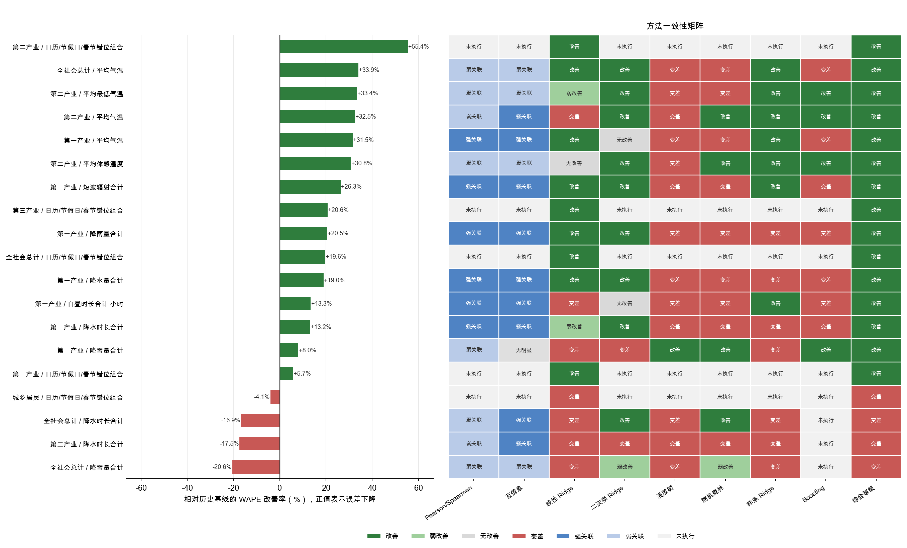
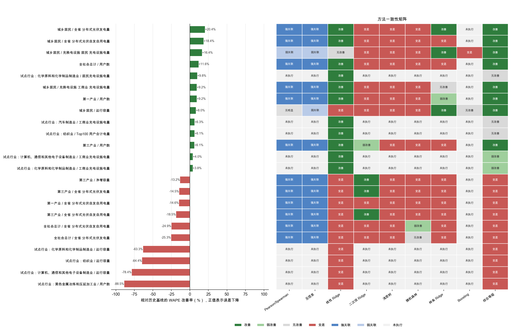
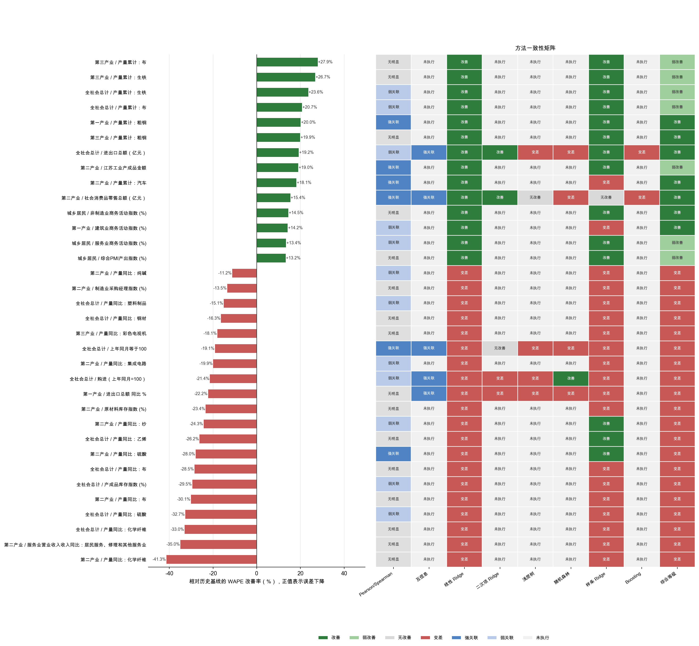
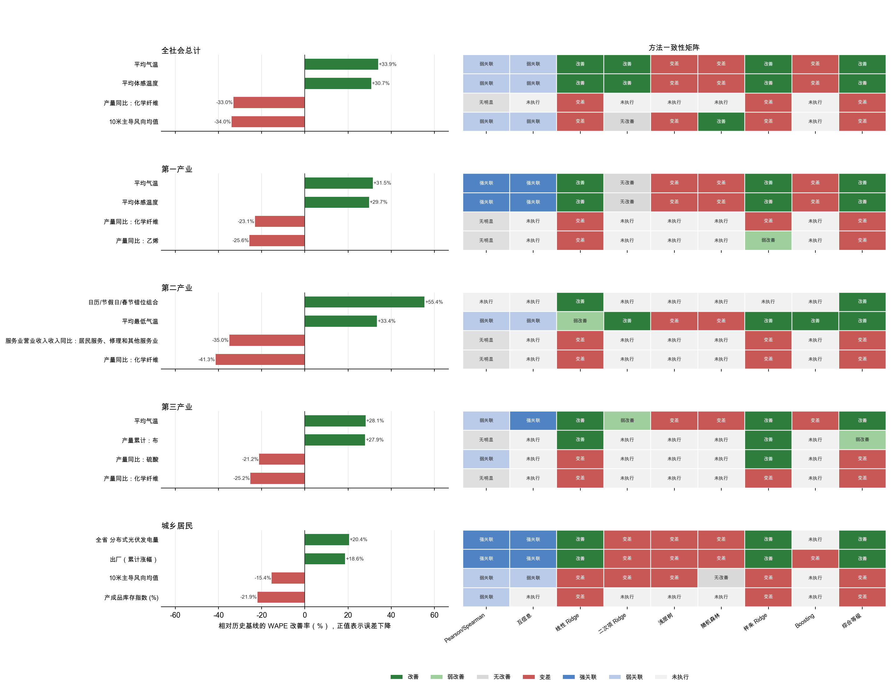
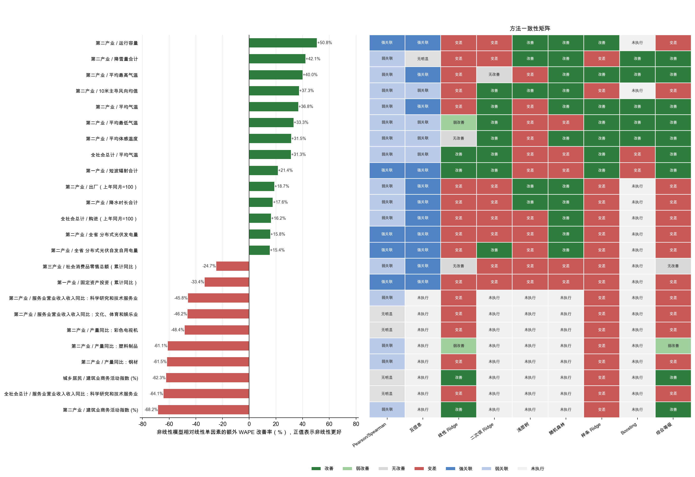

# 《国网江苏营销服务中心 2026 年基于经济因素月度售电量分析能力提升支撑服务》

## 因素分析阶段汇报

华北电力大学  
2026 年 5 月

# 目录

1. 摘要  
2. 因素分析工作的必要性  
3. 分析框架  
4. 核心发现一：日历与天气是优先候选因素  
5. 核心发现二：内部业务结构变量形成重要候选线索  
6. 核心发现三：经济与公开景气指标需要按指标筛选  
7. 核心发现四：不同预测目标的候选因素组合不同  
8. 核心发现五：非线性复核用于缩小候选范围  
9. 当前边界  
10. 后续建模与数据补充建议  
11. 附录  

# 1. 摘要

本阶段因素分析的目标，是在已有月度售电量、日历、天气、公开经济景气、产业活动、内部业务结构和新型负荷等多类数据中，筛选出更值得进入后续预测原型的候选因素。本文所说的“有效”，指某个因素在当前样本和验证口径下，相对历史基线形成预测辅助证据；它不等同于因果关系，也不等同于最终上线模型输入。

总体看，当前最值得优先进入预测原型验证的是三类因素：第一，日历/春节因素和部分天气因素，这类因素逻辑清楚，且日历因素具备预测时点可知优势；第二，用户数、充电设施电量、分布式光伏发电量、自发自用电量等内部业务结构变量，这些因素在部分预测目标上形成候选预测证据，但进入正式预测前需要确认可得时间和口径边界；第三，若干具体经济和公开景气指标，如非制造业商务活动指数、服务业商务活动指数、建筑业商务活动指数、综合 PMI 产出指数等，在部分预测目标上出现候选预测辅助线索，适合按指标逐项筛选。

对于未进入前述优先候选的因素，本阶段已按逐因素基线对比完成分层。运行容量、净增容量、Top100 用户合计电量等内部业务字段，保留为分目标、分行业的候选线索；产品产量、服务业收入、价格指数、库存/产成品等外生经济指标，则按单项结果进入相应目标候选池或暂缓池。判断依据是加入该因素后是否相对目标自身历史基线改善，以及改善是否集中在特定目标或行业。

当前暂缓作为后续预测主输入的，主要是未能超过历史基线、加入后使预测变差，或只能通过同月结算数据解释历史变化的因素。后续建模需要回到具体指标、具体预测目标和具体可得时间来判断，避免用大类名称替代单项证据。

**表 1 因素筛选结论总览**

| 判断层级 | 因素或指标 | 当前建议 | 主要边界 |
| --- | --- | --- | --- |
| 优先进入预测原型候选 | 工作日数、节假日、春节窗口 | 优先验证 | 日历口径需要年度维护 |
| 优先进入预测原型候选 | 温度、体感温度、最低/最高气温、降水、辐射等天气指标 | 按预测目标筛选 | 真实预测需天气预报源或历史预报回放 |
| 优先进入预测原型候选 | 用户数、充电设施电量、分布式光伏发电量、自发自用电量 | 作为业务侧候选变量 | 需确认预测时点可得性、同月结算口径、目标组成关系 |
| 按指标复核 | 非制造业商务活动指数、服务业商务活动指数、建筑业商务活动指数、综合 PMI 产出指数 | 分目标验证 | 同属外生经济因素，但不同预测目标应验证不同指标 |
| 按行业复核 | 5 个试点行业中的日历、经济、天气、新型负荷线索 | 作为分行业扩展依据 | 仅覆盖试点行业，其他行业需补做行业级回测 |
| 暂缓主输入 | 未形成预测增益或加入后变差的因素 | 不作为当前主线 | 不等于理论上无用，后续可在数据口径调整后再验证 |

# 2. 因素分析工作的必要性

月度售电量预测不能简单把所有可获得变量一次性放进模型。短样本月度场景下，变量数量增加后，模型可能改善，也可能无增益，甚至可能变差。对于售电量预测，更关键的问题是：某个因素在预测时点能否取得，它是否能在历史售电量基线之外提供新增信息，以及这个信息能否被业务侧理解和维护。

因此，本阶段先建立历史基线，再逐项考察新增因素的贡献。历史基线用于回答“只靠目标自身历史规律能预测到什么程度”；新增因素验证用于回答“加入某个因素后，是否能在历史基线之外提供额外预测辅助”。这样的验证口径可以避免把同月相关性误读成预测能力，也可以避免把解释性较强但预测时点不可得的字段直接写入预测方案。

本报告把因素结果分为五类。正向预测证据表示加入该因素后相对历史基线有改善；非线性预测证据表示在线性关系不明显时，轻量非线性检查发现补充线索；弱线索表示已有迹象但强度不足；未形成预测增益表示当前样本和模型下没有超过历史基线；加入后变差表示当前不建议作为输入。后续所有结论均按这一证据口径阅读。

本阶段产出的重点放在候选因素清单、可得性约束和后续验证方向。先把因素筛选问题说清楚，再进入正式预测原型设计，可以减少低价值或不可用变量对后续模型的干扰。

# 3. 分析框架

本阶段分析框架可以概括为五层：预测目标层、多源因素输入层、可得性与防泄漏处理层、关系摸底与预测验证层、证据归并与成果表达层。图 1 先给出整体框架，后文再按这个逻辑解释具体发现。

  
   
  <strong>图 1 因素分析总体框架示意图</strong>

预测目标层覆盖 5 个预测目标：全社会用电总计、第一产业、第二产业、第三产业和城乡居民生活用电合计。分行业扩展部分选取 5 个试点行业进行观察，包括纺织业、化学原料和化学制品制造业、黑色金属冶炼和压延加工业、汽车制造业、计算机/通信/其他电子设备制造业。总量、分产业和居民目标用于把握当前可解释预测线索，试点行业用于观察行业差异。

多源因素输入层包括目标历史信息、日历/节假日/春节错位、天气因素、公开经济与景气指标、内部业务结构变量、新型负荷与分布式能源变量等。各类因素进入同一候选池后，再按可解释来源组织为日历、天气、工业景气、公开商务活动指数、产品产量、服务业收入、库存/产销压力、内部业务结构变量、新型负荷与分布式能源变量和目标历史信息。

可得性与防泄漏处理层主要处理三个问题。第一，不同数据需要统一到月度索引，避免频率和统计口径不一致。第二，累计口径、当月口径、指数口径和绝对量口径需要分开解释。第三，同月经济数据、天气观测和内部业务数据如果在预测时点尚不可得，只能用于解释分析，不能直接作为真实预测输入。

关系摸底与预测验证层把同月解释分析和预测验证分开。同月值用于理解关系，预测验证使用预测时点可得的滞后或前置因素。本阶段先用 Pearson / Spearman 相关、滞后相关、去趋势/去季节残差对比、分位数组、离散互信息和散点诊断做关系摸底，初步判断因素与售电量之间是否有方向、滞后或非线性迹象；随后进入回测环节，判断这些迹象能否转化为相对历史基线的预测改善。

回测分为 5 步。第一步是建立基础基线模型。最基础的参照是 seasonal naive，也就是“去年同月朴素基线”：预测某个月时，先用去年同月的售电量作为参照值。这个方法很简单，但对月度售电量很有意义，因为售电量通常具有明显季节性。随后使用历史目标滞后项、滚动均值和月份周期项构造 history baseline，并用 Ridge 回归拟合，回答“如果不加入任何新增因素，只靠售电量自己的历史规律可以做到什么程度”。如果新增因素连这些基础基线都无法改善，就不宜把它作为预测输入的重点候选。

第二步是线性单因素滞后回测，采用 Ridge 回归。通俗地说，就是在历史基线之外，每次只加入一个候选因素的滞后项，例如 `t-1`、`t-2`、`t-3` 或 `t-12`，观察误差是否下降。Ridge 回归会对系数做收缩，能在样本较短、变量波动较大的月度场景下减少过拟合。每次只加入一个因素，是为了看清这个因素本身是否提供了额外信息，避免多个因素混在一起后说不清贡献来源。缺失填补和标准化分别使用 `SimpleImputer` 和 `StandardScaler`，并且只在每个训练窗口内拟合，避免把测试月份之后的信息带入模型。

第三步是非线性单因素初筛。第一组非线性方法包括二次项 Ridge、浅层决策树和低复杂度随机森林：二次项 Ridge 使用 `PolynomialFeatures + Ridge`，用于检查“因素增加到一定程度后影响是否弯曲”；浅层决策树使用 `DecisionTreeRegressor`，用于捕捉简单阈值；低复杂度随机森林使用 `RandomForestRegressor`，用于检查多个浅层树给出的候选信号是否一致。它们共同回答一个问题：线性单因素模型没有捕捉到的关系，是否可能以较简单的非线性形式存在。

第四步是样条非线性复核，采用 `SplineTransformer + Ridge`。它把一个连续因素拆成若干平滑区间，再用 Ridge 回归拟合这些区间的变化关系。相比二次项和浅层树，样条更适合捕捉温度、体感温度、降水、库存、价格等因素可能存在的平滑非线性、阈值、饱和或分段关系，同时仍然比复杂黑盒模型更容易控制和解释，适合当前样本规模下的候选因素筛选。

第五步是浅层 boosting 敏感性对照，采用 `GradientBoostingRegressor`，只对已经出现候选线索的字段做小范围检查。它通过一组很浅的树模型逐步修正误差，用来观察某些非线性候选在另一类模型下是否仍有信号。该结果只作为旁证：如果 Ridge、二次项、浅层树或样条结果已经给出候选线索，boosting 可以帮助判断这个线索是否值得继续保留；如果 boosting 没有形成稳定增益，也不单独否定因素的业务含义。

证据归并与成果表达层把各项结果归并为正向预测证据、非线性预测证据、弱线索、未形成预测增益和加入后变差等等级，再形成分目标候选因素池。图 2 和图 3 分别从预测目标和因素主题两个角度展示当前筛选结果。

  
   
  <strong>图 2 各预测目标的因素筛选结果分布</strong>

  
   
  <strong>图 3 候选因素主题分布热力图</strong>

图 2 用于判断不同预测目标下候选、弱线索、无增益和变差因素的分布差异。图 3 只统计已经进入候选池的因素主题，颜色深浅表示候选数量，不代表单个因素的预测贡献大小。两个图合起来说明：后续预测原型不宜使用一套固定因素覆盖所有目标，应按预测目标分别配置候选池。

# 4. 核心发现一：日历与天气是优先候选因素

日历因素是当前可得性和解释边界较清楚的一类外生结构变量。工作日数、节假日和春节窗口在预测时点可以提前确定，且在当前验证中形成正向预测证据。后续预测原型可以优先纳入工作日数、节假日、春节前后窗口、调休等结构化日历指标，但需要保证年度日历维护口径一致。

图 4 将日历与天气因素的回测结果和方法状态放在同一张图中。左侧条形表示相对历史基线的 WAPE 改善率，正值表示误差下降，负值表示误差上升；右侧矩阵同时展示相关性、互信息、线性模型、非线性模型和综合等级，便于区分“线性改善”“非线性补充”和“加入后变差”。

  
   
  <strong>图 4 日历与天气因素多方法筛选结果</strong>

图 4 显示，日历组合在多个预测目标上有改善，但居民生活用电合计并未改善；天气因素中，温度、体感温度、最低/最高气温、降水和部分辐射/光照类指标在部分预测目标上进入正向候选或非线性候选。天气对售电量的作用往往不只是线性增减，温度和体感温度可能存在阈值或区间效应，降水和辐射也可能通过农业生产、居民生活、服务活动或分布式能源出力产生影响。因此，天气因素适合进入优先候选池，但具体采用哪些天气指标，需要按预测目标筛选。

从预测目标看，全社会用电总计、第一产业和第三产业均有天气相关候选线索。全社会用电总计中，最低气温、有效天数、体感温度、最高气温、平均气温、白昼时长等指标值得关注；第一产业中，体感温度、最低/最高气温、平均气温、降水和降雨等指标更突出；第三产业中，天气线索也与服务活动、城市运行和居民出行场景有一定关系。第二产业和居民生活用电合计也可保留天气候选，但当前不宜只用天气解释所有目标。

天气因素进入真实预测前，还需要补齐天气预报源或历史预报回放。当前验证更多使用滞后天气观测，能够说明天气变量有预测辅助潜力；实际预测时不能默认知道未来天气观测值。后续建议将天气预报数据源、历史预报可回放口径和异常天气标记一并纳入数据准备。

# 5. 核心发现二：内部业务结构变量形成重要候选线索

内部业务结构变量是本阶段需要重点保留的一类候选线索。用户数、运行容量、净增容量、充换电设施电量、分布式光伏发电量、自发自用电量、Top100 用户合计电量等字段，更接近售电业务自身结构。当前结果显示，用户数、充电设施电量、分布式光伏发电量和自发自用电量等变量已在部分预测目标上形成候选预测证据。它们适合进入后续候选池，但进入正式预测原型前，需要先过可得性和口径边界检查。

图 5 将内部业务结构变量的改善率和方法状态合并展示。它同时保留全省预测目标和 5 个试点行业的结果，能够看出哪些字段在当前验证中形成改善，哪些字段虽然有业务含义但加入后反而变差。

  
   
  <strong>图 5 内部业务结构变量多方法筛选结果</strong>

**表 2 内部业务结构候选变量与口径要求**

| 变量类别 | 代表变量 | 当前判断 | 入模与口径要求 |
| --- | --- | --- | --- |
| 用户基础 | 用户数 | 已在部分预测目标上形成候选预测证据 | 需确认预测时点可得性，避免使用同月统计结果 |
| 容量基础 | 运行容量 | 作为分目标线索呈现 | 若为同步统计值，预测验证使用滞后项；入模前确认与售电量目标的口径关系 |
| 容量变化 | 净增容量 | 短样本谨慎线索 | 使用时保留样本窗口、统计口径和滞后规则 |
| 新型负荷 | 充换电设施电量 | 已在部分预测目标上形成候选预测证据 | 需确认是否与目标售电量存在组成关系 |
| 分布式能源 | 分布式光伏发电量、自发自用电量 | 已在部分预测目标上形成候选预测证据 | 方向可能正负并存，需区分发电、自用和购电口径 |
| 重点用户结构 | Top100 用户合计电量 | 行业层级候选线索 | 仅用于对应行业观察；使用时保留样本窗口和重点用户选择口径 |

用户数是当前内部业务变量中较清楚的一类候选因素。它反映用电主体规模和长期需求底座，已在部分预测目标上形成正向预测证据。运行容量和净增容量也有清楚业务含义，但当前证据强度低于用户数，更适合作为分目标线索呈现；若后续纳入预测原型，应同步保留样本窗口、统计口径和滞后规则。

充换电设施电量、分布式光伏发电量和自发自用电量体现了新型负荷与供需结构变化。充电设施电量可反映新能源汽车和交通电气化相关用电场景，分布式光伏和自发自用会改变用户侧购电、发电和售电统计口径。这类变量具备业务解释价值，但口径敏感。后续如果进入预测原型，应先确认它们与目标售电量之间是否存在组成关系或重叠统计。

5 个试点行业的结果进一步提示，行业层级的因素响应存在差异。在试点行业中，不同行业的改善线索数量不同，日历、经济和天气字段均有若干改善线索，新型负荷字段也有少量线索。当前结论只能说明 5 个试点行业的观察；推广到其他行业前，应按同一口径补做行业级回测，先看该字段加入后是否相对该行业历史基线改善，再看预测时点能否取得滞后值，最后检查短样本、重点用户口径和目标组成关系。

# 6. 核心发现三：经济与公开景气指标需要按指标筛选

经济和公开景气指标的差异主要体现在具体指标层面。制造业采购经理指数、库存指数、非制造业商务活动指数、服务业商务活动指数、建筑业商务活动指数、综合 PMI 产出指数、服务业收入、产品产量、产成品变量等，机制和统计口径差异很大。后续使用时应回到具体指标、具体预测目标和具体发布日期。

图 6 展示经济与公开景气指标的多方法筛选结果。同一类外部经济信息中，既有改善项，也有加入后变差项；同一指标在不同预测目标上的方法状态也不完全相同。因此，后续应按具体指标和预测目标筛选，不能只按大类保留或剔除。

  
   
  <strong>图 6 经济与公开景气指标多方法筛选结果</strong>

从当前结果看，非制造业商务活动指数、服务业商务活动指数、建筑业商务活动指数和综合 PMI 产出指数等公开景气指标，已经显示出若干具体指标层面的候选线索。第一产业和第三产业相关候选线索相对更多；第二产业主要形成建筑业商务活动指数相关候选线索；居民生活用电合计对部分非制造业侧景气指标出现候选线索，其中非制造业商务活动指数可作为非线性候选线索继续观察。

全社会用电总计当前没有因非制造业商务活动指数、服务业商务活动指数、建筑业商务活动指数和综合 PMI 产出指数形成强预测增益主线。这个判断只说明这些指标在总量层级下证据不集中，并不表示这些指标没有业务含义。它们更适合在第一产业、第三产业、居民侧或第二产业的少量候选方向中继续复核。

产品产量、服务业收入、价格指数和库存指标也需要按单指标解释。产品产量必须保留具体产品名和单位，不能把塑料制品、钢材、纱、彩色电视机、集成电路等不同产品混成“产品产量整体有效”。价格指数传导链条较长，方向可能不稳定。库存和产成品变量可能代表生产活跃，也可能代表销售压力，需要结合行业和月份背景解释。

本章形成的使用规则是：经济和公开景气指标进入预测原型前，应先看发布日期和滞后可用性，再看是否相对目标历史基线改善，最后看指标机制能否解释并长期维护。通过这三步后，指标才适合进入候选输入池。

# 7. 核心发现四：不同预测目标的候选因素组合不同

即使采用同一套因素池，不同预测目标上的候选因素组合也不同。图 7 按 5 个预测目标分面展示代表性改善项和变差项，并同步给出相关性、互信息、线性模型、非线性模型和综合等级。条形排序只代表当前单因素回测口径下的 WAPE 改善率，不代表最终多变量模型中的变量重要性。

  
   
  <strong>图 7 不同预测目标的候选因素组合对照</strong>

分目标看，全社会用电总计的候选线索相对分散，日历、天气、外贸、社会消费品零售总额、部分产品产量和用户数均可进入候选池。第一产业的天气线索更突出，体感温度、最低/最高气温、平均气温、降水和降雨等指标值得优先复核；建筑业商务活动指数、服务业商务活动指数、综合 PMI 产出指数和非制造业商务活动指数也有候选线索，但需要结合季节性、农村用电结构和异常月份说明一起判断。

第二产业的候选因素更偏向工业活动和少量景气指标，部分产品产量、工业增加值、制造业采购经理指数、建筑业商务活动指数等可以作为候选线索。第三产业的候选线索更多集中在天气、服务活动、消费和部分公开景气指标上，服务业商务活动指数、非制造业商务活动指数、综合 PMI 产出指数、社会消费品零售总额、服务业营业收入等指标具备继续复核价值。城乡居民生活用电合计的候选线索包括价格/成本指标、部分产品产量、库存/产销压力、建筑业商务活动指数、充电设施电量、分布式光伏发电量、自发自用电量、服务业收入、社会消费品零售总额和体感温度等。

图 7 说明，后续预测原型应采用分目标候选池。总量、第一产业、第二产业、第三产业和居民侧需要分别配置变量，并分别做消融验证。对于分行业预测，当前只覆盖 5 个试点行业，其他行业需要按同一验证口径补做行业级回测。

# 8. 核心发现五：非线性复核用于缩小候选范围

部分候选因素在线性单因素验证下不够明显，但在轻量非线性检查中出现补充线索。温度、体感温度、降水、部分价格指标和非制造业商务活动指数等，都可能存在非线性或阈值型关系。非线性复核的价值，是帮助发现线性模型可能遗漏的候选指标，并为后续复核排序提供参考。

图 8 将非线性模型相对线性单因素模型的额外 WAPE 改善率和方法状态合并展示。正值表示非线性复核带来额外改善，负值表示没有额外改善或效果变差；右侧矩阵用于区分线性、二次项、浅层树、随机森林、样条和 Boosting 的状态。

  
   
  <strong>图 8 非线性复核结果对照</strong>

非线性证据不能单独作为某个因素已经成立的证明。它需要与历史基线改善、预测时点可得性、业务解释和口径稳定性一起判断。如果某个指标只有非线性线索，但数据发布滞后、样本窗口短或机制解释不稳，仍应放在候选复核层级，暂缓进入主输入。

平滑非线性模型、浅层树模型等方法在本阶段主要承担候选复核作用。后续可以选择少量候选指标做更细的非线性复核、异常月份排查和稳健性验证，并据此更新因素分层：哪些指标进入候选池，哪些需要附加边界，哪些暂缓使用。

# 9. 当前边界

第一，预测时点可得性仍是最重要的边界。日历因素可以提前确定；公开经济和景气指标需要看发布日期；天气因素需要区分历史观测、滞后观测和未来预报。若将天气因素纳入正式预测原型，应同步设计天气预报源、历史预报回放、预报误差处理和异常天气标记。内部业务结构变量需要确认结算、统计和归档时间。同月变量可以帮助理解历史变化，但不能默认作为真实预测输入。

第二，内部业务结构变量需要确认口径边界。用户数、容量、新型负荷、分布式能源和重点用户字段与售电量目标可能存在同步统计、组成关系或口径重叠。进入正式模型前，应明确哪些字段可用滞后值，哪些字段只能用于解释分析，哪些字段需要重构统计口径。

第三，经济和公开景气指标需要逐项使用。本阶段预测验证已使用 `t-1 / t-2 / t-3 / t-12` 等滞后项，发布日期滞后本身不会否定公开指标的候选价值。进入正式预测原型时，需要按实际预测发起时点确认可用滞后阶数：若 `t-1` 指标在当时尚未发布，则改用 `t-2`、`t-3` 等更稳妥口径。累计口径、同比口径和历史修订也应按同一规则处理。非制造业商务活动指数、服务业商务活动指数、建筑业商务活动指数和综合 PMI 产出指数应按单指标进入候选池，逐项判断预测增益和适用目标。

第四，行业试点结果不能推广为全部行业规律。当前 5 个试点行业已经显示行业层级因素响应存在差异，但其他细分行业仍需要按同一口径补做行业级回测。后续分行业扩展还需要补充异常月份说明、行业口径对应关系和重点用户结构解释。

# 10. 后续建模与数据补充建议

后续建模建议采用“强基线 + 日历 + 天气 + 分目标候选指标池”的路线。先建立稳健、可解释、可滚动回测的历史基线，再加入日历和天气等高优先级因素，随后按预测目标加入内部业务结构变量、公开经济景气指标和新型负荷变量。每类因素是否保留，应通过消融验证决定。

内部业务结构变量应优先完成预测时点可得性和口径边界核验。用户数、容量、新型负荷、分布式光伏和自发自用电量等变量，需要明确结算时点、滞后规则、统计口径和目标组成关系。具备条件后，再作为正式预测原型主输入候选。

经济和公开景气指标应从少量明确候选开始复核。非制造业商务活动指数、服务业商务活动指数、建筑业商务活动指数和综合 PMI 产出指数，建议优先围绕第一产业、第三产业、居民和第二产业中的少量候选线索继续验证。总量层级当前没有形成足够集中的预测增益证据。

非线性复核可用于候选指标排序，正式模型仍以可解释、可回测的因素组合为主。后续可以选择天气温度/体感、部分公开景气指标、少量价格指标等做更细复核，重点观察是否存在稳定区间、异常月份影响和预测目标差异。

数据补充方面，建议优先补齐五类信息：天气预报源和历史预报回放；公开经济和景气指标发布日期；内部业务指标结算时间和滞后可用规则；异常月份和重大扰动说明；售电行业与公开统计指标之间的对应关系。补齐这些信息后，再进入正式预测原型的变量组合和模型治理。

# 11. 附录

## 附录 A：验证口径对照表

**表 3 验证口径对照表**

| 验证口径 | 解决的问题 | 报告中如何使用 | 口径边界 |
| --- | --- | --- | --- |
| 关系摸底 | 判断因素与目标是否存在可解释关系 | 用于理解方向和业务含义 | 不能替代预测验证 |
| 单指标回测 | 判断某个因素是否相对历史基线提供增量信息 | 形成正向预测证据、弱线索、无增益或变差判断 | 不代表最终多变量模型排序 |
| 日历验证 | 判断工作日、节假日、春节窗口是否有预测辅助 | 作为优先候选因素 | 需年度维护调休和春节口径 |
| 预测目标整合 | 比较不同目标下候选因素组合 | 支撑分目标候选池 | 单一目标结论不直接外推到所有目标 |
| 行业试点 | 观察试点行业因素响应差异 | 支撑分行业扩展方向 | 只覆盖 5 个试点行业 |
| 非线性复核 | 补查线性验证可能遗漏的候选指标 | 用于候选排序和后续复核 | 不单独证明因素稳定有效 |

## 附录 B：候选因素与数据补充清单

**表 4 候选因素与数据补充清单**

| 类别 | 当前建议 | 数据补充项 | 入模与口径要求 |
| --- | --- | --- | --- |
| 日历/春节 | 优先进入基础候选 | 年度节假日、调休、春节窗口维护 | 不同目标方向可能不同 |
| 天气 | 优先按预测目标筛选 | 天气预报源、历史预报回放、异常天气标记 | 不能使用未来已发生观测值 |
| 内部业务结构变量 | 作为业务侧重点候选 | 字段结算时点、滞后可用规则、目标组成关系 | 防止同月统计和口径重叠 |
| 新型负荷与分布式能源 | 作为谨慎候选 | 充电设施、分布式光伏、自发自用口径说明 | 方向可能正负并存 |
| 经济与公开景气 | 按具体指标复核 | 发布日期、累计/当月/同比口径说明 | 以单项证据为准，避免大类合并判断 |
| 产品产量 | 按产品和行业复核 | 产品单位、累计值与同比口径、行业对应关系 | 保留具体产品和单位口径 |
| 试点行业扩展 | 保留行业差异观察 | 其他行业级回测、异常月份说明 | 当前只覆盖 5 个试点行业 |
