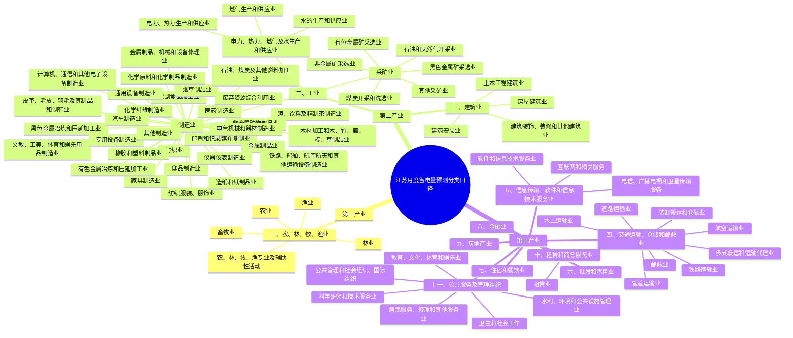

# 江苏省月度售电量分产业、分行业预测新增思路咨询报告

## 报告定位与核心结论

### 报告定位

本报告面向江苏省月度售电量分产业、分行业预测任务，采用“文献综述 + 咨询建议”的写法：文献用于提供证据基础，最终落到可理解、可采纳、可执行的建模建议。

报告不是讲稿，也不是纯学术论文，不按汇报时长或文献学科分类组织，而按甲方问题和项目决策组织。报告不追求穷尽所有电力预测文献，也不进行全量数据采集验证；重点回答甲方最关心的三个问题：

1. 是否存在更有前瞻性或解释力的外生变量。
2. 是否有近年新提出、且适合迁移到本项目的预测方法。
3. 是否有更适合分产业、分行业预测治理和汇报的新评估指标。

### 报告结构 v0.1

| 章节 | 要回答的问题 | 需要的证据 | 预期输出 |
| --- | --- | --- | --- |
| 第一章 项目问题与行业口径 | 本报告为什么这样组织，如何贴合江苏分产业/分行业售电量预测 | 甲方问题、项目基础数据结构、行业分类口径 | 报告边界、行业映射原则、证据使用原则 |
| 第二章 新外生变量 | 有哪些更前瞻、更有解释力的变量可以补充 | 电力预测文献、江苏产业结构、公开数据源链接 | 外生变量优先级清单与入模建议 |
| 第三章 新预测方法 | 哪些新方法适合迁移到本项目 | 近年方法文献、月度小样本适配性、可解释性和工程风险 | 稳健主线、低成本增强、前沿探索三层方法建议 |
| 第四章 新评估指标 | 如何更合理评价分产业/分行业预测 | 指标文献、模型治理需求、甲方汇报场景 | 主指标、辅助指标、稳健性和区间预测指标组合 |
| 第五章 综合建议与落地路线 | 这些变量、方法和指标如何进入下一阶段实施 | 前四章结论、数据可得性、建模成本和风险判断 | 分阶段实施路线和优先级 |

### 建议先行结论

待正文完成后，本节用 3-5 条结论先回答甲方问题。建议采用如下表达方式：

- 外生变量方面：优先补充具有领先性的经济景气、产业链、外贸物流、金融信用、天气日历变量。
- 预测方法方面：建议形成“可解释基线 + 机器学习主模型 + 前沿模型试验线”的组合，而不是直接押注单一新模型。
- 评估指标方面：建议从单一 MAPE 转向“加权误差 + 跨行业可比误差 + 方向命中 + 区间预测指标”的组合。

## 第一章 项目问题与行业口径：先明确报告边界，再讨论新增思路

### 本章要回答的问题

本章回答“这份报告到底要解决什么问题，以及为什么采用当前行业口径”。它不是正式展开变量、模型和指标，而是先说明报告边界：我们要服务的是江苏省月度售电量分产业、分行业预测，不是泛泛讨论电力负荷预测，也不是逐行业穷尽所有文献。

### 写作主线

- 先把甲方需求转译成三个可回答的问题：新外生变量、新预测方法、新评估指标。
- 再说明本项目的数据口径来自项目基础数据，覆盖总量、第一产业、第二产业、第三产业、制造业 31 类、重点细分行业和服务业门类。
- 最后说明文献证据的使用方式：文献不一定能细到每个江苏售电行业，因此采用“文献机制证据 + 江苏产业链映射 + 数据可得性判断”的方法。

### 本章需要的证据

| 证据类型 | 具体材料 | 用途 |
| --- | --- | --- |
| 甲方需求 | 当前任务文件中的三个问题 | 证明报告围绕甲方问题组织，而不是按文献类型堆砌 |
| 数据口径 | `data/项目基础数据-0509_结构说明.md` | 说明行业分类边界和可映射层级 |
| 既有任务口径 | 老板已确认的咨询式报告、数据源深度、行业粒度、协作方式 | 约束报告写法和交付深度 |
| 文献证据池 | `papers for reference` 及逐篇提炼表 | 为后三章提供证据来源 |

### 行业映射原则

本报告不要求每篇文献都精确对应到江苏基础数据中的每一个细分行业。更可行的做法是按产业链和用电机理建立映射关系：

- 面向总量和第一产业、第二产业、第三产业：优先使用宏观经济、天气日历、金融信用和消费服务类变量。
- 面向第二产业和制造业：优先使用 PMI、工业增加值、制造业投资、外贸、产业链库存/价格/产量等变量。
- 面向重点制造业细分：围绕钢铁、水泥、化工、汽车、新能源车、光伏设备、电子通信等构造产业链代理变量。
- 面向第三产业：重点关注交通物流、批发零售、住宿餐饮、信息服务、房地产和公共服务相关变量。
- 面向居民和新型负荷：关注天气、节假日、分布式光伏、充换电设施等结构性因素。

### 项目分类口径示意

下图基于项目基础数据中的售电量、户数、运行容量等表的共同纵向分类口径，先统筹展示第一产业、第二产业、第三产业、行业大类和主要二级类目。后续外生变量映射、全局模型行业编码、层级预测和分组评估均可沿用这一口径。

### 本章输出

- 报告边界说明。
- 行业映射原则。
- 证据使用原则。
- 后续三章的证据需求清单。

## 第二章 新外生变量：从宏观经济同步指标转向领先型产业链信号

### 本章要回答的问题

本章回答“除了已有经济变量，还能补充哪些更前瞻、更有解释力的变量”。重点不是罗列变量，而是说明变量为什么可能领先售电量、对应哪些产业或行业、数据是否容易获取，以及如何进入模型。

### 本节结论 v0.8

江苏月度售电量预测的外生变量不应只停留在 GDP、工业增加值等宏观同步指标上，而应形成“天气日历控制项 + 经济景气领先项 + 产业链行业项 + 结构口径修正项”的组合。文献证据显示，天气和春节错位是国内月度电力需求预测中最稳定、最可解释的基础控制变量；分行业预测还需要行业聚类、产业链上下游指标和经济景气指标来捕捉不同产业的变化机制。对本项目而言，P0 变量应优先选择未来可知、公开可得、解释链条清楚、能按行业映射的变量；金融信用、港口物流、文旅客流等变量可以保留为 P1/P2，但必须先核验连续月度数据入口和领先期。

### 本节建议

1. 优先把天气日历变量做成基础控制模块，包括工作日数、月天数、春节前后影响天数、1-3 月占季比修正、CDD/CDM、HDD/HDM 和极端高低温天数。这类变量未来可知或短期可预测，且已有江苏/国内月度电力需求文献直接支撑，适合作为所有行业模型的共同底座。证据：EV-009、EV-017、EV2-001、EV2-004、EV2-006。
2. 对第二产业和制造业，优先补充 PMI、新订单、生产指数、工业增加值、制造业投资、重点行业增加值等经济景气变量。它们不一定都严格领先售电量，但具备较强解释力和公开可得性，适合做 P0/P1 变量并通过 0-2 个月滞后回测确认领先期。证据：EV-002、EV-016、EV-018、EV2-005、EV2-008、EV2-023。
3. 对重点制造业和服务业，不建议只用宏观变量“一把尺子量到底”，应按产业链构造行业外生变量。汽车、电子、光伏、电气机械、钢铁、化工、批发零售、交通运输等行业，可以用上下游行业售电、产量、库存、价格、外贸和物流指标做时差相关筛选。证据：EV2-002、EV2-003、EV2-009、EV2-024。
4. 将分布式光伏、充电设施电量、户数、运行容量、净增容量、Top100 用户合计电量、业扩报装等甲方已有结构变量纳入解释框架。它们的价值不只是提高误差精度，也能解释“售电量口径变化”和“行业结构变化”。证据：EV-035、EV2-007、EV2-021，另含项目迁移判断。
5. 对金融信用、港口吞吐量、文旅客流、政策事件等变量保持探索态度。可以进入附录和候选池，但在正文中不要写成确定可用的主变量；只有当连续月度来源、发布滞后和行业映射都可验证后，再升级为 P1 或 P0。证据：EV-024、EV-025、EV2-007、EV2-020、EV2-024。

### 本章需要的证据

| 证据类型 | 具体材料 | 用途 |
| --- | --- | --- |
| 文献证据 | 月度电力消费预测、外生变量影响、特征工程与变量选择相关文献 | 证明外生变量确实能改善或解释电力预测 |
| 项目口径 | 基础数据行业结构和重点行业 | 将变量映射到产业、行业或重点细分 |
| 数据源链接 | 江苏统计、国家统计、商务/海关、天气、物流、金融信用等公开来源 | 判断变量是否容易获取和是否适合项目落地 |
| 建模逻辑 | 滞后项、同比/环比、移动平均、事件哑变量、行业映射 | 说明变量如何进入模型 |

### 写作主线

- 先说明月度售电量预测为什么需要外生变量：售电量不仅有季节性，也受生产、投资、出口、天气和日历扰动影响。
- 再区分三类变量：已常用变量、建议优先补充变量、可作为探索或解释的变量。
- 最后给出变量纳入模型的方式：滞后项、同比/环比、移动平均、行业映射、事件哑变量。

### 建议小节

#### 经济景气与订单类领先指标

候选变量包括 PMI、新订单指数、生产指数、原材料库存、供应商配送时间等。重点论证其对制造业、第二产业用电的领先解释力。

#### 重点产业链活动指标

候选变量包括钢铁、水泥、化工、汽车、电子、光伏、新能源车等产业链的产量、库存、价格、开工率或行业景气数据。重点映射到江苏制造业细分行业。

#### 外贸、物流与港口指标

候选变量包括进出口、机电产品出口、新三样出口、港口货物吞吐量、集装箱吞吐量等。重点解释江苏外向型制造和交通运输仓储行业用电。

#### 金融信用、投资与房地产链指标

候选变量包括企业中长期贷款、制造业中长期贷款、社融、制造业投资、基建投资、房地产开发投资、施工/竣工等。重点解释生产扩张和建材链条用电。

#### 天气、日历与事件控制变量

候选变量包括高温/低温度日、极端天气天数、工作日数量、春节错位、重大政策或特殊事件等。重点作为结构性控制变量，提高异常月份解释能力。

### 本章输出表

本章正文应从附录 A 中筛选 P0/P1 变量展开，不需要把所有候选变量都写进正文。每个进入正文的变量必须至少回答四件事：为什么可能影响售电量、适配哪些行业、数据是否容易获得、如何进入模型。

| 变量类别 | 候选变量 | 预测逻辑 | 适配产业/行业 | 领先性判断 | 数据可得性 | 入模方式 | 推荐级别 |
| --- | --- | --- | --- | --- | --- | --- | --- |
| 待填 | 待填 | 待填 | 待填 | 领先/同步/滞后/不确定 | 易获取/需整理/需第三方/需甲方提供 | 滞后项/同比环比/移动平均/事件哑变量/行业映射 | P0/P1/P2/P3 |

## 第三章 新预测方法：从单序列建模转向多行业共享、可解释和风险表达

### 本章要回答的问题

本章回答“哪些新方法适合迁移到江苏月度售电量预测”。判断标准不是模型是否足够新，而是是否适合月度、小样本、多行业、可解释、可汇报的项目场景。

### 本节结论 v0.8

本项目的方法路线不宜被“最新模型”牵着走。江苏月度售电量分产业、分行业预测的核心约束是月度样本短、行业序列多、外生变量多、甲方需要解释，因此稳健路线应是“可解释统计基线 + 特征工程和变量消融 + 树模型增强 + 行业分组/全局模型 + 层级一致性治理”。TimeGPT、Chronos、TimesFM、Moirai 等时间序列基础模型，以及深度多模态模型，已有前沿证据但与省级月度售电量仍有距离，更适合做对照实验和创新储备，不应写成第一阶段主模型承诺。

### 本节建议

1. 先建立强基线，再谈新模型。建议把季节 naive、ETS、ARIMA/SARIMAX、动态回归、可解释回归 + AR 修正作为稳健主线，用它们衡量外生变量是否真的带来增益。证据：EV-028、EV-029、EV-030、EV2-001、EV2-005。
2. 第一阶段机器学习增强优先选树模型和特征治理，而不是直接上复杂深度模型。Random Forest、XGBoost、LightGBM、CatBoost 可以处理滞后特征、行业编码和外生变量交互；但必须配套 SHAP、LOFO/FLOFO 或变量消融，否则容易变成不可解释的变量堆叠。证据：EV-014、EV-015、EV-031、EV2-003、EV2-008。
3. 针对分行业月度小样本，建议引入行业聚类、分组模型和全局模型。先用行业周期性、曲线相似度和业务分类给行业分组，再在相似行业之间共享信息；这比每个细分行业单独建模更符合样本条件。证据：EV2-002、EV2-009，另含项目迁移判断。
4. 对省级、第一产业、第二产业、第三产业和行业层级结果，必须增加层级一致性检查。短期可以先做 bottom-up/top-down 对照和加总误差诊断，后续再尝试 MinT/reconciliation；月度样本短时不要一开始就把复杂 reconciliation 写成必选。证据：EV2-010、EV2-011、EV2-012。
5. 前沿模型只作为探索线。TimeGPT、Chronos、TimesFM、Moirai、可解释多模态模型、概率区间模型可以放入创新储备，但使用前必须和本地强基线滚动回测比较，并说明其外生变量支持、解释性、工程成本和数据频率差异。证据：EV2-013、EV2-014、EV2-015、EV2-019、EV2-020、EV2-022。

### 本章需要的证据

| 证据类型 | 具体材料 | 用途 |
| --- | --- | --- |
| 方法文献 | 统计模型、机器学习、深度时序、基础模型、概率预测和层级预测相关文献 | 说明方法新意和适用边界 |
| 项目约束 | 月度样本短、行业序列多、外生变量多、需要解释和汇报 | 判断方法是否适合迁移 |
| 对照基线 | SARIMAX、动态回归、树模型等可落地基线 | 避免只追逐新模型而缺少可验证主线 |
| 风险判断 | 数据量、工程成本、可解释性、甲方接受度 | 给出主线/增强/探索分层 |

### 写作主线

- 先说明本项目方法选择的约束：月度样本短、行业序列多、外生变量多、甲方需要解释和治理。
- 再按落地优先级组织方法，而不是按算法复杂度组织。
- 最后形成建议技术路线：基线模型、主模型、探索模型、治理机制。

### 建议小节

#### 可解释统计基线：动态回归与 SARIMAX

用于建立透明、可复核的基准结果，也便于比较新增外生变量是否真正改善预测。

#### 机器学习主模型：树模型与可解释特征贡献

以 LightGBM、XGBoost、CatBoost 等为代表，适合处理非线性、滞后特征、行业编码和外生变量，并可通过 SHAP 或特征消融解释变量贡献。

#### 全局模型与多任务学习：缓解分行业月度小样本问题

将多个行业序列共同建模，通过行业标签、产业层级、历史滞后和外生变量共享信息，避免每个行业单独建模时样本不足。

#### 深度时序与基础模型：作为前沿试验线

关注 PatchTST、iTransformer、TFT、TimeGPT、Chronos、TimesFM、Moirai 等方法。建议定位为对照试验或创新储备，不在初期承诺一定优于稳健模型。

#### 概率预测与层级预测：服务风险表达和口径一致

概率预测用于输出预测区间，层级预测用于保证省级、产业、行业之间的加总关系一致。

### 本章输出表

本章正文应从附录 B 中筛选 P0/P1 方法展开，并明确“主线方法”和“探索方法”的差别。不能因为方法新就直接推荐，必须说明它是否适合月度、小样本、多行业和可解释汇报。

| 方法层级 | 方法类别 | 代表方法 | 解决的问题 | 适配本项目的理由 | 数据与工程要求 | 主要风险 | 建议定位 |
| --- | --- | --- | --- | --- | --- | --- | --- |
| 待填 | 统计/机器学习/深度时序/基础模型/概率预测/层级预测 | 待填 | 待填 | 月度/小样本/多行业/可解释/可汇报 | 低/中/高 | 待填 | 稳健主线/低成本增强/前沿探索/暂不建议 |

## 第四章 新评估指标：从单一误差率转向分层、加权和可治理的指标体系

### 本章要回答的问题

本章回答“如何更合理评价分产业、分行业月度售电量预测”。重点解释为什么单一 MAPE 容易误导，以及如何构建适合甲方汇报、模型选择和后续治理的指标组合。

### 本节结论 v0.8

本项目不能继续只用单一 MAPE 判断模型好坏。分产业、分行业售电量预测同时面对行业规模差异、低电量行业、春节和极端天气异常月、总分层级一致性以及后续风险表达需求，因此指标体系应分成四层：甲方汇报看 WAPE/加权 MAPE，模型选择看 MAE、RMSE、MASE/RMSSE，模型治理看 Bias、方向命中率、分组误差和层级一致性，前沿探索再看 Pinball Loss、区间覆盖率和 CRPS。这样既能给老板一个清楚的总体误差，也能定位模型在哪些行业、月份和层级上失效。

### 本节建议

1. 甲方汇报主指标建议使用 WAPE/加权 MAPE，而不是普通 MAPE。WAPE 更贴合售电量规模口径，能避免小行业百分比误差过度影响总体判断；但它会偏重大行业，因此仍需配合行业分组误差。证据：EV-032、EV2-017。
2. MAPE 可以保留为辅助指标，但不能单独用于模型选择。低电量行业、接近零的分母和跨行业规模差异会让 MAPE 失真；建议引入 MASE/RMSSE 判断模型是否优于季节 naive 基线。证据：EV2-016、EV2-017。
3. 模型选择需要同时看 MAE、RMSE 和缩放误差。MAE 便于解释平均误差规模，RMSE 用于识别大偏差，MASE/RMSSE 用于跨行业比较；三者共同使用比单一误差率更稳健。证据：EV-011、EV-021、EV-032、EV2-016。
4. 模型治理必须增加分组诊断，包括春节月、高温月、低温月、异常事件月、重点行业和不同预测期。文献已经显示春节、天气、异常月份会显著影响误差，仅看全年平均误差会掩盖模型短板。证据：EV-010、EV-017、EV-023、EV2-001、EV2-004。
5. 如果后续输出区间预测，应同步建立 Pinball Loss、区间覆盖率、区间宽度和 CRPS。当前阶段可先作为探索指标预留，不要求全行业铺开；更适合先在总量、第二产业和重点行业试点。证据：EV2-018、EV2-019、EV2-020。

### 本章需要的证据

| 证据类型 | 具体材料 | 用途 |
| --- | --- | --- |
| 指标文献 | MAPE、WAPE、MASE/RMSSE、Pinball Loss、CRPS、区间覆盖率等指标资料 | 说明不同指标解决什么问题 |
| 项目场景 | 总量、产业、行业、重点细分和异常月份 | 判断指标是否适合分层评价 |
| 汇报需求 | 甲方需要看总体效果、行业公平性、趋势判断和风险区间 | 形成可解释的指标组合 |
| 验证方式 | 时间滚动回测、分组回测、层级一致性检查 | 说明指标如何用于模型治理 |

### 写作主线

- 先指出单一 MAPE 的局限：低基数行业不稳定、不能体现行业权重、无法评价趋势方向和区间预测。
- 再将指标分为三类：甲方汇报指标、模型选择指标、风险治理指标。
- 最后给出建议采用的指标组合和解释口径。

### 建议小节

#### 甲方汇报指标：WAPE 与售电量加权误差

用于回答整体预测误差是否可控，避免小行业异常值过度放大总体判断。

#### 模型选择指标：MAE、RMSE、MASE/RMSSE

用于滚动回测中的模型比较，兼顾误差规模、异常惩罚和跨行业可比性。

#### 趋势研判指标：同比和环比方向命中率

用于评价模型是否能判断增长或下降方向，服务经营分析和趋势沟通。

#### 分组稳健性指标：行业、月份和异常场景拆分

按产业、行业大类、春节月份、高温月份、旺淡季、异常月份分别评估，判断模型是否只在平均意义上表现良好。

#### 概率预测指标：覆盖率、Pinball Loss 与 CRPS

若后续引入区间预测，应评价预测区间是否既覆盖真实值，又不过宽。

### 本章输出表

本章正文应从附录 C 中筛选主推指标和辅助指标，形成一套可用于甲方汇报、模型选择和模型治理的组合，而不是罗列指标公式。

| 指标层级 | 指标类别 | 指标 | 适用对象 | 解决的问题 | 主要局限 | 汇报解释方式 | 建议定位 |
| --- | --- | --- | --- | --- | --- | --- | --- |
| 待填 | 点预测/相对误差/加权误差/方向判断/分组稳健性/概率预测/层级一致性 | 待填 | 总量/产业/行业/异常月份/区间预测 | 待填 | 待填 | 待填 | 主指标/辅助指标/诊断指标/探索指标 |

## 第五章 综合建议与下一步落地路线

### 推荐技术路线

建议最终形成三层路线：

1. 稳健主线：统计基线 + 树模型 + 外生变量筛选。
2. 增强路线：全局模型、层级预测、滚动回测指标体系。
3. 探索路线：基础模型、深度时序模型、概率预测。

### 后续建模优先级

| 优先级 | 建议事项 | 原因 | 预期产出 |
| --- | --- | --- | --- |
| P0 | 建立滚动回测与 WAPE/MASE 指标框架 | 先保证模型比较口径稳定 | 基线评估表 |
| P1 | 补充 PMI、投资、外贸、天气日历变量 | 数据相对可得，解释链条清楚 | 外生变量增强版特征表 |
| P2 | 尝试全局树模型和行业编码 | 适合多行业小样本 | 主模型候选 |
| P3 | 试验基础模型和概率预测 | 体现前沿性和风险表达 | 创新对照结果 |

### 本章需要的证据

| 证据类型 | 具体材料 | 用途 |
| --- | --- | --- |
| 前四章结论 | 外生变量、方法、指标的推荐分级 | 形成综合路线 |
| 数据可得性 | 数据源链接和获取难度 | 判断哪些建议能立即推进 |
| 工程成本 | 模型复杂度、解释成本、验证成本 | 排序实施优先级 |
| 项目目标 | 甲方分产业/分行业月度预测需求 | 避免建议脱离项目交付 |

## 附录 A：外生变量候选清单

### A.1 填表规则与 v0.8 口径

- `变量类别` 用于报告结构分组，不追求细到每个行业。
- `预测逻辑` 必须写成一句可解释的话，避免只写“相关”。
- `适配口径` 优先贴合项目基础数据：总量、第一产业、第二产业、第三产业、制造业 31 类、重点细分、服务业、新型负荷。
- `领先性判断` 可以先写“理论领先/经验同步/不确定”，后续用回测验证。
- `数据源链接` 只放容易获取的来源；难以获取的数据写清楚获取难度即可。
- `推荐级别` 统一使用 P0/P1/P2/P3：P0 进入正文主线，P1 正文支撑，P2 附录探索，P3 暂低优先。

### A.2 外生变量候选表 v0.8

| 变量类别 | 候选变量 | 变量含义/构造方式 | 预测逻辑 | 适配口径/行业 | 领先性判断 | 数据源或来源类型 | 数据源链接 | 获取难度 | 纳入模型方式 | 证据来源/支撑文献 | 推荐级别 | 备注 |
| --- | --- | --- | --- | --- | --- | --- | --- | --- | --- | --- | --- | --- |
| 历史售电与自回归 | 历史售电量滞后项 | 滞后 1/2/3/12 月、去年同月、滚动均值、同比、环比 | 售电量具有强季节性和自相关，是判断外生变量是否真正增益的基准 | 全社会、第一产业、第二产业、第三产业、制造业 31 类、服务业、居民 | 已知变量 | 甲方已有售电量表 | 无需外部链接 | 易获取 | 滞后项、同期项、滚动均值、同比环比 | EV-001、EV-011、EV-021、EV-028 | P0 | 所有模型底座，不作为“新增变量”宣传 |
| 时间日历 | 月份、季度、月天数、工作日数 | 月份/季度 dummy、自然天数、工作日数、周末数、周期编码 | 解释固定季节波动和不同月份长度、工作日结构造成的售电量差异 | 全部行业，尤其第二产业、第三产业、居民和季节性工业 | 未来已知 | 日历、项目时间索引 | 无需外部链接 | 易获取 | 月份固定效应、周期编码、工作日计数、交互项 | EV-001、EV-009、EV-021、EV2-001 | P0 | 需和春节错位变量分开 |
| 天气日历事件 | 春节错位、春节前后影响天数、1-3 月占季比 | 春节所在月、距月初天数、节前/节后影响天数、1-3 月售电量占季比 | 春节移动会造成生产停复工和消费服务活动跨月错位，普通月份哑变量难以吸收 | 第二产业、制造业、建筑链、物流、批发零售、住宿餐饮、居民 | 未来已知 | 国务院节假日安排、公开日历 | 无需外部链接 | 易获取 | 春节错位 dummy、节前节后计数、1-3 月后处理、行业交互项 | EV-009、EV-017、EV2-001、EV2-004、EV2-006 | P0 | 国内月度售电预测必做，建议单独做春节月误差诊断 |
| 天气日历事件 | CDD/CDM、HDD/HDM、高温/低温天数 | 基于日最高/最低/均温构造制冷度、采暖度、极端高低温天数 | 温度影响空调、电采暖和部分生产负荷，度日指标比简单均温更贴近用电机理 | 总量、居民、第三产业、公共服务、数据中心、部分制造业 | 同步/短期预测可得 | 天气 API、气象站、公开历史天气 | https://open-meteo.com/en/docs/historical-weather-api | 需整理 | CDD/HDD、双阈值温度分段、月度聚合、行业交互项 | EV-007、EV-009、EV-022、EV-027、EV2-001 | P0 | 真实预测时需区分天气预报值和历史回放值 |
| 天气日历事件 | 湿度、热指数、湿球/露点、高温高湿天数 | 将温度与湿度合成为体感热或潜热需求指标 | 江苏夏季湿热，高湿会放大空调、除湿和公共服务用电需求 | 居民、商业、公共服务、住宿餐饮、数据中心等 | 同步/短期预测可得 | 天气 API、气象站 | https://open-meteo.com/en/docs/historical-weather-api | 需整理 | 热指数、湿球温度、高温高湿天数、与 CDD 组合入模 | EV-008、EV-009、EV-010、EV2-001 | P1 | 第一批可与 CDD/HDD 同步构造 |
| 行业结构 | 行业周期标签、行业相似度、行业聚类标签 | 基于分行业售电曲线的周期性、趋势性、波动性和相似度构造行业标签 | 相似行业共享用电规律，能缓解单行业月度样本短和噪声大的问题 | 制造业 31 类、服务业门类、重点行业 | 已知/随样本更新 | 甲方已有分行业售电量表 | 无需外部链接 | 易获取/需建模整理 | 行业标签、聚类编号、全局模型行业编码、分组建模 | EV2-002、EV2-010 | P0 | 是分行业预测的组织变量，不是外部数据 |
| 经济景气 | PMI、生产指数、新订单指数、供应商配送时间 | 制造业 PMI 分项指标，按月发布，可取当月、滞后、扩张收缩状态 | PMI 反映制造业生产和订单景气，可能领先第二产业和制造业售电变化 | 第二产业、制造业、装备制造、电子、电气机械、汽车等 | 理论领先/经验同步 | 国家统计局、江苏经济运行信息 | https://www.stats.gov.cn/sj/zxfbhjd/202604/t20260430_1963473.html | 易获取/需整理 | 滞后 0-2 月、环比变化、扩张收缩 dummy、行业映射 | EV-002、EV-011、EV-018、EV-022、EV2-023 | P0 | 需回测全国 PMI 与江苏行业售电的贴合度 |
| 经济景气 | 工业增加值、服务业增加值、重点行业增加值 | 月度或进度经济产出指标，优先使用同比增速和累计增速拆解 | 用电需求与实际生产、服务活动强相关，是解释工业和第三产业售电的核心变量 | 第二产业、制造业 31 类、第三产业、公共服务 | 经验同步/可能滞后 | 江苏统计局、江苏省政府经济运行简况 | https://tj.jiangsu.gov.cn/col/col90203/index.html；https://www.jiangsu.gov.cn/art/2025/6/20/art_34151_11586355.html | 易获取/需整理 | 同比、环比、累计转当月、滞后项、行业映射 | EV-004、EV-016、EV-018、EV-021、EV2-005、EV2-008、EV2-023 | P0 | 发布滞后时更适合做滞后预测或解释 |
| 产业链活动 | 上下游行业售电、重点产品产量、库存、价格、开工率 | 钢铁、水泥、玻璃、化工品、汽车、新能源车、光伏、电子等产业链指标 | 行业售电受上下游需求、订单、库存和价格景气影响，产业链指标比宏观总量更贴近细分行业 | 钢铁、水泥、玻璃、化工、汽车、电气机械、光伏设备、电子通信、批发零售 | 理论领先/经验同步 | 官方统计、行业协会、公开平台、第三方数据库 | 江苏统计进度数据、行业协会公开月报、第三方数据库（按行业选源） | 需整理/需第三方 | 同比环比、价格指数、库存变化、行业映射、时差相关筛选 | EV-015、EV-016、EV-018、EV2-003、EV2-009 | P1 | 首批建议覆盖江苏重点制造链条，领先期必须回测 |
| 外贸物流 | 进出口、机电产品出口、新三样出口 | 江苏进出口总额、机电产品出口、新能源车/锂电/光伏等出口指标 | 外向型制造订单和出口交付会影响制造业开工和售电需求 | 计算机通信电子、电气机械、汽车、通用/专用设备、港口物流 | 理论领先/经验同步 | 南京海关、商务统计月报、政府新闻发布 | https://shtb.mofcom.gov.cn/hszsw/art/2026/art_78de7c5ade5145f3bc98f6129f1a061f.html | 易获取/需整理 | 滞后 0-2 月、同比环比、出口结构映射到行业 | EV-003、EV-018、EV-021、EV2-003、EV2-024 | P1 | 推荐进入正文支撑，月度连续入口仍需核验 |
| 外贸物流 | 港口货物吞吐量、集装箱吞吐量、客货运量 | 港口、铁路、公路、航空等物流活动月度指标 | 物流活动连接外贸、制造业和交通运输仓储邮政业用电 | 交通运输仓储邮政、水上运输、港口岸电、外向型制造 | 经验同步/短期领先 | 港口物流、交通运输、统计公报 | https://js.msa.gov.cn/art/2025/10/20/art_278_1571995.html | 需核验连续入口 | 同比环比、移动平均、与外贸指标交互 | EV-003、EV-024、EV2-024 | P2 | 先列为待核验数据源，不写成稳定 P0 |
| 金融投资 | 制造业投资、基建投资、房地产开发投资、施工/竣工 | 固定资产投资及房地产链条指标 | 投资扩张影响设备制造、建材、建筑业和后续产能用电 | 建筑业、非金属矿物、水泥玻璃、通用/专用设备、电气机械 | 理论领先/经验同步 | 江苏统计局、省政府经济运行简况 | https://www.jiangsu.gov.cn/art/2025/6/20/art_34151_11586355.html | 易获取/需整理 | 同比增速、累计转当月、滞后 1-6 月、行业映射 | EV-004、EV-018、EV2-005、EV2-023 | P1 | 房地产链条需避免过度外推 |
| 金融投资 | 企业中长期贷款、制造业贷款、社融、M1/M2 | 金融信用扩张和实体融资条件指标 | 融资条件可能领先投资、生产扩张和企业开工 | 第二产业、制造业、建筑业、部分服务业 | 理论领先/不确定 | 央行、金融统计、地方金融运行材料 | https://www.zgjssw.gov.cn/yaowen/202604/t20260407_8566997.shtml | 需核验官方连续入口 | 滞后项、同比环比、扩张/收缩状态 | EV-004、EV-018、EV-020、EV2-024 | P2 | 方向和领先期必须回测确认 |
| 能源与价格 | PPI、工业品价格、煤价、天然气价、电价/代理购电价格 | 成本、价格环境和能源替代变量 | 能源和工业品价格影响生产意愿、产品景气和能源替代 | 高耗能制造、化工、钢铁、建材、电力热力燃气水 | 经验同步/不确定 | 统计局、能源价格平台、交易公告 | https://www.jiangsu.gov.cn/art/2025/6/20/art_34151_11586355.html | 需整理/需第三方 | 同比环比、滞后项、价格区间 dummy、行业映射 | EV-003、EV-018、EV-020、EV2-023 | P1/P2 | 若缺少稳定月度源，可先作解释变量 |
| 能源结构与新型负荷 | 分布式光伏发电量、自发自用电量 | 项目结构说明中已有 202201-202603 月度光伏字段 | 分布式光伏和自发自用会改变从电网购电/售电口径，不只改变真实用能需求 | 全社会、居民、工商业、分布式光伏相关行业 | 同步/结构变量 | 甲方已有分布式光伏电量表 | 无需外部链接 | 易获取 | 月度水平、占比、同比环比、售电口径修正项 | EV-018、EV-021、EV-035、EV2-021 | P1 | 重点区分“用电需求”和“售电量口径” |
| 能源结构与新型负荷 | 充电设施电量、充换电服务业 | 项目结构说明中已有充电设施电量和充换电服务业行业口径 | 新能源车渗透带来新型负荷，可能影响交通、居民和商业用电结构 | 充换电服务业、交通运输、居民、商业 | 同步/中长期领先 | 甲方已有充电设施电量表 | 无需外部链接 | 易获取 | 月度水平、同比环比、渗透趋势、情景变量 | EV-018、EV-035、EV2-021 | P1 | 可作为新型负荷专题 |
| 结构变量 | 户数、运行容量、净增容量、Top100 用户合计电量、业扩报装 | 行业用户规模、容量扩张、重点用户活动和新增负荷线索 | 用户规模、容量扩张和业扩活动能解释行业售电结构变化，并可能领先后续电量变化 | 全行业、制造业、重点细分、服务业、代理购电用户 | 同步/部分领先 | 甲方已有结构表、业扩报装系统或营销业务数据 | 无需外部链接 | 易获取/需甲方提供 | 容量/户数同比、净增容量滞后项、重点用户占比、业扩事件变量 | EV-002、EV-018、EV-021、EV2-007 | P1 | Top100 历史较短，适合重点行业解释 |
| 事件变量 | 极端天气、政策冲击、限产、重大活动、代理购电特殊事件、异常月份标签 | 人工维护事件清单或结构化事件哑变量 | 非平稳冲击会让常规趋势和季节模型失效，事件标签用于解释异常和改善鲁棒性 | 高耗能行业、服务业、居民、公共服务、异常月份 | 未来已知/事后解释并存 | 政策文件、天气预警、项目事件记录、人工标签 | 政府政策公告、气象预警、甲方事件台账或人工维护清单 | 需整理 | 事件 dummy、强度变量、样本权重、异常月份分组 | EV-012、EV-013、EV-017、EV2-007、EV2-020 | P1 | 第一阶段用结构化标签，不直接用长文本 |
| 服务业活动 | 文旅客流、酒店入住率、景区客流、人口流动、节假日活动 | 旅游/人口压力、交通客流、住宿餐饮热度等代理变量 | 服务业和居民节假日用电受人流和消费活动影响，工业主线不适用 | 住宿餐饮、批发零售、交通运输、公共服务、居民 | 同步/短期领先/不确定 | 文旅、交通、酒店、第三方移动数据 | 文旅部门公开发布、交通客运发布、第三方移动/酒店数据 | 需第三方/需整理 | 月度聚合、节假日强度、事件变量、服务业映射 | EV-024、EV-025 | P2 | 作为附录探索，不进入第二产业主线 |

## 附录 B：预测方法适配矩阵

### B.1 填表规则与 v0.8 口径

- `方法层级` 用于形成项目建议路线，而不是学术分类。
- `适配判断` 必须围绕本项目约束：月度、小样本、多行业、外生变量、可解释、可汇报。
- `建议定位` 统一为：稳健主线、低成本增强、前沿探索、暂不建议。
- 前沿模型必须写清楚风险，不能直接承诺效果优于基线。

### B.2 预测方法适配矩阵 v0.8

| 方法层级 | 方法类别 | 代表方法 | 代表文献/资料 | 解决的问题 | 适配场景 | 小样本适配性 | 多行业适配性 | 外生变量支持 | 可解释性 | 工程成本 | 验证方式 | 主要风险 | 建议定位 | 备注 |
| --- | --- | --- | --- | --- | --- | --- | --- | --- | --- | --- | --- | --- | --- | --- |
| 基线 | 朴素季节基线 | 去年同月、移动平均、季节 naive | EV-001、EV-011、EV-021 | 建立所有新变量和新模型的最低比较线 | 所有月度行业序列 | 高 | 高 | 弱 | 高 | 低 | 滚动回测、按行业/月份分组误差 | 只能外推历史季节性，无法解释结构变化 | 稳健主线 | 必须保留 |
| 基线 | 指数平滑/季节模型 | Holt-Winters、ETS | EV-011、EV-021、EV-025 | 捕捉趋势和季节性，快速形成低成本基线 | 季节性清晰、外生变量不足的行业 | 高 | 中 | 弱 | 中 | 低 | 滚动回测、与 SARIMA/回归比较 | 结构突变和外生冲击下容易失真 | 稳健主线 | 适合作为自动基线 |
| 基线 | 统计时间序列 | ARIMA、SARIMA、SARIMAX、动态回归 | EV-003、EV-011、EV-021、EV-029、EV2-005 | 在季节基线中纳入外生变量，解释变量增益 | 总量、产业、行业单序列 | 中/高 | 中 | 强 | 中/高 | 低/中 | 滚动回测、外生变量消融 | 行业多时维护成本上升，未来外生变量可得性需确认 | 稳健主线 | SARIMAX 是外生变量增强基线 |
| 基线 | 可解释回归 + AR 修正 | MLR、正则化回归、GAM、温度阈值、AR 残差修正 | EV-002、EV-007、EV-009、EV-028、EV-030、EV2-001 | 解释天气、日历、经济变量如何影响月度售电，并处理残差自相关 | 月度小样本、甲方沟通、变量贡献解释 | 高 | 中 | 强 | 高 | 低/中 | 滚动回测、残差自相关诊断、变量消融 | 非线性和变量交互可能不足；共线性需治理 | 稳健主线 | 天气、春节和异常月份解释的首选方法 |
| 基线 | 季节分解与校正 | X-12-ARIMA、年度/季度电量校正、特殊月份修正 | EV2-004、EV2-005、EV2-006 | 把月度季节性、年度总量约束和春节/特殊月份修正拆开处理 | 月度售电量、春节错位、一季度预测 | 高 | 中 | 中/强 | 中/高 | 中 | 年度约束误差、1-3 月误差、特殊月份回测 | 校正规则过强可能掩盖真实结构变化 | 稳健主线/低成本增强 | 适合 D2 后立即进入方法备选 |
| 主模型 | 树模型/梯度提升 | Random Forest、XGBoost、LightGBM、CatBoost | EV-003、EV-011、EV-014、EV-019、EV-027、EV2-008 | 处理非线性、滞后特征、行业变量和外生变量交互 | 多行业外生变量建模、重点行业预测 | 中 | 高 | 强 | 中 | 中 | 滚动回测、SHAP/特征重要性、特征消融 | 样本短时易过拟合，解释需配合 SHAP/消融 | 低成本增强 | 建议作为第一阶段机器学习主模型候选 |
| 主模型 | 特征工程与特征选择 | 滞后/滚动/差分/周期编码、wrapper、LOFO/FLOFO、SHAP、时差相关 | EV-014、EV-015、EV-031、EV2-003 | 从“堆变量”转向“变量生成、筛选和解释” | 外生变量多、行业映射复杂的场景 | 高 | 高 | 强 | 中/高 | 中 | 特征消融、训练耗时、变量稳定性检查 | 过度生成特征会增加解释成本和泄漏风险 | 稳健主线 | 这是方法治理，不是单独预测器 |
| 增强 | 行业聚类/分组模型 | 数形相似性、k-means、分组 Prophet、分组回归 | EV2-002 | 将相似行业共享规律，并对天气敏感、春节敏感行业分组建模 | 制造业 31 类、第三产业门类、重点行业 | 中/高 | 高 | 强 | 中 | 中 | 分组前后误差、行业内误差、春节月误差 | 聚类结果可能不稳定，需业务解释 | 低成本增强 | 贴合“分产业、分行业”项目场景 |
| 增强 | 全局/面板模型 | 行业编码 + 全行业联合训练、global LightGBM、multi-task 回归 | EV-018、EV-021、EV-023、EV2-002、EV2-009 | 缓解单行业月度样本短，用多行业共享信息 | 分产业、分行业、多层级序列 | 中 | 高 | 强 | 中 | 中 | 分行业滚动回测、留一行业/分组验证 | 行业差异过大时可能相互干扰 | 低成本增强 | 需和行业聚类结果联动 |
| 增强 | 层级预测与协调 | Bottom-up、Top-down、Middle-out、MinT/reconciliation | EV2-010、EV2-011、EV2-012 | 保证全省、产业、行业预测口径加总一致 | 总量、第一产业、第二产业、第三产业、行业大类、细分行业 | 中 | 高 | 中 | 中 | 中 | 层级一致性检查、加总误差、分层 WAPE | MinT 需要稳定误差协方差，小样本下估计不稳 | 低成本增强 | 先做一致性检查，再尝试简化 reconciliation |
| 增强 | 分状态/分组模型 | 季节分组、月份模型、天气状态聚类、异常月份降权 | EV-010、EV-016、EV-017、EV-027 | 处理不同季节、天气状态、冲击月份下的机制差异 | 迎峰度夏、春节错位、强季节行业 | 中 | 中 | 强 | 中 | 中 | 分组回测、异常月份误差、消融实验 | 月度样本短，分组过细会导致每组样本不足 | 低成本增强 | 控制簇数和分组粒度 |
| 增强 | 混合/集成模型 | 统计基线 + 树模型残差、模型加权平均、情景集成、因子分解机增强 | EV-011、EV-019、EV-021、EV2-006 | 结合统计模型稳定性和机器学习非线性能力 | 总量、产业、重点行业 | 中 | 中/高 | 强 | 中 | 中 | 滚动回测、残差诊断、模型权重稳定性 | 组合过多会降低可解释性 | 低成本增强 | 可作为第二阶段提升线 |
| 探索 | 灰色模型和小样本模型 | GM(1,N)、多变量灰色模型、DGGM、AWBO-DGGM | EV-016、EV-017、EV-021、EV2-009 | 在小样本、低频、强季节或异常冲击下提供备选 | 样本很短或口径变化多的细分行业 | 中/高 | 低/中 | 弱/中 | 中 | 中 | 与 ARIMA/回归滚动对比、异常期误差 | 不适合作为全项目主模型，变量扩展能力有限 | 前沿探索 | 更像备选模型库 |
| 探索 | 深度时序 | LSTM、GRU、TCN、Transformer、PatchTST、iTransformer、TFT | EV-011、EV-021、EV-033、EV2-021 | 处理复杂序列依赖和高维非线性 | 高频数据、多行业长面板或后续创新对照 | 低/中 | 中/高 | 中/强 | 低 | 高 | 滚动回测、与强基线比较、异常月份测试 | 当前月度样本短，解释和调参成本高 | 前沿探索 | 不作为 D2 稳健主线 |
| 探索 | 时间序列基础模型 | TimeGPT、Chronos、TimesFM、Moirai | EV2-013、EV2-014、EV2-015 | 零样本/小样本对照和创新展示 | 创新储备、快速 benchmark、多行业共享表征探索 | 不确定 | 中/高 | 不确定 | 低/中 | 中/高 | 与本地强基线滚动比较、zero-shot/fine-tuning 对照 | 现有证据多为通用时序或短期负荷，和省级月度售电仍有距离 | 前沿探索 | 已补证据，但只能写“探索/对照实验” |
| 探索 | 事件感知模型 | 事件 dummy、事件交互项、EventTSF 类多模态模型、特殊事件调节模型 | EV-012、EV-013、EV-033、EV2-007、EV2-020 | 解释春节、极端天气、政策、产业冲击等非平稳事件 | 异常月份、服务业活动、政策冲击、代理购电 | 中 | 中 | 强 | 中/低 | 中/高 | 事件覆盖率、事件消融、事件月份误差 | 文本事件模型成本高；事件标签稀疏会失效 | 前沿探索/低成本增强 | 第一阶段用结构化事件变量 |
| 探索 | 概率/区间预测 | 分位数回归、Quantile LightGBM、Pinball Loss、CRPS、conformal prediction | EV-013、EV-020、EV-021、EV-034、EV2-018、EV2-019、EV2-020 | 从点预测扩展到风险区间和不确定性表达 | 经营风险、预算区间、异常月份风险 | 中 | 中/高 | 中/强 | 中 | 中/高 | Pinball Loss、区间覆盖率、CRPS、区间宽度 | 甲方需要理解区间口径；样本短影响校准 | 前沿探索 | 若当前只做点预测，先预留指标 |
| 拓展 | 月售电量到负荷/容量风险 | 月均电量换算日均负荷、负荷率、峰时系数 | EV-026、EV-036 | 把售电量预测结果转译为峰值负荷或容量压力 | 迎峰度夏、配网容量、居民/服务业负荷风险 | 中 | 中 | 中 | 中 | 中 | 与实际负荷/容量数据校验 | 目标变量从 kWh 转为 kW，不能混同售电量预测 | 前沿探索 | 仅在甲方关心负荷风险时展开 |

## 附录 C：评估指标候选清单

### C.1 填表规则与 v0.8 口径

- 指标不按公式堆砌，而按“汇报、选模、诊断、风险表达”分层。
- 每个指标必须说明解决什么问题，以及在哪些场景会误导。
- 对甲方汇报指标要写清楚非算法背景也能理解的解释口径。
- `建议定位` 统一为：主指标、辅助指标、诊断指标、探索指标、暂不建议。

### C.2 评估指标候选清单 v0.8

| 指标层级 | 指标类别 | 指标 | 公式/计算口径 | 评价对象 | 解决的问题 | 优点 | 局限/误导风险 | 汇报解释方式 | 使用场景 | 证据来源/支撑文献 | 建议定位 |
| --- | --- | --- | --- | --- | --- | --- | --- | --- | --- | --- | --- |
| 汇报 | 加权误差 | WAPE / 加权 MAPE | `sum(|y-yhat|)/sum(|y|)`；也可按行业售电量权重汇总 APE | 总量、第一产业、第二产业、第三产业、行业组合 | 避免低基数小行业的百分比误差过度影响总体判断 | 甲方容易理解，适合总体和分产业汇报 | 大行业权重高，小行业公平性不足；分母接近零时仍需保护 | “每 100 度售电量平均误差约多少度” | 甲方汇报、模型总览、分产业比较 | EV-013、EV-032、EV2-017 | 主指标 |
| 汇报 | 相对误差 | MAPE | `mean(|(y-yhat)/y|)`，低基数行业需设保护规则 | 总量、产业、重点行业 | 保留传统百分比误差口径，便于和文献及既有模型比较 | 直观、常见 | 分母小或接近 0 时失真；行业规模不加权 | “平均百分比误差”，但需注明低基数行业不单独使用 | 甲方汇报、文献对照 | EV-001、EV-003、EV-011、EV-021、EV-032、EV2-016 | 辅助指标 |
| 汇报 | 相对误差 | sMAPE | `mean(2|y-yhat|/(|y|+|yhat|))` | 行业、低基数序列备选 | 缓解普通 MAPE 对低真实值的极端敏感 | 比 MAPE 稳定一些 | 仍可能在低值场景难解释，业务直观性弱 | “对预测值和实际值都做归一化的百分比误差” | 低基数行业辅助比较 | EV-021、EV2-016 | 辅助指标 |
| 选模 | 绝对误差 | MAE | `mean(|y-yhat|)` | 单行业、总量、重点行业 | 衡量平均误差规模 | 单位直观，不被平方放大 | 跨行业不可直接比较 | “平均每月差多少电量单位” | 模型比较、行业内部诊断 | EV-001、EV-011、EV-020、EV-032 | 辅助指标 |
| 选模 | 大误差惩罚 | RMSE | `sqrt(mean((y-yhat)^2))` | 总量、重点行业、异常月份 | 识别大偏差和极端月份表现 | 对大误差敏感，适合风险诊断 | 易被少数异常月主导 | “大误差会被更重惩罚” | 模型选择、异常月份诊断 | EV-001、EV-003、EV-011、EV-021、EV-032 | 辅助指标 |
| 选模 | 缩放误差 | MASE | `MAE(model)/MAE(naive)`，naive 可用去年同月或季节 naive | 多行业、不同规模序列 | 解决不同行业规模差异，判断是否优于简单基线 | 跨序列可比，适合小样本多行业 | 需要定义稳定的 naive 基线 | “小于 1 表示优于简单季节基线” | 跨行业模型选择 | EV-011、EV-021、EV-032、EV2-016、EV2-017 | 诊断指标 |
| 选模 | 缩放误差 | RMSSE | `RMSE(model)/RMSE(naive)` | 多行业、重点行业 | 在跨行业比较中保留大误差惩罚 | 兼顾可比性和大误差 | 对 naive 基线选择敏感，当前专门文献仍需补强 | “考虑大误差后是否优于基线” | 跨行业模型选择、竞赛式评估 | EV-011、EV-021、EV-032、EV2-016 | 诊断指标 |
| 诊断 | 系统偏差 | Bias / NMBE | `mean(yhat-y)`；NMBE 为归一化平均偏差 | 总量、产业、行业 | 识别长期高估或低估 | 能发现方向性偏差，便于模型校准 | 正负误差可能抵消，不能单独衡量准确率 | “模型是否系统性偏高或偏低” | 模型治理、月度复盘 | EV-020、EV-031、EV2-017 | 诊断指标 |
| 诊断 | 方向判断 | 同比/环比方向命中率 | 预测同比或环比方向与实际方向一致的月份占比 | 总量、产业、重点行业 | 评价模型是否能判断增长/下降趋势 | 适合经营研判和甲方沟通 | 不反映误差大小，属于项目治理口径而非主要学术指标 | “涨跌方向判断对了多少次” | 趋势汇报、经营分析 | 项目迁移判断；EV-023 支持分对象评价 | 诊断指标 |
| 诊断 | 分组稳健性 | 分产业/分行业/月份/异常场景误差 | 按产业、行业、春节月、高温月、低温月、异常事件月分别计算 WAPE/MAE/RMSE | 行业、月份、异常场景 | 防止平均误差掩盖局部失效 | 能定位模型短板，服务变量和方法迭代 | 表格较多，需控制汇报层级 | “哪些行业、哪些月份误差最大” | 异常诊断、模型治理 | EV-010、EV-017、EV-023、EV2-001、EV2-004 | 诊断指标 |
| 诊断 | 预测期分组 | 1 个月、3 个月、6 个月 horizon 误差 | 按预测步长分别计算 WAPE/MAE/RMSE/MASE | 总量、产业、行业 | 避免用一个平均误差覆盖不同预测期 | 贴合经营预测周期 | 需要设计滚动回测样本 | “短期和中期预测分别表现如何” | 滚动回测、模型选择 | EV-005、EV-023 | 诊断指标 |
| 诊断 | 层级一致性 | 加总误差 / reconciliation gap | 省级预测与产业/行业预测加总之间的差额或差率 | 总量、第一产业、第二产业、第三产业、行业层级 | 保证分层预测口径一致 | 贴合项目行业层级 | 不直接衡量点预测准不准，需要和 WAPE/MAE 联合看 | “分行业加起来是否等于全省口径” | 层级预测治理 | EV-021、EV-023、EV2-010、EV2-011、EV2-012 | 诊断指标 |
| 诊断 | 外生变量增益 | 消融增益 | 比较基线、加入天气、加入经济、加入行业变量、加入事件后的误差变化 | 变量类别、行业、预测期 | 证明新增变量是否真的提升预测 | 直接支撑变量优先级 | 受模型和回测窗口影响，需要稳定性检验 | “新增这类变量后误差下降多少” | 变量筛选、报告证据 | EV-006、EV-013、EV-022、EV-027 | 诊断指标 |
| 风险表达 | 分位数预测 | Pinball Loss / WQL | 对不同分位数预测误差加权计算 | 分位数预测、区间预测 | 评价预测区间上下沿是否合理 | 适合风险表达和经营区间 | 甲方理解成本较高，需要先有分位数模型 | “预测区间偏上或偏下都会被惩罚” | 风险表达、概率预测 | EV-013、EV-034、EV2-017、EV2-018、EV2-020 | 探索指标 |
| 风险表达 | 区间校准 | 区间覆盖率 / PICP | 真实值落入预测区间的比例，可搭配区间宽度 | 区间预测 | 判断区间是否覆盖真实波动 | 直观，适合甲方解释 | 只看覆盖率可能鼓励区间过宽 | “90% 区间是否大约覆盖 90% 真实月份” | 风险汇报、区间预测治理 | EV-020、EV-034、EV2-019、EV2-020 | 探索指标 |
| 风险表达 | 区间宽度 | PINAW / 平均区间宽度 | 预测区间宽度的归一化或平均值 | 区间预测 | 防止为了提高覆盖率而给出过宽区间 | 与覆盖率互补 | 单独看宽度可能鼓励过窄区间 | “区间是否既覆盖真实值，又不过宽” | 风险汇报、区间预测治理 | EV2-019、EV2-020 | 探索指标 |
| 风险表达 | 概率预测 | CRPS | 综合评价预测分布与真实值距离 | 概率预测 | 同时评价分布位置和不确定性 | 概率预测标准指标之一 | 解释成本高，需要完整预测分布 | “预测分布整体离真实值有多远” | 前沿概率模型评价 | EV-013、EV-034、EV2-018 | 探索指标 |
| 解释 | 业务价值换算 | 误差折算容量/电量/运维影响 | 将预测误差按负荷、容量、调度或经营影响折算 | 总量、峰值负荷、重点行业 | 把误差指标转成业务语言 | 便于甲方理解预测改进价值 | 需要本地负荷、容量、成本或调度数据，不能硬编 | “误差降低对应多少容量或经营风险变化” | 业务复盘、后续扩展 | EV-026、EV-036 | 探索指标 |

## 附录 D：参考文献与数据源链接

### D.1 参考文献

- 待补充。

### D.2 数据源链接

- 待补充。

## 写作检查清单

- 每一章都要先给结论，再给证据。
- 每个推荐变量都要说明预测逻辑、行业映射、可能领先期、数据可得性和入模方式。
- 每类方法都要说明适配本项目的理由、风险和是否建议纳入技术路线。
- 指标体系至少覆盖点预测、相对误差、行业加权、跨行业可比、概率/区间预测。
- 所有“前沿方法”均需区分可落地建议和探索性建议，避免写成直接承诺。
