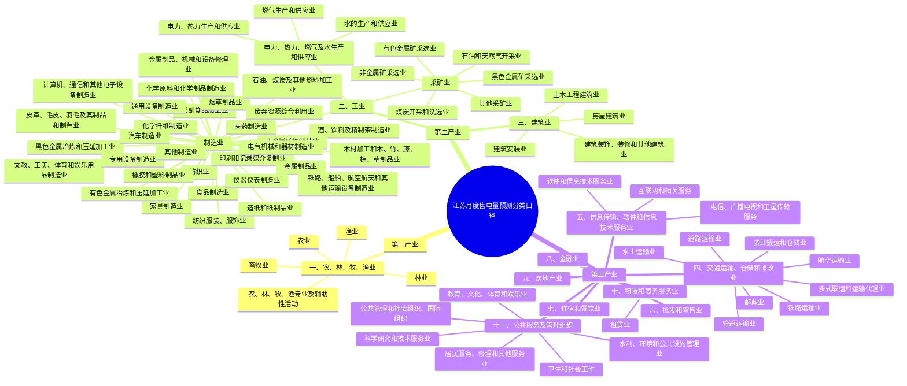

# 江苏省月度售电量分产业、分行业预测新增思路咨询报告

## 报告定位与核心结论

### 报告定位

本报告面向江苏省月度售电量分产业、分行业预测任务，采用“文献综述 + 咨询建议”的写法：文献用于提供证据基础，最终落到可理解、可采纳、可执行的建模建议。

报告不是讲稿，也不是纯学术论文，不按汇报时长或文献学科分类组织，而按甲方问题和项目决策组织。报告不追求穷尽所有电力预测文献，也不进行全量数据采集验证；重点回答甲方最关心的三个问题：

1. 是否存在更有前瞻性或解释力的外生变量。
2. 是否有近年新提出、且适合迁移到本项目的预测方法。
3. 是否有更适合分产业、分行业预测治理和汇报的新评估指标。

### 报告结构 v0.1

| 章节 | 要回答的问题 | 需要的证据 | 预期输出 |
| --- | --- | --- | --- |
| 第一章 项目问题与行业口径 | 本报告为什么这样组织，如何贴合江苏分产业/分行业售电量预测 | 甲方问题、项目基础数据结构、行业分类口径 | 报告边界、行业映射原则、证据使用原则 |
| 第二章 新外生变量 | 有哪些更前瞻、更有解释力的变量可以补充 | 电力预测文献、江苏产业结构、公开数据源链接 | 外生变量优先级清单与入模建议 |
| 第三章 新预测方法 | 哪些新方法适合迁移到本项目 | 近年方法文献、月度小样本适配性、可解释性和工程风险 | 稳健主线、低成本增强、前沿探索三层方法建议 |
| 第四章 新评估指标 | 如何更合理评价分产业/分行业预测 | 指标文献、模型治理需求、甲方汇报场景 | 主指标、辅助指标、稳健性和区间预测指标组合 |
| 第五章 综合建议与落地路线 | 这些变量、方法和指标如何进入下一阶段实施 | 前四章结论、数据可得性、建模成本和风险判断 | 分阶段实施路线和优先级 |

### 建议先行结论

1. 外生变量方面，建议形成“天气日历基础控制 + 经济景气变量 + 产业链行业变量 + 结构口径修正变量”的组合，而不是只依赖 GDP、工业增加值等宏观同步指标。天气、春节错位、PMI、工业增加值、行业聚类、产业链上下游指标和甲方已有结构变量应作为正文主线；金融信用、港口吞吐量、文旅客流等变量先作为探索项，待连续月度来源和领先期核验后再升级。
2. 预测方法方面，建议先建立可解释强基线，再做机器学习增强，最后保留前沿模型对照实验。稳健主线应包括季节 naive、ETS、ARIMA/SARIMAX、动态回归、可解释回归 + AR 修正；增强线可采用树模型、特征选择、行业聚类/分组模型和层级一致性治理；TimeGPT、Chronos、TimesFM、Moirai 等基础模型只作为探索和 benchmark，不承诺优于本地强基线。
3. 评估指标方面，不建议继续只用单一 MAPE。甲方汇报宜以 WAPE/加权 MAPE 为主，模型选择同时看 MAE、RMSE、MASE/RMSSE，模型治理增加 Bias、方向命中率、分组误差和层级一致性，概率/区间预测指标如 Pinball Loss、区间覆盖率和 CRPS 作为后续风险表达探索项。
4. 分产业、分行业预测的关键不是把所有行业套进同一套模型，而是先识别行业差异。制造业重点关注景气、投资、外贸和产业链变量；第三产业重点关注物流、消费、文旅和服务活动；居民和新型负荷重点关注天气、节假日、分布式光伏、充换电设施等结构因素。
5. 本报告的落地建议应分层推进：短期先做数据可得、解释链条清楚的变量和稳健模型；中期验证行业分组、树模型增强和层级一致性；前沿探索只在强基线之后开展，以滚动回测和消融实验判断是否真正带来增益。

## 第一章 项目问题与行业口径：先明确报告边界，再讨论新增思路

### 本章要回答的问题

本章回答“这份报告到底要解决什么问题，以及为什么采用当前行业口径”。它不是正式展开变量、模型和指标，而是先说明报告边界：我们要服务的是江苏省月度售电量分产业、分行业预测，不是泛泛讨论电力负荷预测，也不是逐行业穷尽所有文献。

### 写作主线

- 先把甲方需求转译成三个可回答的问题：新外生变量、新预测方法、新评估指标。
- 再说明本项目的数据口径来自项目基础数据，覆盖总量、第一产业、第二产业、第三产业、制造业 31 类、重点细分行业和服务业门类。
- 最后说明文献证据的使用方式：文献不一定能细到每个江苏售电行业，因此采用“文献机制证据 + 江苏产业链映射 + 数据可得性判断”的方法。

### 本章需要的证据

| 证据类型 | 具体材料 | 用途 |
| --- | --- | --- |
| 甲方需求 | 当前任务文件中的三个问题 | 证明报告围绕甲方问题组织，而不是按文献类型堆砌 |
| 数据口径 | `data/项目基础数据-0509_结构说明.md` | 说明行业分类边界和可映射层级 |
| 既有任务口径 | 老板已确认的咨询式报告、数据源深度、行业粒度、协作方式 | 约束报告写法和交付深度 |
| 文献证据池 | `papers for reference` 及逐篇提炼表 | 为后三章提供证据来源 |

### 行业映射原则

本报告不要求每篇文献都精确对应到江苏基础数据中的每一个细分行业。更可行的做法是按产业链和用电机理建立映射关系：

- 面向总量和第一产业、第二产业、第三产业：优先使用宏观经济、天气日历和消费服务类变量；金融信用先作为探索变量核验连续月度来源和领先期。
- 面向第二产业和制造业：优先使用 PMI、工业增加值、制造业投资、外贸、产业链库存/价格/产量等变量。
- 面向重点制造业细分：围绕钢铁、水泥、化工、汽车、新能源车、光伏设备、电子通信等构造产业链代理变量。
- 面向第三产业：重点关注交通物流、批发零售、住宿餐饮、信息服务、房地产和公共服务相关变量。
- 面向居民和新型负荷：关注天气、节假日、分布式光伏、充换电设施等结构性因素。

### 项目分类口径示意

下图基于项目基础数据中的售电量、户数、运行容量等表的共同纵向分类口径，先统筹展示第一产业、第二产业、第三产业、行业大类和主要二级类目。后续外生变量映射、全局模型行业编码、层级预测和分组评估均可沿用这一口径。

### 本章输出

- 报告边界说明。
- 行业映射原则。
- 证据使用原则。
- 后续三章的证据需求清单。

## 第二章 新外生变量：从宏观经济同步指标转向领先型产业链信号

### 本章要回答的问题

本章回答“除了已有经济变量，还能补充哪些更前瞻、更有解释力的变量”。重点不是罗列变量，而是说明变量为什么可能领先售电量、对应哪些产业或行业、数据是否容易获取，以及如何进入模型。

### 本章结论 v0.8

江苏月度售电量预测的外生变量不应只停留在 GDP、工业增加值等宏观同步指标上，而应形成“天气日历基础控制 + 经济景气变量 + 产业链与行业变量 + 结构与业务变量”的组合。天气日历变量解决月度预测中最稳定的季节、工作日、春节错位和高低温扰动；经济景气变量解释工业生产、订单和服务活动变化；产业链变量负责把制造业和服务业差异落到具体行业；结构与业务变量则把行业结构、主导行业、业扩报装、有效容量、容量释放滞后和容量利用小时纳入模型，使预测不只是通用时间序列外推，而更像电力业务预测。

从落地优先级看，P0 变量应优先选择未来可知、公开可得、解释链条清楚、能按行业映射的变量。天气、日历、春节错位、PMI、工业增加值、行业结构标签、运行容量、净增容量、业扩容量释放和容量利用小时，建议进入正文主线；金融信用、港口吞吐量、文旅客流等变量可保留在探索池，但必须先核验稳定月度入口、发布滞后和领先期，不宜在现阶段写成确定主推。证据基础包括天气日历和春节错位文献 EV-007、EV-009、EV2-001、EV2-004，经济景气和行业因素文献 EV-002、EV-016、EV2-008、EV2-023，产业链和分行业文献 EV2-002、EV2-003、EV2-025，以及业扩容量和容量利用文献 EV2-026、EV2-027。

### 1. 天气与日历变量：先把基础控制项做扎实

天气和日历变量不是“锦上添花”，而是月度售电量预测的基础控制项。月天数、工作日数、周末数、春节前后影响天数、1-3 月春节占季比、CDD/CDM、HDD/HDM、极端高温和低温天数，能够解释相同经济活动水平下为什么不同月份售电量不同。国内月度电力需求文献已经显示，制冷度、采暖度和春节移动假日变量能够改善月度预测并帮助解释异常月份；苏州月度电力需求研究还把春节前、春节后影响拆开处理，并用 AR 误差修正增强可解释回归的稳定性（EV2-001）。春节占季比修正文献进一步说明，春节错位不应只作为普通月份哑变量，而应对 1-3 月做单独修正和诊断（EV2-004）。

这类变量适配范围最广：全社会总量、第一产业、第二产业、第三产业、居民和大多数行业都应保留基础日历项；天气变量对居民、批发零售、住宿餐饮、公共服务、数据中心、商业楼宇和部分温控制造业更敏感；春节变量对制造业、建筑链、物流、批发零售、住宿餐饮和居民消费都重要。其领先性也最清楚：日历和春节安排是未来已知变量，天气在真实预测时可用短期预报或气候均值替代，历史回测时必须区分“真实天气回放”和“预测时可获得天气”。建议入模方式包括月份固定效应、周期编码、工作日计数、春节前后影响天数、CDD/HDD 月度聚合、极端天气天数、以及与行业标签的交互项。证据：EV-007、EV-009、EV-010、EV-017、EV2-001、EV2-004、EV2-006。

### 2. 经济景气变量：从宏观同步指标转向月度景气和订单信号

经济景气变量的作用是解释生产和服务活动强弱，而不是简单把 GDP 这类低频指标塞进模型。对第二产业和制造业，优先考虑 PMI、生产指数、新订单指数、供应商配送时间、工业增加值、制造业投资、重点行业增加值、PPI 等；对第三产业，可关注服务业增加值、社会消费品零售、批发零售、住宿餐饮、信息服务和公共服务相关进度数据。PMI 和新订单具有一定领先属性，工业增加值和服务业增加值更偏同步或滞后解释，因此必须通过 0-2 个月滞后项、同比/环比和滚动回测确认实际领先期。证据池中，经济因素和随机森林、季节分解、工业效率等文献均支持经济变量对电量预测有解释价值，但也提示不能把所有经济变量无筛选地堆叠入模（EV-002、EV-016、EV-018、EV2-005、EV2-008）。

数据可得性方面，国家统计局 PMI、江苏统计进度数据和江苏省政府经济运行简况是优先来源，适合先作为 P0/P1 变量进入特征表（EV2-023）。入模时建议使用同比、环比、扩张/收缩哑变量、累计转当月、滞后项和移动平均，并区分“预测时已发布”和“事后才可获得”。对发布滞后的经济指标，应优先作为滞后解释变量或预测后解释变量；只有在发布节奏能满足业务预测窗口时，才作为真正的预测输入。

### 3. 产业链与行业变量：按制造业、服务业、居民和新型负荷分开建变量池

分行业预测不宜用同一组宏观变量“一把尺子量到底”。细分行业月度电量研究表明，先识别行业周期性、行业相似度和天气/春节敏感性，再按行业组配置变量和模型，可以更好地处理多行业小样本问题（EV2-002）。产业链售电量研究则提供了更具体的变量筛选思路：先用投入产出关系识别上下游行业，再用时差相关筛选上下游售电、产量、投资、价格和目标行业售电之间的领先/同步关系（EV2-003）。

对制造业，建议优先围绕钢铁、水泥、玻璃、化工、汽车、新能源车、光伏设备、电气机械、电子通信等江苏重点链条构造变量。可选变量包括重点产品产量、库存、价格、开工率、行业投资、外贸出口、上下游行业售电和行业景气指标。外向型制造可补充进出口、机电产品出口、新三样出口等变量，但其月度连续入口和发布滞后仍需核验（EV-003、EV2-024）。对服务业，批发零售、交通运输、住宿餐饮、信息服务、房地产和公共服务的用电机制差异较大，变量应分别来自消费、物流、客流、服务业景气、公共活动和天气日历，而不是只用工业景气替代。对居民和新型负荷，应把天气、节假日、分布式光伏自发自用、充电设施电量、充换电服务业等结构因素纳入解释，重点区分“真实用能需求变化”和“电网售电口径变化”（EV-035、EV2-021）。

这类变量的领先性不应凭经验拍板。建议固定做时差相关、K-L 信息量或类似领先性诊断，再用滚动回测确认它们是否能在目标预测窗口内带来增益。若变量只能事后解释而不能预测，应在报告中明确标注为解释项。

### 4. 结构与业务变量：把行业结构、业扩容量和容量利用纳入主线

本项目区别于一般公开时间序列预测的一个优势，是甲方已有售电量、户数、运行容量、净增容量、分布式光伏、充电设施、重点用户等业务结构数据。新增中文证据进一步说明，这些变量不只是“辅助解释”，而应进入正文主线。

第一，行业结构本身就是预测信息。江苏阜宁分行业月度电量研究先按国民经济行业口径分析第一产业、第二产业、第三产业、城乡居民和细分行业用电结构，再按工业、商业、居民等不同用电形态选择变量和模型。它对本项目的直接启发是：先识别主导行业、增长行业、周期稳定行业和结构变化行业，再决定变量池和模型，而不是直接对省级总量外推。主导行业决定总体误差，增长行业决定结构变化，低电量行业则决定分组诊断和治理重点。证据：EV2-025。

第二，业扩报装是具有滞后释放机制的业务领先变量。业扩报装、增容、减容、暂停、恢复、销户不应只作为“发生过某个事件”的标签，也不能简单认为报装当月就全部形成售电量。业扩容量曲线研究将存量电量和每次业扩产生的电量分离，用 Logistic 生长曲线拟合容量释放过程，提取稳定利用小时数、稳定时间和逐月投运比例，再把报装容量转化为按月释放的有效容量。对江苏项目而言，应把新增容量、减少容量、恢复容量、有效容量、容量释放滞后、投运比例和业扩类型纳入变量池，尤其适用于制造业、园区、大工业和新增项目集中的行业。证据：EV2-026。

第三，容量利用小时/容量利用率是连接产业活动、经济景气和售电量的结构变量。容量利用特征文献将运行容量拆分为存量容量和业扩容量，先预测存量容量利用小时，再叠加业扩增量电量；同时用 Pearson 相关系数和 K-L 信息量识别上下游经济主导因素。这个框架把产业链变量和业务容量变量连接起来：产业链指标解释容量利用为什么上升或下降，业扩变量解释新增用电能力何时释放，售电量则由存量利用和增量释放共同形成。对江苏重点制造业，建议优先构造运行容量、存量容量、净增容量、有效投运容量、容量利用小时、容量利用率、存量/增量贡献拆分等变量。证据：EV2-027。

### 5. 探索变量：金融信用、港口和文旅先放入候选池，不写成确定主推

金融信用、港口吞吐量、文旅客流、人口流动、重大活动和政策事件等变量有解释潜力，但现阶段证据和数据连续性不如天气、经济景气、产业链和业务结构变量稳。企业中长期贷款、制造业贷款、社融等金融指标理论上可能领先投资和产能扩张，但需要核验江苏本地连续月度入口和行业映射；港口货物吞吐量、集装箱吞吐量和客货运量可解释外贸物流和交通运输仓储用电，但目前更多是数据线索，不能直接写成稳定 P0；文旅客流、酒店入住率和人口流动更适合住宿餐饮、交通运输、居民和公共服务，不适合解释第二产业主线。证据：EV-024、EV-025、EV2-007、EV2-020、EV2-024。

因此，建议把这些变量作为 P2 探索项保留在附录 A：先做数据源核验，再做领先期和变量消融；只有当连续月度来源、发布滞后、行业映射和回测增益都成立后，再升级为 P1 或 P0。这样写更稳健，也避免把“看起来相关”的外部数据误写成确定可部署变量。

### 本章输出表 v0.8

| 变量组 | 主推变量 | 预测逻辑 | 适配产业/行业 | 领先性/同步性 | 数据可得性 | 建议入模方式 | 证据 |
| --- | --- | --- | --- | --- | --- | --- | --- |
| 天气日历 | 月天数、工作日数、春节前后影响天数、CDD/CDM、HDD/HDM、极端天气天数 | 控制季节、工作日、春节错位和高低温负荷扰动 | 全行业；居民、第三产业、公共服务、温控制造业更敏感 | 日历未来已知；天气短期可预测/回测需区分真实天气 | 易获取/需整理 | 月份固定效应、节前节后计数、度日指标、行业交互、春节月后处理 | EV-007、EV-009、EV2-001、EV2-004 |
| 经济景气 | PMI、新订单、生产指数、工业增加值、制造业投资、服务业进度数据 | 反映生产、订单、投资和服务活动强弱 | 第二产业、制造业、第三产业、重点行业 | PMI 理论领先；增加值多为同步/滞后 | 公开可得，需整理发布滞后 | 同比/环比、滞后 0-2 月、累计转当月、扩张收缩状态 | EV-002、EV-016、EV2-008、EV2-023 |
| 产业链行业变量 | 上下游行业售电、重点产品产量、库存、价格、外贸出口、物流活动 | 把宏观景气落到行业链条，解释细分行业差异 | 钢铁、化工、汽车、光伏、电子、电气机械、批发零售、交通运输 | 理论领先/同步，需时差相关验证 | 部分公开，部分需第三方或人工整理 | 产业链映射、时差相关、同比环比、行业专属变量池 | EV2-002、EV2-003、EV2-024 |
| 结构与业务变量 | 行业结构标签、主导行业标签、户数、运行容量、净增容量、业扩报装、有效容量、容量利用小时/利用率 | 解释行业结构变化、新增产能释放和存量容量利用变化 | 全行业；制造业、园区、大工业、重点用户行业优先 | 行业结构已知；业扩具滞后释放；容量利用多为同步/解释 | 甲方已有或需业务系统提供 | 行业标签、存量/增量拆分、容量释放滞后、有效投运容量、利用小时预测 | EV2-025、EV2-026、EV2-027 |
| 探索变量 | 金融信用、港口吞吐量、文旅客流、政策事件 | 可能解释投资扩张、物流活动、服务消费和非平稳冲击 | 制造业、交通物流、住宿餐饮、公共服务、居民 | 不确定，需核验领先期 | 连续入口待核验/可能需第三方 | 先入候选池，做数据源核验、消融和分行业试验 | EV-024、EV2-007、EV2-020、EV2-024 |

## 第三章 新预测方法：从单序列建模转向多行业共享、可解释和风险表达

### 本章要回答的问题

本章回答“哪些新方法适合迁移到江苏月度售电量预测”。判断标准不是模型是否足够新，而是是否适合月度、小样本、多行业、可解释、可汇报的项目场景。

### 本章结论 v0.8

本项目的方法路线不宜被“最新模型”牵着走。江苏月度售电量分产业、分行业预测的核心约束是月度样本短、行业序列多、外生变量多、甲方需要解释和治理，因此建议采用“四层路线”：第一层是可解释强基线，先用季节 naive、ETS、ARIMA/SARIMAX、动态回归、可解释回归 + AR 修正建立可靠比较标尺；第二层是低成本增强，用特征治理、树模型、行业分组、全局模型和结构化存量/增量模型提升效果；第三层是前沿探索，TimeGPT、Chronos、TimesFM、Moirai 等只做 benchmark 或创新储备；第四层是层级一致性治理，保证省级、第一产业、第二产业、第三产业和行业层级之间不互相矛盾。

新增中文证据进一步强化了“按行业特性选择模型”的必要性。阜宁案例说明，江苏本地分行业月度预测应先识别行业结构和主导行业，再对工业、商业、居民等不同对象配置不同变量和模型（EV2-025）。业扩容量曲线和容量利用特征文献则提示，部分行业不应只用黑箱模型预测，而应拆成“存量电量 + 业扩增量”“存量容量利用小时 + 新增容量释放”两类更可解释的业务预测框架（EV2-026、EV2-027）。

### 1. 稳健主线：先建立可解释强基线

第一阶段不要直接把复杂模型作为“主模型”，而应先建立强基线。强基线至少包括去年同月/季节 naive、移动平均、ETS、ARIMA/SARIMAX、动态回归、可解释回归 + AR 误差修正。它们的价值有三点：一是为所有新变量和新模型提供最低比较线；二是能解释天气、日历、春节、经济景气等变量的边际贡献；三是便于甲方复核模型为什么在某些月份高估或低估。韩国月度负荷回归、西班牙 SARIMAX、苏州天气春节回归等证据都支持月度小样本下可解释统计模型不应被跳过（EV-028、EV-029、EV-030、EV2-001）。

稳健主线还应包括季节分解和特殊月份修正。X-12-ARIMA、年度/季度约束校正、春节占季比、春节前后影响天数、异常月份后处理，适合处理 1-3 月、春节错位、迎峰度夏和极端天气月份（EV2-004、EV2-005、EV2-006）。这些方法不是为了“显得传统”，而是为了把模型最容易失效的月份先管住。

### 2. 低成本增强：树模型、行业分组和结构化业务模型并行推进

低成本增强不等于盲目堆模型，而是围绕三个方向推进。

第一，做特征治理和树模型增强。Random Forest、XGBoost、LightGBM、CatBoost 适合处理滞后特征、行业编码、天气日历、经济景气和产业链变量之间的非线性关系，也适合把多个行业放入统一面板训练。但树模型必须配套 SHAP、LOFO/FLOFO、变量消融和滚动回测，否则容易变成不可解释的变量堆叠（EV-014、EV-015、EV-031、EV2-008）。对本项目来说，树模型更适合作为“外生变量增强主模型候选”，而不是取代全部统计基线。

第二，做行业聚类、分组模型和全局模型。细分行业文献和阜宁案例共同说明，工业、商业、居民、服务业和重点制造业的用电机理不同，不能简单套一个模型（EV2-002、EV2-025）。建议先按行业周期性、曲线相似度、行业占比、增长趋势、天气敏感性、春节敏感性和业务属性给行业打标签，再决定是行业专属模型、分组模型还是全局模型。对样本很短的低电量行业，可考虑聚合到相似行业组或使用全局模型共享信息；对主导行业和重点制造业，应保留行业专属解释。

第三，做“存量 + 增量”的结构化业务模型。业扩容量曲线文献提出将存量电量和各次业扩产生电量分离，用 Logistic 生长曲线估计新增容量逐月释放比例，再预测行业月度用电量（EV2-026）。容量利用文献进一步将运行容量拆成存量容量和业扩容量，用产业链主导因素预测存量容量利用小时，再叠加业扩增量电量（EV2-027）。这条路线尤其适合制造业、园区、大工业、重点用户和新增项目集中的行业。它的优势不是一定比树模型复杂，而是更容易解释“为什么新增容量没有当月全部变成售电量”“为什么同样容量下用电小时发生变化”。

### 3. 前沿探索：基础模型只能先做 benchmark，不承诺优于本地强基线

TimeGPT、Chronos、TimesFM、Moirai、PatchTST、iTransformer、TFT、可解释多模态模型和概率区间模型可以作为创新储备，但不应写成第一阶段主模型承诺。现有证据主要来自通用时间序列、短期负荷或家庭用电 benchmark，与省级月度分行业售电量在对象、频率、样本长度、外生变量支持和解释要求上都有差异（EV2-013、EV2-014、EV2-015、EV2-021、EV2-022）。

建议的使用方式是 benchmark 化：选取总量、第二产业、第三产业和若干重点行业，和季节 naive、SARIMAX、可解释回归、LightGBM、行业分组模型做同一滚动回测；同时记录它是否支持外生变量、是否能解释变量贡献、是否能稳定处理月度短序列、工程成本是否可接受。只有当它在同一回测框架下稳定超过本地强基线，且能满足解释和交付要求，才考虑升级为增强路线。

### 4. 层级一致性治理：预测结果要能加总、能解释、能复盘

分产业、分行业预测的天然风险是“每一层单独看都合理，但加总后互相打架”。中文主导行业与上下级协调文献、以及 forecast reconciliation/MinT 方法源头都支持一个判断：省级总量、第一产业、第二产业、第三产业、行业大类和细分行业之间必须检查加总一致性（EV2-010、EV2-011、EV2-012）。

短期建议先做治理而不是直接上复杂算法：分别输出 top-down、bottom-up、middle-out 的对照结果，计算省级预测与行业加总之间的差额，找出导致不一致的行业和月份。中期再尝试简化 reconciliation 或 MinT，但要注意月度样本短时误差协方差估计不稳定。对甲方汇报来说，层级一致性本身就是质量要求：分行业预测不仅要准，还要能和总量、产业口径对得上。

### 本章输出表 v0.8

| 方法层级 | 方法类别 | 代表方法 | 解决的问题 | 适配本项目的理由 | 验证方式 | 主要风险 | 建议定位 | 证据 |
| --- | --- | --- | --- | --- | --- | --- | --- | --- |
| 稳健主线 | 可解释统计基线 | 季节 naive、ETS、ARIMA/SARIMAX、动态回归、可解释回归 + AR 修正 | 建立比较标尺，解释天气日历和经济变量贡献 | 月度小样本、可解释、易沟通 | 滚动回测、残差诊断、变量消融 | 非线性和行业差异表达不足 | 必做 | EV-028、EV-029、EV2-001、EV2-005 |
| 低成本增强 | 树模型与特征治理 | Random Forest、XGBoost、LightGBM、CatBoost、SHAP、LOFO/FLOFO | 处理非线性、滞后、行业编码和外生变量交互 | 多行业变量多，工程成本适中 | 滚动回测、SHAP、变量消融 | 样本短时过拟合，解释成本上升 | 主模型候选 | EV-014、EV-031、EV2-008 |
| 低成本增强 | 行业分组/全局模型 | 行业聚类、分组回归、分组 Prophet、global LightGBM | 缓解单行业样本短，按行业特性共享信息 | 贴合分产业、分行业口径 | 分组前后误差、留组验证、行业解释 | 聚类不稳定或业务解释不足 | 增强路线 | EV2-002、EV2-025 |
| 低成本增强 | 结构化业务模型 | 存量电量 + 业扩增量、容量释放曲线、存量容量利用小时预测 | 把新增容量释放和存量利用变化纳入预测 | 适合制造业、园区、大工业和重点用户 | 修正前后对照、存量/增量拆分、行业回测 | 需要业扩和容量业务数据，参数估计需简化 | 重点增强 | EV2-026、EV2-027 |
| 前沿探索 | 时间序列基础模型 | TimeGPT、Chronos、TimesFM、Moirai | 做 zero-shot/fine-tuning benchmark 和创新展示 | 可作为强基线后的探索 | 同一滚动回测框架 benchmark | 迁移到省级月度行业售电量证据不足 | 探索/对照 | EV2-013、EV2-014、EV2-015 |
| 治理机制 | 层级预测与协调 | bottom-up、top-down、middle-out、reconciliation、MinT | 保证总量、产业、行业结果一致 | 分层汇报和模型治理必需 | 加总误差、分层 WAPE、reconciliation 对照 | 小样本下复杂协调参数不稳 | 必做检查，逐步增强 | EV2-010、EV2-011、EV2-012 |

## 第四章 新评估指标：从单一误差率转向分层、加权和可治理的指标体系

### 本章要回答的问题

本章回答“如何更合理评价分产业、分行业月度售电量预测”。重点解释为什么单一 MAPE 容易误导，以及如何构建适合甲方汇报、模型选择和后续治理的指标组合。

### 本章结论 v0.8

本项目不能继续只用单一 MAPE 判断模型好坏。分产业、分行业售电量预测同时面对行业规模差异、低电量行业、春节和极端天气异常月、总分层级一致性、业务结构变量解释和后续风险表达需求。更合适的指标体系应分为四层：甲方主汇报看 WAPE/加权 MAPE；模型选择看 MAE、RMSE、MASE/RMSSE；治理诊断看 Bias、方向命中率、分组误差、层级一致性误差、春节月/异常月误差和变量消融；风险表达看 Pinball Loss、区间覆盖率、区间宽度和 CRPS，先作为探索项。

EV2-026 和 EV2-027 还提示，容量-电量相关系数、K-L 信息量、修正前后对照、存量/增量贡献拆分等指标更适合作为模型诊断或变量筛选依据，而不是甲方主汇报指标。它们的价值在于帮助解释“容量变量是否构造对了”“产业链变量是否具备领先性”“新增容量释放是否真的改善预测”，最终汇报仍应回到 WAPE、MAE/RMSE、分组误差和层级一致性这些更稳定的管理口径。

### 为什么不能只用 MAPE

MAPE 的优点是直观，甲方和文献都容易理解，但在本项目中单独使用会带来三类误导。第一，低电量行业或接近零的月份会出现百分比误差被放大的问题，小行业的异常可能压过真正影响总体经营判断的大行业误差。第二，MAPE 不体现售电量权重，无法回答“整体售电量预测是否可控”。第三，它不能诊断模型是系统性高估还是低估，也不能说明模型在哪些行业、月份、预测期或层级上失效。预测指标权威文献已经系统指出 MAPE 等常见指标存在局限，MASE 可用于跨序列比较；工程资料也提示 WAPE、MASE、WQL 等指标需要按业务场景搭配使用（EV2-016、EV2-017）。

因此，建议把 MAPE 保留为辅助口径，而不是主导模型选择。对老板和甲方，应优先汇报 WAPE/加权 MAPE；对模型团队，应同时看 MAE、RMSE、MASE/RMSSE、Bias 和分组误差；对变量和方法治理，应看消融、修正前后对照、层级一致性和异常月份表现。

### 1. 主汇报指标：WAPE/加权 MAPE

主汇报指标建议采用 WAPE 或加权 MAPE。WAPE 的解释方式可以写成“每 100 度售电量平均误差约多少度”，比普通 MAPE 更贴合售电量规模口径，也能避免低基数小行业对总体判断产生过度影响。对省级总量、第一产业、第二产业、第三产业和行业组合，WAPE 可以作为统一主指标；对行业内部仍可保留 MAPE，便于和既有材料或文献对照。证据：EV-032、EV2-017。

需要注意的是，WAPE 会偏重大行业，因此不能替代分行业公平性诊断。建议汇报页采用“两层口径”：第一层给总体 WAPE 和分产业 WAPE，回答整体是否可控；第二层给重点行业和异常月份误差，回答风险集中在哪里。

### 2. 选模指标：MAE、RMSE、MASE/RMSSE

模型选择不能只看相对误差。MAE 可以告诉业务方平均每月差多少电量单位，适合单行业或重点行业内部比较；RMSE 对大误差更敏感，适合识别极端月份和高风险行业；MASE/RMSSE 则用于跨行业比较，回答某个模型是否真正优于去年同月或季节 naive 基线。对多行业月度序列，建议每个候选模型都同时输出 MAE、RMSE、MASE/RMSSE，并明确 naive 基线的定义。证据：EV-011、EV-021、EV-032、EV2-016、EV2-017。

MASE/RMSSE 的汇报解释不必复杂化，可以写成“小于 1 表示优于简单季节基线”。这对甲方也有价值：不是只问模型误差多大，而是问复杂模型是否比简单办法真的有增益。

### 3. 治理诊断指标：看偏差、分组、层级和变量贡献

治理诊断指标服务于模型复盘和后续迭代，不一定都放到甲方首页。建议至少包括四类。

第一，Bias/NMBE。它用于判断模型是否系统性高估或低估，避免正负误差在 MAE/MAPE 中被掩盖。第二，分组误差。按第一产业、第二产业、第三产业、行业大类、重点细分行业、春节月、高温月、低温月、异常事件月分别计算 WAPE、MAE、RMSE，可判断模型是否只在平均意义上表现良好。天气、春节和异常月份文献都支持单独诊断这些场景（EV-010、EV-017、EV-023、EV2-001、EV2-004）。第三，层级一致性误差。省级预测、产业预测和行业预测之间应计算加总差额或 reconciliation gap，避免分层预测结果互相矛盾（EV2-010、EV2-011、EV2-012）。第四，方向命中率。同比和环比方向命中率可服务经营研判，但它只评价涨跌方向，不反映误差大小，应作为诊断指标而不是主指标。

与 EV2-026、EV2-027 相关的指标也应放在治理诊断层。修正前后对照可比较“原始净增容量”和“有效容量/滞后释放容量”哪个更有预测贡献；容量-电量相关系数可检查容量变量构造是否更贴近售电趋势；Pearson 相关系数和 K-L 信息量可用于筛选产业链主导因素和判断领先/滞后关系；存量/增量贡献拆分可解释预测结果来自既有容量利用变化还是新增业扩释放。这些指标有助于模型解释和变量筛选，但不宜作为甲方主汇报指标。

### 4. 风险表达指标：区间预测先试点，不全行业承诺

如果后续从点预测扩展到区间预测，应引入 Pinball Loss、区间覆盖率、区间宽度和 CRPS。Pinball Loss 或 weighted quantile loss 评价分位数预测是否偏上或偏下；区间覆盖率检查真实值是否落入预测区间；区间宽度防止为了提高覆盖率而给出过宽区间；CRPS 用于评价完整预测分布。概率评分理论和中文区间预测文献可支撑这条探索线（EV2-018、EV2-019、EV2-020）。

当前阶段建议先在总量、第二产业、第三产业和少数重点行业试点区间预测，不要求全行业铺开。原因是区间预测需要较稳定的回测样本和校准机制，低电量行业、强结构变化行业和样本短行业容易出现区间过宽或覆盖不足。报告中应把这类指标写成“风险表达探索项”，不写成 D3 必须落地的主指标。

### 本章输出表 v0.8

| 指标层级 | 指标类别 | 指标 | 适用对象 | 解决的问题 | 主要局限 | 汇报解释方式 | 建议定位 | 证据 |
| --- | --- | --- | --- | --- | --- | --- | --- | --- |
| 主汇报 | 加权误差 | WAPE / 加权 MAPE | 总量、第一产业、第二产业、第三产业、行业组合 | 避免小行业百分比误差过度影响总体判断 | 偏重大行业，小行业公平性不足 | “每 100 度售电量平均误差约多少度” | 主指标 | EV-032、EV2-017 |
| 辅助汇报 | 相对误差 | MAPE / sMAPE | 总量、产业、重点行业 | 保留传统百分比误差口径 | 低基数和接近零分母会失真 | “平均百分比误差，但不能单独判断好坏” | 辅助指标 | EV2-016、EV2-017 |
| 选模 | 绝对/平方误差 | MAE、RMSE | 单行业、总量、重点行业、异常月份 | 衡量平均误差规模和大偏差 | 跨行业规模不可直接比较 | “平均差多少”和“大错惩罚” | 辅助/选模指标 | EV-011、EV-032 |
| 选模 | 缩放误差 | MASE、RMSSE | 多行业、不同规模序列 | 判断是否优于季节 naive 基线 | 依赖 naive 基线定义 | “小于 1 表示优于简单基线” | 诊断指标 | EV2-016、EV2-017 |
| 治理诊断 | 偏差与分组 | Bias/NMBE、分产业/分行业/异常月误差、方向命中率 | 产业、行业、春节月、高温月、异常月 | 定位系统性偏差和局部失效 | 表格较多，需控制汇报层级 | “哪些行业、哪些月份误差最大，是否长期偏高/偏低” | 诊断指标 | EV-010、EV-017、EV2-001、EV2-004 |
| 治理诊断 | 层级一致性 | 加总误差 / reconciliation gap | 省级、产业、行业层级 | 保证总量和分项预测口径一致 | 不直接代表点预测准确率 | “分行业加起来是否等于全省口径” | 诊断指标 | EV2-010、EV2-011、EV2-012 |
| 变量诊断 | 结构变量诊断 | 修正前后对照、容量-电量相关系数、K-L 信息量、存量/增量贡献拆分 | 业扩容量、容量利用、产业链变量 | 判断变量构造和领先性是否有效 | 不适合作为甲方主汇报指标 | “这个业务变量是否真的解释了误差下降” | 变量筛选/诊断 | EV2-026、EV2-027 |
| 风险表达 | 概率/区间指标 | Pinball Loss、区间覆盖率、区间宽度、CRPS | 区间预测、分位数预测 | 评价预测区间是否既覆盖真实值又不过宽 | 解释和校准成本较高 | “90% 区间是否覆盖约 90% 真实月份” | 探索指标 | EV2-018、EV2-019、EV2-020 |

## 第五章 综合建议与下一步落地路线

### 本章要回答的问题

本章把前面三类新增思路收束成可执行路线：哪些建议可以立即进入建模，哪些需要先核验数据源和业务口径，哪些只适合作为创新储备。对甲方而言，报告的重点不是证明“能找到很多新变量和新模型”，而是形成一条风险可控、能逐步验证的升级路径。

### 本章结论 v0.8

建议将江苏月度售电量分产业、分行业预测升级为“三阶段路线”：短期先建立稳健底座，中期做行业结构和业务变量增强，远期保留前沿模型和风险表达探索。短期阶段强调可得数据、可解释模型和统一评价口径；中期阶段把行业结构、业扩容量释放、容量利用小时、产业链变量和层级一致性纳入主线；远期阶段再把时间序列基础模型、深度时序模型、概率预测和复杂事件感知模型作为 benchmark 或创新储备。

这一路线的基本原则是：先让新增变量和新增方法在同一滚动回测框架下证明增益，再决定是否进入正式模型。天气日历、PMI/工业增加值、春节错位、行业结构标签、运行容量、净增容量、业扩容量释放和容量利用小时可以作为优先落地项；金融信用、港口吞吐量、文旅客流、复杂深度时序和区间预测暂时放入探索池，等待连续月度来源、领先期和回测增益核验。

这一路线主要对应三类证据：一是天气、春节、经济景气和产业链变量对月度电力需求的解释证据（EV2-001、EV2-003、EV2-004、EV2-008、EV2-023）；二是江苏本地分行业、业扩容量释放和容量利用的业务结构证据（EV2-025、EV2-026、EV2-027）；三是层级预测、缩放误差和概率指标等方法与评估证据（EV2-010 至 EV2-020）。

### 1. 短期可落地：先把预测底座和评估口径做稳

短期阶段的目标是建立一套可以被甲方复核、可以给后续创新做对照的基础版本。建议优先完成三件事。

第一，建立统一滚动回测框架。所有变量和模型都应在同一训练窗口、预测窗口和行业口径下比较，至少输出总量、第一产业、第二产业、第三产业、制造业重点行业和服务业重点行业的误差结果。主汇报指标采用 WAPE/加权 MAPE，模型选择同时看 MAE、RMSE、MASE/RMSSE，并保留春节月、高温月、异常月和分行业误差诊断。

第二，建立可解释强基线。短期不建议直接以复杂模型作为正式方案，而应先完成季节 naive、ETS、ARIMA/SARIMAX、动态回归、可解释回归 + AR 修正等基线。它们既能给新方法提供比较标尺，也能解释天气、日历、春节和经济变量的作用。只有当树模型、行业分组模型或结构化业务模型在滚动回测中稳定优于这些基线，才建议升级为主模型候选。

第三，优先接入低风险变量。短期变量池建议包括历史售电滞后项、月天数、工作日数、春节前后影响天数、CDD/HDD、极端温度天数、PMI、工业增加值、服务业进度数据、行业结构标签、户数、运行容量、净增容量、分布式光伏和充电设施电量。这些变量要么未来可知，要么公开可得，要么来自甲方已有结构口径，解释链条相对清楚。

### 2. 中期增强：把分行业预测做成业务结构模型

中期阶段的目标是让模型从“时间序列外推”升级为“行业结构 + 业务机制 + 外生景气”的预测框架。

第一，按行业特性组织模型。先识别主导行业、增长行业、周期稳定行业、天气敏感行业、春节敏感行业和结构变化行业，再决定行业专属模型、分组模型或全局模型。主导行业和重点制造业应保留更强的行业解释；低电量和样本短行业可以通过行业聚类、分组模型或全局模型共享信息。

第二，把业扩和容量变量从“解释项”升级为“预测机制”。对制造业、园区、大工业和重点用户行业，应尝试构造新增容量、减少容量、恢复容量、有效容量、容量释放滞后、投运比例、容量利用小时和容量利用率。模型上可采用“存量电量 + 业扩增量”或“存量容量利用小时 + 新增容量释放”的结构，把新增用电能力何时释放、存量容量为何多用或少用讲清楚。

第三，做产业链变量筛选和消融。对钢铁、化工、汽车、新能源车、光伏设备、电子通信、电气机械、交通物流、批发零售等行业，先建立候选产业链变量，再用时差相关、Pearson 相关、K-L 信息量、变量消融和滚动回测确认其领先性。能稳定提升预测的变量进入 P1；只能解释历史但不能预测未来的变量，保留为复盘解释项。

第四，建立层级一致性治理。分行业结果必须检查是否能与省级总量、产业层级和行业大类加总口径一致。短期可先做 bottom-up、top-down、middle-out 对照和加总差额诊断；中期再考虑简化 reconciliation 或 MinT。对甲方汇报来说，层级一致性不是炫技，而是分产业、分行业预测结果能否被管理使用的基本条件。

### 3. 前沿探索：先做对照实验，不写成正式承诺

前沿模型和新指标建议保留，但要放在强基线之后。TimeGPT、Chronos、TimesFM、Moirai、PatchTST、iTransformer、TFT 等可以作为 benchmark，用相同滚动回测框架比较其在总量、第二产业、第三产业和重点行业上的表现；如果不能稳定超过本地强基线，或不能满足外生变量、解释性和交付成本要求，就不应升级为正式主线。

概率预测和区间指标也建议先试点，不全行业铺开。可以先选择总量、第二产业、第三产业和少数重点行业，尝试 Pinball Loss、区间覆盖率、区间宽度和 CRPS。它们的作用是表达经营风险，而不是替代点预测主指标。对于样本短、结构变化强或低电量行业，区间预测容易出现过宽或校准不足，应谨慎使用。

金融信用、港口吞吐量、文旅客流、人口流动和重大事件等变量同样应先作为探索项。它们有解释潜力，但需要先回答三个问题：是否有连续月度来源，发布时间是否早于预测窗口，是否能映射到具体行业并在回测中带来增益。未回答这三个问题前，不建议写入正式特征清单。

### 4. 建议落地清单

| 阶段 | 建议事项 | 优先级 | 解决的问题 | 预期产出 | 验证口径 |
| --- | --- | --- | --- | --- | --- |
| 短期可落地 | 建立滚动回测框架和 WAPE/MASE 指标体系 | P0 | 统一模型比较口径，避免只看单一 MAPE | 回测方案、指标表、行业分组误差表 | WAPE、MAE/RMSE、MASE/RMSSE、Bias、分组误差 |
| 短期可落地 | 建立季节 naive、ETS、SARIMAX、可解释回归 + AR 修正基线 | P0 | 给所有新方法提供强比较线 | 基线模型结果、残差诊断、变量贡献解释 | 是否优于季节 naive，异常月是否可解释 |
| 短期可落地 | 接入天气、日历、春节错位、PMI、工业增加值、行业结构标签和容量基础变量 | P0/P1 | 形成第一版外生变量增强模型 | 外生变量特征表 v1、消融结果 | 加入变量后分行业 WAPE/MASE 是否改善 |
| 中期增强 | 构造行业分组、主导行业标签和全局/分组模型 | P1 | 缓解多行业小样本问题，避免一套模型套所有行业 | 行业标签表、分组模型结果 | 分组前后误差、重点行业解释性 |
| 中期增强 | 构造业扩容量释放、有效容量、容量利用小时和存量/增量拆分 | P1 | 解释新增产能释放和存量容量利用变化 | 结构化业务变量表、存量/增量预测框架 | 修正前后对照、容量-电量相关、存量/增量贡献拆分 |
| 中期增强 | 做产业链变量筛选与层级一致性治理 | P1/P2 | 提升重点行业解释力，保证总分口径一致 | 产业链变量清单、层级一致性诊断 | 时差相关、K-L 信息量、加总误差 |
| 前沿探索 | TimeGPT/Chronos/TimesFM/Moirai 等基础模型 benchmark | P2 | 展示前沿性，检验是否真有增益 | 前沿模型对照实验 | 同一滚动回测下是否超过本地强基线 |
| 前沿探索 | 概率预测、区间指标、金融信用、港口、文旅等探索项 | P2/P3 | 表达风险或发现潜在新增信号 | 探索变量核验表、区间预测试点 | 连续月度来源、领先期、区间覆盖率、变量消融 |

### 5. 给甲方的表述建议

对甲方汇报时，建议把本报告的建议概括为一句话：先用稳定变量和可解释模型把预测底座做稳，再把江苏分行业业务结构变量纳入模型，最后用前沿模型和区间预测作为创新对照。

具体表述上，应避免承诺“某个新模型一定更准”，而应强调“我们会用统一滚动回测和变量消融来验证新增思路是否真的有效”。这样既回应了甲方想要新思路的需求，也保留了咨询报告应有的专业边界：能立即落地的写清楚，需数据核验的标出来，只适合创新储备的放在探索层。

## 附录 A：外生变量候选清单

### A.1 填表规则与 v0.8 口径

- `变量类别` 用于报告结构分组，不追求细到每个行业。
- `预测逻辑` 必须写成一句可解释的话，避免只写“相关”。
- `适配口径` 优先贴合项目基础数据：总量、第一产业、第二产业、第三产业、制造业 31 类、重点细分、服务业、新型负荷。
- `领先性判断` 可以先写“理论领先/经验同步/不确定”，后续用回测验证。
- `数据源链接` 只放容易获取的来源；难以获取的数据写清楚获取难度即可。
- `推荐级别` 统一使用 P0/P1/P2/P3：P0 进入正文主线，P1 正文支撑，P2 附录探索，P3 暂低优先。

### A.2 外生变量候选表 v0.8

| 变量类别 | 候选变量 | 变量含义/构造方式 | 预测逻辑 | 适配口径/行业 | 领先性判断 | 数据源或来源类型 | 数据源链接 | 获取难度 | 纳入模型方式 | 证据来源/支撑文献 | 推荐级别 | 备注 |
| --- | --- | --- | --- | --- | --- | --- | --- | --- | --- | --- | --- | --- |
| 历史售电与自回归 | 历史售电量滞后项 | 滞后 1/2/3/12 月、去年同月、滚动均值、同比、环比 | 售电量具有强季节性和自相关，是判断外生变量是否真正增益的基准 | 全社会、第一产业、第二产业、第三产业、制造业 31 类、服务业、居民 | 已知变量 | 甲方已有售电量表 | 无需外部链接 | 易获取 | 滞后项、同期项、滚动均值、同比环比 | EV-001、EV-011、EV-021、EV-028 | P0 | 所有模型底座，不作为“新增变量”宣传 |
| 时间日历 | 月份、季度、月天数、工作日数 | 月份/季度 dummy、自然天数、工作日数、周末数、周期编码 | 解释固定季节波动和不同月份长度、工作日结构造成的售电量差异 | 全部行业，尤其第二产业、第三产业、居民和季节性工业 | 未来已知 | 日历、项目时间索引 | 无需外部链接 | 易获取 | 月份固定效应、周期编码、工作日计数、交互项 | EV-001、EV-009、EV-021、EV2-001 | P0 | 需和春节错位变量分开 |
| 天气日历事件 | 春节错位、春节前后影响天数、1-3 月占季比 | 春节所在月、距月初天数、节前/节后影响天数、1-3 月售电量占季比 | 春节移动会造成生产停复工和消费服务活动跨月错位，普通月份哑变量难以吸收 | 第二产业、制造业、建筑链、物流、批发零售、住宿餐饮、居民 | 未来已知 | 国务院节假日安排、公开日历 | 无需外部链接 | 易获取 | 春节错位 dummy、节前节后计数、1-3 月后处理、行业交互项 | EV-009、EV-017、EV2-001、EV2-004、EV2-006 | P0 | 国内月度售电预测必做，建议单独做春节月误差诊断 |
| 天气日历事件 | CDD/CDM、HDD/HDM、高温/低温天数 | 基于日最高/最低/均温构造制冷度、采暖度、极端高低温天数 | 温度影响空调、电采暖和部分生产负荷，度日指标比简单均温更贴近用电机理 | 总量、居民、第三产业、公共服务、数据中心、部分制造业 | 同步/短期预测可得 | 天气 API、气象站、公开历史天气 | https://open-meteo.com/en/docs/historical-weather-api | 需整理 | CDD/HDD、双阈值温度分段、月度聚合、行业交互项 | EV-007、EV-009、EV-022、EV-027、EV2-001 | P0 | 真实预测时需区分天气预报值和历史回放值 |
| 天气日历事件 | 湿度、热指数、湿球/露点、高温高湿天数 | 将温度与湿度合成为体感热或潜热需求指标 | 江苏夏季湿热，高湿会放大空调、除湿和公共服务用电需求 | 居民、商业、公共服务、住宿餐饮、数据中心等 | 同步/短期预测可得 | 天气 API、气象站 | https://open-meteo.com/en/docs/historical-weather-api | 需整理 | 热指数、湿球温度、高温高湿天数、与 CDD 组合入模 | EV-008、EV-009、EV-010、EV2-001 | P1 | 第一批可与 CDD/HDD 同步构造 |
| 行业结构 | 行业周期标签、行业相似度、行业聚类标签、主导行业标签 | 基于分行业售电曲线的周期性、趋势性、波动性、相似度和行业占比构造标签 | 相似行业共享用电规律，主导行业决定总体误差和结构变化解释重点 | 制造业 31 类、服务业门类、重点行业 | 已知/随样本更新 | 甲方已有分行业售电量表 | 无需外部链接 | 易获取/需建模整理 | 行业标签、聚类编号、主导行业识别、全局模型行业编码、分组建模 | EV2-002、EV2-010、EV2-025 | P0 | 是分行业预测的组织变量，不是外部数据 |
| 经济景气 | PMI、生产指数、新订单指数、供应商配送时间 | 制造业 PMI 分项指标，按月发布，可取当月、滞后、扩张收缩状态 | PMI 反映制造业生产和订单景气，可能领先第二产业和制造业售电变化 | 第二产业、制造业、装备制造、电子、电气机械、汽车等 | 理论领先/经验同步 | 国家统计局、江苏经济运行信息 | https://www.stats.gov.cn/sj/zxfbhjd/202604/t20260430_1963473.html | 易获取/需整理 | 滞后 0-2 月、环比变化、扩张收缩 dummy、行业映射 | EV-002、EV-011、EV-018、EV-022、EV2-023 | P0 | 需回测全国 PMI 与江苏行业售电的贴合度 |
| 经济景气 | 工业增加值、服务业增加值、重点行业增加值 | 月度或进度经济产出指标，优先使用同比增速和累计增速拆解 | 用电需求与实际生产、服务活动强相关，是解释工业和第三产业售电的核心变量 | 第二产业、制造业 31 类、第三产业、公共服务 | 经验同步/可能滞后 | 江苏统计局、江苏省政府经济运行简况 | https://tj.jiangsu.gov.cn/col/col90203/index.html；https://www.jiangsu.gov.cn/art/2025/6/20/art_34151_11586355.html | 易获取/需整理 | 同比、环比、累计转当月、滞后项、行业映射 | EV-004、EV-016、EV-018、EV-021、EV2-005、EV2-008、EV2-023 | P0 | 发布滞后时更适合做滞后预测或解释 |
| 产业链活动 | 上下游行业售电、重点产品产量、库存、价格、开工率 | 钢铁、水泥、玻璃、化工品、汽车、新能源车、光伏、电子等产业链指标 | 行业售电受上下游需求、订单、库存和价格景气影响，产业链指标比宏观总量更贴近细分行业 | 钢铁、水泥、玻璃、化工、汽车、电气机械、光伏设备、电子通信、批发零售 | 理论领先/经验同步 | 官方统计、行业协会、公开平台、第三方数据库 | 江苏统计进度数据、行业协会公开月报、第三方数据库（按行业选源） | 需整理/需第三方 | 同比环比、价格指数、库存变化、行业映射、时差相关筛选 | EV-015、EV-016、EV-018、EV2-003、EV2-009 | P1 | 首批建议覆盖江苏重点制造链条，领先期必须回测 |
| 外贸物流 | 进出口、机电产品出口、新三样出口 | 江苏进出口总额、机电产品出口、新能源车/锂电/光伏等出口指标 | 外向型制造订单和出口交付会影响制造业开工和售电需求 | 计算机通信电子、电气机械、汽车、通用/专用设备、港口物流 | 理论领先/经验同步 | 南京海关、商务统计月报、政府新闻发布 | https://shtb.mofcom.gov.cn/hszsw/art/2026/art_78de7c5ade5145f3bc98f6129f1a061f.html | 易获取/需整理 | 滞后 0-2 月、同比环比、出口结构映射到行业 | EV-003、EV-018、EV-021、EV2-003、EV2-024 | P1 | 推荐进入正文支撑，月度连续入口仍需核验 |
| 外贸物流 | 港口货物吞吐量、集装箱吞吐量、客货运量 | 港口、铁路、公路、航空等物流活动月度指标 | 物流活动连接外贸、制造业和交通运输仓储邮政业用电 | 交通运输仓储邮政、水上运输、港口岸电、外向型制造 | 经验同步/短期领先 | 港口物流、交通运输、统计公报 | https://js.msa.gov.cn/art/2025/10/20/art_278_1571995.html | 需核验连续入口 | 同比环比、移动平均、与外贸指标交互 | EV-003、EV-024、EV2-024 | P2 | 先列为待核验数据源，不写成稳定 P0 |
| 金融投资 | 制造业投资、基建投资、房地产开发投资、施工/竣工 | 固定资产投资及房地产链条指标 | 投资扩张影响设备制造、建材、建筑业和后续产能用电 | 建筑业、非金属矿物、水泥玻璃、通用/专用设备、电气机械 | 理论领先/经验同步 | 江苏统计局、省政府经济运行简况 | https://www.jiangsu.gov.cn/art/2025/6/20/art_34151_11586355.html | 易获取/需整理 | 同比增速、累计转当月、滞后 1-6 月、行业映射 | EV-004、EV-018、EV2-005、EV2-023 | P1 | 房地产链条需避免过度外推 |
| 金融投资 | 企业中长期贷款、制造业贷款、社融、M1/M2 | 金融信用扩张和实体融资条件指标 | 融资条件可能领先投资、生产扩张和企业开工 | 第二产业、制造业、建筑业、部分服务业 | 理论领先/不确定 | 央行、金融统计、地方金融运行材料 | https://www.zgjssw.gov.cn/yaowen/202604/t20260407_8566997.shtml | 需核验官方连续入口 | 滞后项、同比环比、扩张/收缩状态 | EV-004、EV-018、EV-020、EV2-024 | P2 | 方向和领先期必须回测确认 |
| 能源与价格 | PPI、工业品价格、煤价、天然气价、电价/代理购电价格 | 成本、价格环境和能源替代变量 | 能源和工业品价格影响生产意愿、产品景气和能源替代 | 高耗能制造、化工、钢铁、建材、电力热力燃气水 | 经验同步/不确定 | 统计局、能源价格平台、交易公告 | https://www.jiangsu.gov.cn/art/2025/6/20/art_34151_11586355.html | 需整理/需第三方 | 同比环比、滞后项、价格区间 dummy、行业映射 | EV-003、EV-018、EV-020、EV2-023 | P1/P2 | 若缺少稳定月度源，可先作解释变量 |
| 能源结构与新型负荷 | 分布式光伏发电量、自发自用电量 | 项目结构说明中已有 202201-202603 月度光伏字段 | 分布式光伏和自发自用会改变从电网购电/售电口径，不只改变真实用能需求 | 全社会、居民、工商业、分布式光伏相关行业 | 同步/结构变量 | 甲方已有分布式光伏电量表 | 无需外部链接 | 易获取 | 月度水平、占比、同比环比、售电口径修正项 | EV-018、EV-021、EV-035、EV2-021 | P1 | 重点区分“用电需求”和“售电量口径” |
| 能源结构与新型负荷 | 充电设施电量、充换电服务业 | 项目结构说明中已有充电设施电量和充换电服务业行业口径 | 新能源车渗透带来新型负荷，可能影响交通、居民和商业用电结构 | 充换电服务业、交通运输、居民、商业 | 同步/中长期领先 | 甲方已有充电设施电量表 | 无需外部链接 | 易获取 | 月度水平、同比环比、渗透趋势、情景变量 | EV-018、EV-035、EV2-021 | P1 | 可作为新型负荷专题 |
| 结构变量 | 户数、运行容量、净增容量、Top100 用户合计电量、业扩报装、有效容量、容量释放滞后、投运比例、容量利用小时/利用率 | 行业用户规模、容量扩张、重点用户活动、新增容量释放和存量容量利用变化 | 用户规模、容量扩张、业扩释放和容量利用能解释行业售电结构变化，并可能领先后续电量变化 | 全行业、制造业、重点细分、园区、大工业、代理购电用户 | 同步/部分领先 | 甲方已有结构表、业扩报装系统或营销业务数据 | 无需外部链接 | 易获取/需甲方提供 | 容量/户数同比、净增容量滞后项、重点用户占比、有效容量、容量释放曲线、存量/增量拆分 | EV-002、EV-018、EV-021、EV2-007、EV2-025、EV2-026、EV2-027 | P0/P1 | Top100 历史较短，适合重点行业解释；业扩和容量利用适合制造业、园区和大工业优先验证 |
| 事件变量 | 极端天气、政策冲击、限产、重大活动、代理购电特殊事件、异常月份标签 | 人工维护事件清单或结构化事件哑变量 | 非平稳冲击会让常规趋势和季节模型失效，事件标签用于解释异常和改善鲁棒性 | 高耗能行业、服务业、居民、公共服务、异常月份 | 未来已知/事后解释并存 | 政策文件、天气预警、项目事件记录、人工标签 | 政府政策公告、气象预警、甲方事件台账或人工维护清单 | 需整理 | 事件 dummy、强度变量、样本权重、异常月份分组 | EV-012、EV-013、EV-017、EV2-007、EV2-020 | P1 | 第一阶段用结构化标签，不直接用长文本 |
| 服务业活动 | 文旅客流、酒店入住率、景区客流、人口流动、节假日活动 | 旅游/人口压力、交通客流、住宿餐饮热度等代理变量 | 服务业和居民节假日用电受人流和消费活动影响，工业主线不适用 | 住宿餐饮、批发零售、交通运输、公共服务、居民 | 同步/短期领先/不确定 | 文旅、交通、酒店、第三方移动数据 | 文旅部门公开发布、交通客运发布、第三方移动/酒店数据 | 需第三方/需整理 | 月度聚合、节假日强度、事件变量、服务业映射 | EV-024、EV-025 | P2 | 作为附录探索，不进入第二产业主线 |

## 附录 B：预测方法适配矩阵

### B.1 填表规则与 v0.8 口径

- `方法层级` 用于形成项目建议路线，而不是学术分类。
- `适配判断` 必须围绕本项目约束：月度、小样本、多行业、外生变量、可解释、可汇报。
- `建议定位` 统一为：稳健主线、低成本增强、前沿探索、暂不建议。
- 前沿模型必须写清楚风险，不能直接承诺效果优于基线。

### B.2 预测方法适配矩阵 v0.8

| 方法层级 | 方法类别 | 代表方法 | 代表文献/资料 | 解决的问题 | 适配场景 | 小样本适配性 | 多行业适配性 | 外生变量支持 | 可解释性 | 工程成本 | 验证方式 | 主要风险 | 建议定位 | 备注 |
| --- | --- | --- | --- | --- | --- | --- | --- | --- | --- | --- | --- | --- | --- | --- |
| 基线 | 朴素季节基线 | 去年同月、移动平均、季节 naive | EV-001、EV-011、EV-021 | 建立所有新变量和新模型的最低比较线 | 所有月度行业序列 | 高 | 高 | 弱 | 高 | 低 | 滚动回测、按行业/月份分组误差 | 只能外推历史季节性，无法解释结构变化 | 稳健主线 | 必须保留 |
| 基线 | 指数平滑/季节模型 | Holt-Winters、ETS | EV-011、EV-021、EV-025 | 捕捉趋势和季节性，快速形成低成本基线 | 季节性清晰、外生变量不足的行业 | 高 | 中 | 弱 | 中 | 低 | 滚动回测、与 SARIMA/回归比较 | 结构突变和外生冲击下容易失真 | 稳健主线 | 适合作为自动基线 |
| 基线 | 统计时间序列 | ARIMA、SARIMA、SARIMAX、动态回归 | EV-003、EV-011、EV-021、EV-029、EV2-005 | 在季节基线中纳入外生变量，解释变量增益 | 总量、产业、行业单序列 | 中/高 | 中 | 强 | 中/高 | 低/中 | 滚动回测、外生变量消融 | 行业多时维护成本上升，未来外生变量可得性需确认 | 稳健主线 | SARIMAX 是外生变量增强基线 |
| 基线 | 可解释回归 + AR 修正 | MLR、正则化回归、GAM、温度阈值、AR 残差修正 | EV-002、EV-007、EV-009、EV-028、EV-030、EV2-001 | 解释天气、日历、经济变量如何影响月度售电，并处理残差自相关 | 月度小样本、甲方沟通、变量贡献解释 | 高 | 中 | 强 | 高 | 低/中 | 滚动回测、残差自相关诊断、变量消融 | 非线性和变量交互可能不足；共线性需治理 | 稳健主线 | 天气、春节和异常月份解释的首选方法 |
| 基线 | 季节分解与校正 | X-12-ARIMA、年度/季度电量校正、特殊月份修正 | EV2-004、EV2-005、EV2-006 | 把月度季节性、年度总量约束和春节/特殊月份修正拆开处理 | 月度售电量、春节错位、一季度预测 | 高 | 中 | 中/强 | 中/高 | 中 | 年度约束误差、1-3 月误差、特殊月份回测 | 校正规则过强可能掩盖真实结构变化 | 稳健主线/低成本增强 | 适合 D2 后立即进入方法备选 |
| 主模型 | 树模型/梯度提升 | Random Forest、XGBoost、LightGBM、CatBoost | EV-003、EV-011、EV-014、EV-019、EV-027、EV2-008 | 处理非线性、滞后特征、行业变量和外生变量交互 | 多行业外生变量建模、重点行业预测 | 中 | 高 | 强 | 中 | 中 | 滚动回测、SHAP/特征重要性、特征消融 | 样本短时易过拟合，解释需配合 SHAP/消融 | 低成本增强 | 建议作为第一阶段机器学习主模型候选 |
| 主模型 | 特征工程与特征选择 | 滞后/滚动/差分/周期编码、wrapper、LOFO/FLOFO、SHAP、时差相关 | EV-014、EV-015、EV-031、EV2-003 | 从“堆变量”转向“变量生成、筛选和解释” | 外生变量多、行业映射复杂的场景 | 高 | 高 | 强 | 中/高 | 中 | 特征消融、训练耗时、变量稳定性检查 | 过度生成特征会增加解释成本和泄漏风险 | 稳健主线 | 这是方法治理，不是单独预测器 |
| 增强 | 行业聚类/分组模型 | 数形相似性、k-means、分组 Prophet、分组回归、行业专属模型 | EV2-002、EV2-025 | 将相似行业共享规律，并按主导行业、工业/商业/居民等不同用电机理分组建模 | 制造业 31 类、第三产业门类、重点行业 | 中/高 | 高 | 强 | 中 | 中 | 分组前后误差、行业内误差、春节月误差 | 聚类结果可能不稳定，需业务解释 | 低成本增强 | 贴合“分产业、分行业”项目场景 |
| 增强 | 全局/面板模型 | 行业编码 + 全行业联合训练、global LightGBM、multi-task 回归 | EV-018、EV-021、EV-023、EV2-002、EV2-009 | 缓解单行业月度样本短，用多行业共享信息 | 分产业、分行业、多层级序列 | 中 | 高 | 强 | 中 | 中 | 分行业滚动回测、留一行业/分组验证 | 行业差异过大时可能相互干扰 | 低成本增强 | 需和行业聚类结果联动 |
| 增强 | 结构化业务模型 | 存量电量 + 业扩增量、业扩容量释放曲线、存量容量利用小时预测 | EV2-026、EV2-027 | 将新增容量释放和存量容量利用变化拆开建模 | 制造业、园区、大工业、重点用户和新增项目集中行业 | 中 | 中/高 | 强 | 高 | 中 | 修正前后对照、存量/增量拆分、容量-电量相关、行业回测 | 需要业扩、容量和投运比例等业务数据，参数需简化 | 低成本增强 | 是本报告区别于通用时间序列建模的重点增强路线 |
| 增强 | 层级预测与协调 | Bottom-up、Top-down、Middle-out、MinT/reconciliation | EV2-010、EV2-011、EV2-012 | 保证全省、产业、行业预测口径加总一致 | 总量、第一产业、第二产业、第三产业、行业大类、细分行业 | 中 | 高 | 中 | 中 | 中 | 层级一致性检查、加总误差、分层 WAPE | MinT 需要稳定误差协方差，小样本下估计不稳 | 低成本增强 | 先做一致性检查，再尝试简化 reconciliation |
| 增强 | 分状态/分组模型 | 季节分组、月份模型、天气状态聚类、异常月份降权 | EV-010、EV-016、EV-017、EV-027 | 处理不同季节、天气状态、冲击月份下的机制差异 | 迎峰度夏、春节错位、强季节行业 | 中 | 中 | 强 | 中 | 中 | 分组回测、异常月份误差、消融实验 | 月度样本短，分组过细会导致每组样本不足 | 低成本增强 | 控制簇数和分组粒度 |
| 增强 | 混合/集成模型 | 统计基线 + 树模型残差、模型加权平均、情景集成、因子分解机增强 | EV-011、EV-019、EV-021、EV2-006 | 结合统计模型稳定性和机器学习非线性能力 | 总量、产业、重点行业 | 中 | 中/高 | 强 | 中 | 中 | 滚动回测、残差诊断、模型权重稳定性 | 组合过多会降低可解释性 | 低成本增强 | 可作为第二阶段提升线 |
| 探索 | 灰色模型和小样本模型 | GM(1,N)、多变量灰色模型、DGGM、AWBO-DGGM | EV-016、EV-017、EV-021、EV2-009 | 在小样本、低频、强季节或异常冲击下提供备选 | 样本很短或口径变化多的细分行业 | 中/高 | 低/中 | 弱/中 | 中 | 中 | 与 ARIMA/回归滚动对比、异常期误差 | 不适合作为全项目主模型，变量扩展能力有限 | 前沿探索 | 更像备选模型库 |
| 探索 | 深度时序 | LSTM、GRU、TCN、Transformer、PatchTST、iTransformer、TFT | EV-011、EV-021、EV-033、EV2-021 | 处理复杂序列依赖和高维非线性 | 高频数据、多行业长面板或后续创新对照 | 低/中 | 中/高 | 中/强 | 低 | 高 | 滚动回测、与强基线比较、异常月份测试 | 当前月度样本短，解释和调参成本高 | 前沿探索 | 不作为 D2 稳健主线 |
| 探索 | 时间序列基础模型 | TimeGPT、Chronos、TimesFM、Moirai | EV2-013、EV2-014、EV2-015 | 零样本/小样本对照和创新展示 | 创新储备、快速 benchmark、多行业共享表征探索 | 不确定 | 中/高 | 不确定 | 低/中 | 中/高 | 与本地强基线滚动比较、zero-shot/fine-tuning 对照 | 现有证据多为通用时序或短期负荷，和省级月度售电仍有距离 | 前沿探索 | 已补证据，但只能写“探索/对照实验” |
| 探索 | 事件感知模型 | 事件 dummy、事件交互项、EventTSF 类多模态模型、特殊事件调节模型 | EV-012、EV-013、EV-033、EV2-007、EV2-020 | 解释春节、极端天气、政策、产业冲击等非平稳事件 | 异常月份、服务业活动、政策冲击、代理购电 | 中 | 中 | 强 | 中/低 | 中/高 | 事件覆盖率、事件消融、事件月份误差 | 文本事件模型成本高；事件标签稀疏会失效 | 前沿探索/低成本增强 | 第一阶段用结构化事件变量 |
| 探索 | 概率/区间预测 | 分位数回归、Quantile LightGBM、Pinball Loss、CRPS、conformal prediction | EV-013、EV-020、EV-021、EV-034、EV2-018、EV2-019、EV2-020 | 从点预测扩展到风险区间和不确定性表达 | 经营风险、预算区间、异常月份风险 | 中 | 中/高 | 中/强 | 中 | 中/高 | Pinball Loss、区间覆盖率、CRPS、区间宽度 | 甲方需要理解区间口径；样本短影响校准 | 前沿探索 | 若当前只做点预测，先预留指标 |
| 拓展 | 月售电量到负荷/容量风险 | 月均电量换算日均负荷、负荷率、峰时系数 | EV-026、EV-036 | 把售电量预测结果转译为峰值负荷或容量压力 | 迎峰度夏、配网容量、居民/服务业负荷风险 | 中 | 中 | 中 | 中 | 中 | 与实际负荷/容量数据校验 | 目标变量从 kWh 转为 kW，不能混同售电量预测 | 前沿探索 | 仅在甲方关心负荷风险时展开 |

## 附录 C：评估指标候选清单

### C.1 填表规则与 v0.8 口径

- 指标不按公式堆砌，而按“汇报、选模、诊断、风险表达”分层。
- 每个指标必须说明解决什么问题，以及在哪些场景会误导。
- 对甲方汇报指标要写清楚非算法背景也能理解的解释口径。
- `建议定位` 统一为：主指标、辅助指标、诊断指标、探索指标、暂不建议。

### C.2 评估指标候选清单 v0.8

| 指标层级 | 指标类别 | 指标 | 公式/计算口径 | 评价对象 | 解决的问题 | 优点 | 局限/误导风险 | 汇报解释方式 | 使用场景 | 证据来源/支撑文献 | 建议定位 |
| --- | --- | --- | --- | --- | --- | --- | --- | --- | --- | --- | --- |
| 汇报 | 加权误差 | WAPE / 加权 MAPE | `sum(|y-yhat|)/sum(|y|)`；也可按行业售电量权重汇总 APE | 总量、第一产业、第二产业、第三产业、行业组合 | 避免低基数小行业的百分比误差过度影响总体判断 | 甲方容易理解，适合总体和分产业汇报 | 大行业权重高，小行业公平性不足；分母接近零时仍需保护 | “每 100 度售电量平均误差约多少度” | 甲方汇报、模型总览、分产业比较 | EV-013、EV-032、EV2-017 | 主指标 |
| 汇报 | 相对误差 | MAPE | `mean(|(y-yhat)/y|)`，低基数行业需设保护规则 | 总量、产业、重点行业 | 保留传统百分比误差口径，便于和文献及既有模型比较 | 直观、常见 | 分母小或接近 0 时失真；行业规模不加权 | “平均百分比误差”，但需注明低基数行业不单独使用 | 甲方汇报、文献对照 | EV-001、EV-003、EV-011、EV-021、EV-032、EV2-016 | 辅助指标 |
| 汇报 | 相对误差 | sMAPE | `mean(2|y-yhat|/(|y|+|yhat|))` | 行业、低基数序列备选 | 缓解普通 MAPE 对低真实值的极端敏感 | 比 MAPE 稳定一些 | 仍可能在低值场景难解释，业务直观性弱 | “对预测值和实际值都做归一化的百分比误差” | 低基数行业辅助比较 | EV-021、EV2-016 | 辅助指标 |
| 选模 | 绝对误差 | MAE | `mean(|y-yhat|)` | 单行业、总量、重点行业 | 衡量平均误差规模 | 单位直观，不被平方放大 | 跨行业不可直接比较 | “平均每月差多少电量单位” | 模型比较、行业内部诊断 | EV-001、EV-011、EV-020、EV-032 | 辅助指标 |
| 选模 | 大误差惩罚 | RMSE | `sqrt(mean((y-yhat)^2))` | 总量、重点行业、异常月份 | 识别大偏差和极端月份表现 | 对大误差敏感，适合风险诊断 | 易被少数异常月主导 | “大误差会被更重惩罚” | 模型选择、异常月份诊断 | EV-001、EV-003、EV-011、EV-021、EV-032 | 辅助指标 |
| 选模 | 缩放误差 | MASE | `MAE(model)/MAE(naive)`，naive 可用去年同月或季节 naive | 多行业、不同规模序列 | 解决不同行业规模差异，判断是否优于简单基线 | 跨序列可比，适合小样本多行业 | 需要定义稳定的 naive 基线 | “小于 1 表示优于简单季节基线” | 跨行业模型选择 | EV-011、EV-021、EV-032、EV2-016、EV2-017 | 诊断指标 |
| 选模 | 缩放误差 | RMSSE | `RMSE(model)/RMSE(naive)` | 多行业、重点行业 | 在跨行业比较中保留大误差惩罚 | 兼顾可比性和大误差 | 对 naive 基线选择敏感，当前专门文献仍需补强 | “考虑大误差后是否优于基线” | 跨行业模型选择、竞赛式评估 | EV-011、EV-021、EV-032、EV2-016 | 诊断指标 |
| 诊断 | 系统偏差 | Bias / NMBE | `mean(yhat-y)`；NMBE 为归一化平均偏差 | 总量、产业、行业 | 识别长期高估或低估 | 能发现方向性偏差，便于模型校准 | 正负误差可能抵消，不能单独衡量准确率 | “模型是否系统性偏高或偏低” | 模型治理、月度复盘 | EV-020、EV-031、EV2-017 | 诊断指标 |
| 诊断 | 方向判断 | 同比/环比方向命中率 | 预测同比或环比方向与实际方向一致的月份占比 | 总量、产业、重点行业 | 评价模型是否能判断增长/下降趋势 | 适合经营研判和甲方沟通 | 不反映误差大小，属于项目治理口径而非主要学术指标 | “涨跌方向判断对了多少次” | 趋势汇报、经营分析 | 项目迁移判断；EV-023 支持分对象评价 | 诊断指标 |
| 诊断 | 分组稳健性 | 分产业/分行业/月份/异常场景误差 | 按产业、行业、春节月、高温月、低温月、异常事件月分别计算 WAPE/MAE/RMSE | 行业、月份、异常场景 | 防止平均误差掩盖局部失效 | 能定位模型短板，服务变量和方法迭代 | 表格较多，需控制汇报层级 | “哪些行业、哪些月份误差最大” | 异常诊断、模型治理 | EV-010、EV-017、EV-023、EV2-001、EV2-004 | 诊断指标 |
| 诊断 | 预测期分组 | 1 个月、3 个月、6 个月 horizon 误差 | 按预测步长分别计算 WAPE/MAE/RMSE/MASE | 总量、产业、行业 | 避免用一个平均误差覆盖不同预测期 | 贴合经营预测周期 | 需要设计滚动回测样本 | “短期和中期预测分别表现如何” | 滚动回测、模型选择 | EV-005、EV-023 | 诊断指标 |
| 诊断 | 层级一致性 | 加总误差 / reconciliation gap | 省级预测与产业/行业预测加总之间的差额或差率 | 总量、第一产业、第二产业、第三产业、行业层级 | 保证分层预测口径一致 | 贴合项目行业层级 | 不直接衡量点预测准不准，需要和 WAPE/MAE 联合看 | “分行业加起来是否等于全省口径” | 层级预测治理 | EV-021、EV-023、EV2-010、EV2-011、EV2-012 | 诊断指标 |
| 诊断 | 外生变量增益 | 消融增益 | 比较基线、加入天气、加入经济、加入行业变量、加入事件后的误差变化 | 变量类别、行业、预测期 | 证明新增变量是否真的提升预测 | 直接支撑变量优先级 | 受模型和回测窗口影响，需要稳定性检验 | “新增这类变量后误差下降多少” | 变量筛选、报告证据 | EV-006、EV-013、EV-022、EV-027 | 诊断指标 |
| 诊断 | 结构变量诊断 | 修正前后对照、容量-电量相关系数、K-L 信息量、存量/增量贡献拆分 | 业扩容量、容量利用、产业链变量 | 判断业务结构变量构造和领先性是否有效 | 能解释业扩释放、容量利用和产业链变量是否真的带来增益 | 不适合作为甲方主汇报指标，需和 WAPE/MAE 联合看 | “这个业务变量是否真的解释了误差下降” | 变量筛选、结构化业务模型诊断 | EV2-026、EV2-027 | 诊断指标 |
| 风险表达 | 分位数预测 | Pinball Loss / WQL | 对不同分位数预测误差加权计算 | 分位数预测、区间预测 | 评价预测区间上下沿是否合理 | 适合风险表达和经营区间 | 甲方理解成本较高，需要先有分位数模型 | “预测区间偏上或偏下都会被惩罚” | 风险表达、概率预测 | EV-013、EV-034、EV2-017、EV2-018、EV2-020 | 探索指标 |
| 风险表达 | 区间校准 | 区间覆盖率 / PICP | 真实值落入预测区间的比例，可搭配区间宽度 | 区间预测 | 判断区间是否覆盖真实波动 | 直观，适合甲方解释 | 只看覆盖率可能鼓励区间过宽 | “90% 区间是否大约覆盖 90% 真实月份” | 风险汇报、区间预测治理 | EV-020、EV-034、EV2-019、EV2-020 | 探索指标 |
| 风险表达 | 区间宽度 | PINAW / 平均区间宽度 | 预测区间宽度的归一化或平均值 | 区间预测 | 防止为了提高覆盖率而给出过宽区间 | 与覆盖率互补 | 单独看宽度可能鼓励过窄区间 | “区间是否既覆盖真实值，又不过宽” | 风险汇报、区间预测治理 | EV2-019、EV2-020 | 探索指标 |
| 风险表达 | 概率预测 | CRPS | 综合评价预测分布与真实值距离 | 概率预测 | 同时评价分布位置和不确定性 | 概率预测标准指标之一 | 解释成本高，需要完整预测分布 | “预测分布整体离真实值有多远” | 前沿概率模型评价 | EV-013、EV-034、EV2-018 | 探索指标 |
| 解释 | 业务价值换算 | 误差折算容量/电量/运维影响 | 将预测误差按负荷、容量、调度或经营影响折算 | 总量、峰值负荷、重点行业 | 把误差指标转成业务语言 | 便于甲方理解预测改进价值 | 需要本地负荷、容量、成本或调度数据，不能硬编 | “误差降低对应多少容量或经营风险变化” | 业务复盘、后续扩展 | EV-026、EV-036 | 探索指标 |

## 附录 D：参考文献与数据源链接

### D.1 参考文献

- 待补充。

### D.2 数据源链接

- 待补充。

## 写作检查清单

- 每一章都要先给结论，再给证据。
- 每个推荐变量都要说明预测逻辑、行业映射、可能领先期、数据可得性和入模方式。
- 每类方法都要说明适配本项目的理由、风险和是否建议纳入技术路线。
- 指标体系至少覆盖点预测、相对误差、行业加权、跨行业可比、概率/区间预测。
- 所有“前沿方法”均需区分可落地建议和探索性建议，避免写成直接承诺。
