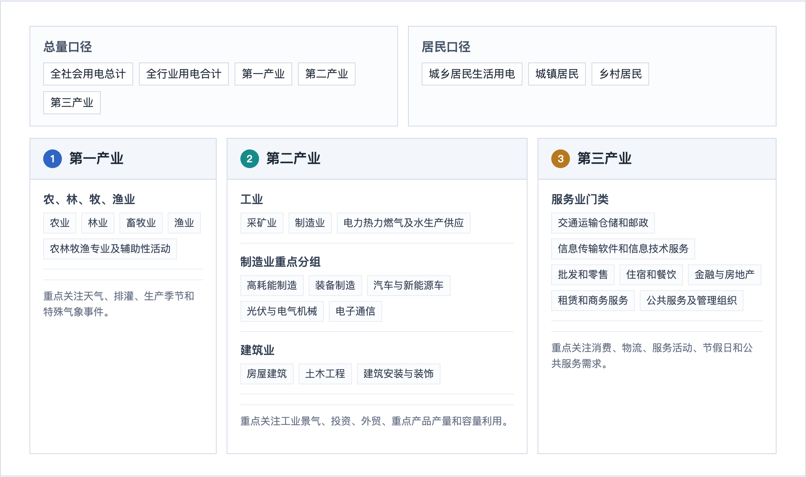
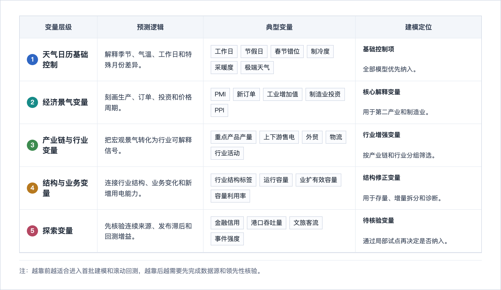
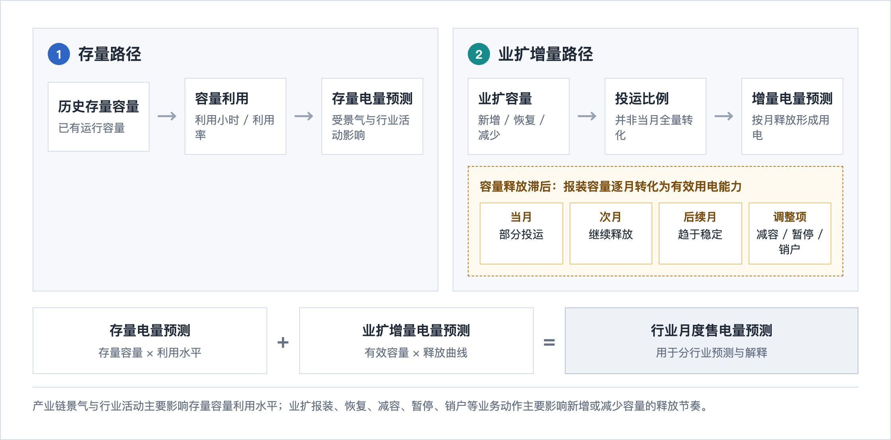

# 江苏省月度售电量分产业、分行业预测新增思路咨询报告

## 第一章 项目情况与行业口径

### 1.1 项目任务

江苏省月度售电量预测需要同时服务总量判断、第一产业、第二产业、第三产业以及分行业研判。现有预测工作已经具备历史售电量、户数、运行容量、净增容量、分布式光伏电量、充电设施电量、重点用户合计电量等基础材料。新增思路的价值在于：在既有时间序列特征之外，补充更有解释力的外生变量，配置更适合分行业场景的方法，并建立能支持结果解释、模型选择和模型治理的指标体系。

报告围绕三个方向展开：

1. 外生变量：除常规历史售电量、月份和宏观经济指标外，补充天气日历、经济景气、产业链、行业结构、业扩容量和容量利用等变量。
2. 预测方法：形成“稳健基线、低成本增强、前沿对照、层级一致性治理”的方法组合。
3. 评估指标：从单一百分比误差扩展到加权误差、跨行业可比误差、分组诊断、层级一致性和区间预测评价。

### 1.2 行业口径

项目基础数据按总量、第一产业、第二产业、第三产业、城乡居民、行业大类和细分行业组织。售电量、户数、运行容量等表在纵向分类上具有一致性，可作为后续变量映射、模型分组和误差诊断的共同口径\[[15](#ref-15)\]。

行业层级较多，逐一为每个细分行业建立独立外生变量体系会带来明显的工程成本和样本不足问题。按照产业链和用电机理映射变量更符合经济活动传导关系：上游产量、价格、库存、投资和订单会影响中游制造开工；下游消费、出口和物流会影响生产节奏；天气、节假日和服务活动会影响居民和第三产业负荷。产业链映射把行业之间的先验关联纳入建模过程，有助于提升解释性，也便于后续通过时差相关、消融实验和分组回测验证有效性\[[3](#ref-3)\] \[[4](#ref-4)\] \[[7](#ref-7)\]。

### 1.3 行业映射层次

变量映射建议按三个层次组织。

第一层是产业层。第一产业可重点关注天气、排灌、农林牧渔生产季节和特殊气象事件；第二产业可重点关注工业景气、制造业投资、外贸、重点产品产量和容量利用；第三产业可重点关注消费、物流、服务业活动、节假日、天气和公共服务需求。

第二层是行业大类。工业、建筑业、交通运输仓储和邮政业、信息传输软件和信息技术服务业、批发零售业、住宿餐饮业、房地产业、公共服务及管理组织等行业大类的用电机理不同。工业与第二产业虽不属于同一层级，但其机理决定了二者可共享部分经济景气和产业链变量。

第三层是重点细分行业。钢铁、水泥、化工、汽车、新能源车、光伏设备、电子通信、电气机械、数据中心、充换电服务等细分行业，应结合产业链位置、容量扩张、产品产量、外贸订单和新型负荷特征单独配置变量。对低电量、短样本或波动较强的细分行业，可先归入相似行业组，再在回测中判断是否需要独立建模。

### 1.4 分类口径示意

受限于篇幅，图 1-1 保留建模和结果解释最需要的层级，并未将全部细分行业展开。完整细分口径以“项目基础数据表”为准\[[15](#ref-15)\]。

  
  
图 1-1 江苏月度售电量预测分类口径示意

## 第二章 新外生变量

### 2.1 本章总述

除历史售电量、月份、工业增加值等常规变量外，江苏月度售电量预测可以形成五类外生变量组合：天气与日历变量、经济景气变量、产业链与行业活动变量、结构与业务变量、有待探索的补充变量。前四类适合进入近期建模试验；金融信用、港口吞吐量、文旅客流等变量具备解释潜力，但需要先核验连续月度来源、发布滞后和行业映射关系。

如图 2-1 所示，外生变量不是简单罗列，而是按照可落地程度和预测逻辑分层组织：基础控制项优先保证可比性，经济、行业和业务变量逐层增强解释力，探索变量先保留核验入口。

  
  
图 2-1 新增外生变量分层框架

### 2.2 变量优先级口径

为避免“新变量”清单过长，建议按可得性、解释链条、预测时点可用性和回测增益划分优先级。

| 优先级 | 判定条件 | 建议处理方式 | 典型变量 |
| --- | --- | --- | --- |
| P0 | 数据可稳定获得，预测时点可用，解释链条清楚，适配多个产业或重点行业 | 进入第一批建模和滚动回测 | 工作日数、春节错位、制冷度、采暖度、PMI、工业增加值、行业结构标签、运行容量、净增容量 |
| P1 | 解释链条清楚，但数据整理、行业映射或领先期仍需验证 | 进入候选特征表，并做消融实验 | 外贸出口、重点产品产量、制造业投资、分布式光伏、充电设施电量、有效容量 |
| P2 | 理论上可能有效，但连续月度来源、发布滞后或行业映射尚不稳定 | 保留为后续试验变量 | 金融信用、港口吞吐量、文旅客流、人口流动、政策事件强度 |
| P3 | 当前证据不足或难以在预测时点获得 | 暂不进入正文主线 | 非结构化长文本事件、难以稳定获取的第三方商业数据 |

### 2.3 天气与日历变量

天气与日历变量是月度售电量预测的基础控制项。月天数、工作日数、周末数、节假日安排、春节前后影响天数能够解释同等经济活动水平下不同月份的售电量差异。温度变量应从简单均温扩展为制冷度（Cooling Degree Days, CDD；月度口径可聚合为 Cooling Degree Month, CDM）、采暖度（Heating Degree Days, HDD；月度口径可聚合为 Heating Degree Month, HDM）、极端高温天数、极端低温天数和高温高湿天数。苏州月度电力需求研究表明，制冷度、采暖度、春节前后移动假日变量和自回归误差修正（Autoregressive error correction, AR error correction）能够改善月度预测并增强异常月份解释\[[1](#ref-1)\]；春节修正文献也说明，1-3 月预测需要单独处理春节跨月错位和占季比变化\[[2](#ref-2)\]。

这类变量适用于全部产业和行业。居民、批发零售、住宿餐饮、公共服务、商业楼宇、数据中心和部分温控制造业对天气更敏感；第二产业、制造业、建筑链、物流和消费服务行业对春节停复工节奏更敏感。建模时可采用月份固定效应、周期编码、工作日计数、节前节后影响天数、CDD/HDD 月度聚合、极端天气天数，以及天气变量与行业标签的交互项。

### 2.4 经济景气变量

经济景气变量用于刻画生产、订单、投资和服务活动强弱。第二产业和制造业优先关注采购经理指数（Purchasing Managers' Index, PMI）、生产指数、新订单指数、工业增加值、制造业投资、重点行业增加值、工业品出厂价格指数（Producer Price Index, PPI）。这些指标与生产开工、订单变化和库存调整直接相关，因此更适合解释制造业及第二产业售电量变化\[[8](#ref-8)\]。PMI 和新订单具有较强的先行属性；工业增加值和服务业增加值多偏同步；投资指标反映中长期扩产预期，但需要区分投资计划、项目开工、融资等前瞻信号与投资完成额等同步统计，并通过 0-2 个月滞后项、同比、环比和滚动回测确认实际使用方式。

第三产业变量应从服务活动角度选择。批发零售、住宿餐饮、交通运输、信息服务、公共服务等行业可分别关注消费、物流、服务业景气、公共活动和天气日历。使用经济变量时，需要明确预测时点能否获得该指标。若某项指标发布滞后明显，可作为滞后解释变量或预测后解释变量，不宜直接作为实时预测输入。

### 2.5 产业链与行业活动变量

产业链变量把宏观景气转化为行业可解释信号。对制造业，可围绕钢铁、水泥、玻璃、化工、汽车、新能源车、光伏设备、电气机械、电子通信等链条构造重点产品产量、库存、价格、开工率、行业投资、上下游行业售电和外贸出口指标。产业链售电量研究使用投入产出关系识别上下游行业，并通过时差相关筛选领先、同步或滞后变量，这一思路适合迁移到江苏重点行业变量筛选\[[4](#ref-4)\]。

服务业变量需要按业务活动划分。交通运输仓储和邮政业可关注货运量、港口吞吐量、快递业务量和外贸物流；批发零售和住宿餐饮可关注消费、客流、节假日和天气；信息传输软件和信息技术服务业可关注数据中心、互联网服务和数字经济活动。居民和新型负荷变量应区分两类影响：一类是真实用能需求变化，如高温、低温、节假日和充电设施用电；另一类是售电统计口径变化，如分布式光伏自发自用减少从电网购买的电量。充电设施电量和充换电服务业更适合作为交通电气化相关的结构变量，分布式光伏自发自用更适合作为售电口径修正变量。

产业链变量入模前应完成领先性诊断。可采用时差相关、Pearson 相关系数、K-L 信息量等方法筛选变量，并通过滚动回测验证预测贡献。若某变量只能事后解释变化，应将其标注为解释变量。

### 2.6 结构与业务变量

结构与业务变量是本项目区别于通用时间序列预测的重要部分。江苏阜宁分行业月度电量研究先分析行业结构、主导行业和不同用户类型，再分别为工业、商业、居民配置模型，说明行业结构本身就是预测信息\[[5](#ref-5)\]。因此，建模前应先识别主导行业、增长行业、周期稳定行业、天气敏感行业和春节敏感行业。主导行业影响总体误差，增长行业影响结构变化，低电量行业影响分组诊断。

业扩报装变量应从事件标签升级为结构化业务变量。业扩容量曲线研究将存量电量和每次业扩产生的电量分离，用 Logistic 生长曲线拟合容量释放过程，提取稳定利用小时、稳定时间和逐月投运比例，再将报装容量转换为按月释放的有效容量\[[6](#ref-6)\]。因此，新增容量、减容、暂停、恢复、销户、有效容量、容量释放滞后和投运比例均可作为制造业、园区、大工业和重点用户行业的业务领先变量。

容量利用小时和容量利用率可连接产业活动、经济景气和售电量。容量利用特征研究将运行容量拆分为存量容量和业扩容量，用产业链主导因素预测存量容量利用小时，再叠加业扩增量电量\[[7](#ref-7)\]。这一框架适合用于重点制造业：产业链指标解释容量利用变化，业扩变量解释新增用电能力何时释放，售电量由存量利用与增量释放共同形成。

### 2.7 有待探索的补充变量

金融信用、港口吞吐量、文旅客流、人口流动、重大活动和政策事件具备一定解释潜力。企业中长期贷款、制造业贷款、社会融资规模等指标可能领先投资和产能扩张；港口货物吞吐量、集装箱吞吐量和客货运量可反映外贸物流和交通运输活动；文旅客流和酒店入住率更适合住宿餐饮、交通运输、居民和公共服务行业。上述变量目前需要进一步核验连续月度来源、发布滞后、行业映射和回测增益，建议作为后续试验项。

## 第三章 新预测方法

### 3.1 本章总述

江苏月度售电量分产业、分行业预测具有月度样本短、行业序列多、外生变量多、解释要求高等特点。方法路线宜分为四层：稳健主线、低成本增强、前沿对照、层级一致性治理。稳健主线提供可复核的比较标尺；低成本增强负责吸收行业差异和业务结构变量；前沿模型用于 benchmark；层级一致性治理保证总量、产业和行业预测结果在汇总口径上协调。

### 3.2 稳健主线

稳健主线包括季节 naive、指数平滑模型（Exponential Smoothing, ETS）、自回归积分滑动平均模型（Autoregressive Integrated Moving Average, ARIMA）、季节自回归积分滑动平均模型（Seasonal ARIMA, SARIMA）、带外生变量的季节自回归积分滑动平均模型（Seasonal ARIMA with exogenous variables, SARIMAX）、动态回归和可解释回归。

季节 naive 使用去年同月或相邻季节作为预测值，用于建立最低比较线。ETS 通过趋势、季节和误差项分解捕捉平滑变化，适合季节性清晰、外生变量不足的行业。ARIMA/SARIMA 通过自回归、差分和移动平均处理序列惯性与季节性。SARIMAX 和动态回归进一步纳入天气、日历、经济景气等外生变量，用于判断新增变量是否真正带来预测增益。可解释回归可直接呈现变量方向和贡献，并可配合 AR 误差修正处理残差自相关\[[1](#ref-1)\] \[[9](#ref-9)\]。

稳健主线还应包含季节分解和特殊月份修正。X-12-ARIMA 可将月度序列拆分为趋势项、季节项和不规则项；春节占季比修正、节前节后影响天数、年度或季度总量约束可用于处理 1-3 月和异常月份\[[2](#ref-2)\]。

### 3.3 低成本增强

低成本增强包括三类方法。

第一类是树模型和特征治理。随机森林（Random Forest）通过多棵决策树平均降低单树波动；XGBoost、LightGBM 和 CatBoost 属于梯度提升树方法，通过逐步拟合残差处理非线性关系和变量交互。树模型适合处理滞后特征、行业编码、天气日历、经济景气和产业链变量之间的非线性关系。使用这类模型时，应配套 SHAP（SHapley Additive exPlanations）解释、留一特征法（Leave One Feature Out, LOFO）或类似消融实验，避免变量堆叠造成解释成本上升\[[10](#ref-10)\]。

第二类是行业聚类、分组模型和全局模型。细分行业月度电量研究先识别行业周期性和行业相似度，再按行业组配置模型\[[3](#ref-3)\]。阜宁案例也显示，工业、商业、居民等对象的变量和模型选择存在明显差异\[[5](#ref-5)\]。因此，可先按行业占比、趋势、季节性、天气敏感性、春节敏感性和业务属性建立行业标签，再选择行业专属模型、分组模型或全局模型。全局模型可将多个行业序列合并训练，通过行业编码共享信息，缓解单行业样本不足。

第三类是结构化业务模型。业扩容量释放曲线可用于预测新增容量从报装到实际用电的转化过程\[[6](#ref-6)\]；容量利用模型可先预测存量容量利用小时，再叠加业扩增量电量\[[7](#ref-7)\]。这一方法特别适用于制造业、园区、大工业、重点用户和新增项目集中的行业。它的优势在于解释力：模型可以拆分出存量贡献、增量贡献、容量释放滞后和产业链主导因素。

图 3-1 将这一结构化业务模型拆成两条路径：一条解释已有容量如何形成存量电量，另一条解释业扩容量如何经过投运和滞后释放形成增量电量。

  
  
图 3-1 业扩容量释放与存量/增量拆分示意图（证据指向：EV2-026、EV2-027；对应参考 <a href="#ref-6">[6]</a>、<a href="#ref-7">[7]</a>）

这一路径的实施重点不是把业扩容量简单作为当月解释变量，而是先形成有效容量和释放曲线，再与存量容量利用预测合成行业月度售电量。

### 3.4 前沿对照

前沿模型可以作为创新对照，不宜在第一阶段直接替代本地强基线。TimeGPT 属于面向时间序列的预训练模型，适合测试小样本或零样本预测能力；Chronos 将时间序列数值离散化为 token，并使用语言模型结构进行预测；TimesFM 采用面向时间序列 patch 的解码式 Transformer；Moirai 属于通用时序基础模型，强调跨数据集泛化能力。现有公开研究更多集中在通用时序或短期负荷场景，与省级月度分行业售电量在样本长度、变量支持和解释要求上存在差异\[[14](#ref-14)\]。

建议采用 benchmark 化验证：选取总量、第二产业、第三产业和若干重点行业，将 TimeGPT、Chronos、TimesFM、Moirai 与季节 naive、SARIMAX、可解释回归、LightGBM、行业分组模型放在同一滚动回测框架中比较。只有在同一口径下稳定超过本地强基线，并能满足解释和交付要求，前沿模型才适合进入增强路线。

### 3.5 层级一致性治理

分产业、分行业预测需要保证省级总量、第一产业、第二产业、第三产业和行业大类之间的加总关系。自下而上（bottom-up）方法先预测细分行业再汇总；自上而下（top-down）方法先预测总量再按权重分配；中间层汇总（middle-out）从产业或行业大类开始向上、向下分解；预测协调（forecast reconciliation）在多层级预测之间调整结果，使各层级保持一致\[[11](#ref-11)\]。MinT（Minimum Trace reconciliation）进一步利用预测误差协方差信息生成一致预测，但月度小样本下误差协方差估计需要谨慎\[[12](#ref-12)\]。

近期可先建立层级一致性检查：分别输出 bottom-up、top-down、middle-out 结果，计算总量预测与分项加总之间的差额，定位导致不一致的行业和月份。后续再尝试简化 reconciliation 或 MinT。

## 第四章 新评估指标

### 4.1 本章总述

分产业、分行业预测同时涉及行业规模差异、低电量行业、春节和极端天气异常月、层级加总一致性、业务结构变量解释和区间风险表达。单一平均百分比误差难以覆盖这些需求。指标体系宜分为四层：主评估指标、选模指标、治理诊断指标、风险表达指标。

### 4.2 MAPE 指标不唯一的原因

平均绝对百分比误差（Mean Absolute Percentage Error, MAPE）直观、常见，适合保留为辅助口径。但 MAPE 在本项目中存在三类限制：低电量行业或接近零的月份会导致百分比误差异常放大；普通平均方式无法体现售电量规模权重；该指标不能识别系统性高估、系统性低估、层级不一致和异常月份失效。预测评价方法研究已经指出 MAPE 等常见指标存在局限，并提出缩放误差用于跨序列比较\[[9](#ref-9)\]。

### 4.3 主评估指标

主评估指标建议采用加权绝对百分比误差（Weighted Absolute Percentage Error, WAPE）或按售电量权重汇总的加权 MAPE。WAPE 的解释方式可以写成“每 100 度售电量平均误差约多少度”，适合总量、第一产业、第二产业、第三产业和行业组合评估\[[13](#ref-13)\]。WAPE 会偏重大行业，因此还需配合分行业误差和低电量行业诊断。

### 4.4 选模指标

模型选择建议同时使用平均绝对误差（Mean Absolute Error, MAE）、均方根误差（Root Mean Squared Error, RMSE）、平均绝对缩放误差（Mean Absolute Scaled Error, MASE）和均方根缩放误差（Root Mean Squared Scaled Error, RMSSE）。MAE 用于解释平均误差规模；RMSE 对大误差更敏感，适合识别极端月份；MASE/RMSSE 可将模型误差与季节 naive 等简单基线比较，适合跨行业序列评价\[[9](#ref-9)\]。

### 4.5 治理诊断指标

治理诊断指标用于定位模型失效原因。系统偏差（Bias）或归一化平均偏差（Normalized Mean Bias Error, NMBE）用于识别长期高估或低估；分组误差用于比较第一产业、第二产业、第三产业、行业大类、重点细分行业、春节月、高温月、低温月和异常事件月表现；层级一致性误差用于衡量省级预测与产业、行业加总之间的差额；同比和环比方向命中率用于评价趋势判断能力。

业务结构变量还需要专门诊断。业扩容量模型可比较原始净增容量与有效容量、滞后释放容量的修正前后误差；容量利用模型可计算容量-电量相关系数、Pearson 相关系数、K-L 信息量和存量/增量贡献拆分\[[6](#ref-6)\] \[[7](#ref-7)\]。这些指标适合变量筛选和模型解释，不适合作为主评估指标。

### 4.6 风险表达指标

若后续输出预测区间，应引入分位数损失（Pinball Loss）、加权分位数损失（Weighted Quantile Loss, WQL）、区间覆盖率、区间宽度和连续排序概率评分（Continuous Ranked Probability Score, CRPS）。Pinball Loss/WQL 评价分位数预测上下沿是否合理；区间覆盖率检查真实值落入预测区间的比例；区间宽度防止区间过宽；CRPS 可评价完整预测分布\[[13](#ref-13)\] \[[16](#ref-16)\]。

区间预测建议先在总量、第二产业、第三产业和重点行业试点，逐步扩展到更多行业。低电量行业、强结构变化行业和样本短行业需要先解决校准问题。

## 第五章 综合建议与落地路线

### 5.1 短期路线：先建立可解释、可回测的基准体系

短期工作应集中在三件事。第一，建立滚动回测框架，统一 WAPE、MAE、RMSE、MASE/RMSSE、分组误差和层级一致性指标。第二，构造天气日历、春节错位、PMI、工业增加值、行业结构标签、运行容量和净增容量等 P0/P1 变量。第三，建立季节 naive、ETS、SARIMAX、可解释回归和 LightGBM 等强基线，所有新增变量和新方法均与强基线对照。

### 5.2 中期路线：强化行业分组和结构化业务建模

中期工作可围绕行业差异展开。先按行业结构、占比、周期性、天气敏感性、春节敏感性和产业链属性建立行业标签，再选择行业专属模型、分组模型或全局模型。制造业、园区、大工业和重点用户行业可优先试验“存量电量 + 业扩增量”“存量容量利用小时 + 新增容量释放”框架，用修正前后对照验证业务变量是否带来稳定增益。

### 5.3 长期路线：前沿模型和概率预测作为创新储备

前沿模型、深度时序模型、多模态模型和区间预测适合在强基线之后推进。TimeGPT、Chronos、TimesFM、Moirai 等可作为 benchmark；分位数回归、Conformal prediction 和 CRPS 等概率预测方法可先在总量和重点行业试点。前沿探索的采用条件应明确：同一滚动回测口径下优于本地强基线，能够解释主要变量贡献，工程成本可控，且输出满足分层解释和业务复盘需要。

## 附录 A：外生变量建议清单

| 变量类别 | 代表变量 | 适配对象 | 入模方式 | 优先级 | 参考依据 |
| --- | --- | --- | --- | --- | --- |
| 天气日历 | 工作日数、春节前后影响天数、CDD/CDM、HDD/HDM、极端天气天数 | 全部行业；居民、第三产业、公共服务更敏感 | 月度聚合、节前节后计数、行业交互、异常月修正 | P0 | \[[1](#ref-1)\] \[[2](#ref-2)\] |
| 经济景气 | PMI、新订单、生产指数、工业增加值、制造业投资 | 第二产业、制造业、第三产业 | 同比、环比、滞后项、扩张收缩状态 | P0/P1 | \[[8](#ref-8)\] |
| 产业链活动 | 上下游行业售电、重点产品产量、库存、价格、外贸出口 | 钢铁、化工、汽车、光伏、电子、电气机械、批发零售、交通运输 | 产业链映射、时差相关、行业专属变量池 | P1 | \[[4](#ref-4)\] |
| 行业结构 | 主导行业标签、增长行业标签、行业相似度、行业聚类 | 全行业和重点细分行业 | 行业编码、分组建模、全局模型标签 | P0 | \[[3](#ref-3)\] \[[5](#ref-5)\] |
| 业务结构 | 户数、运行容量、净增容量、业扩报装、有效容量、容量利用小时 | 制造业、园区、大工业、重点用户 | 存量/增量拆分、容量释放滞后、有效容量 | P0/P1 | \[[6](#ref-6)\] \[[7](#ref-7)\] |
| 新型负荷 | 分布式光伏、充电设施电量、充换电服务业 | 居民、商业、交通、新型负荷相关行业 | 占比、趋势项、售电口径修正 | P1 | \[[15](#ref-15)\] |
| 补充变量 | 金融信用、港口吞吐量、文旅客流、重大事件 | 投资链、物流链、住宿餐饮、公共服务 | 数据源核验后再做滞后项和消融 | P2 | \[[17](#ref-17)\] |

## 附录 B：预测方法建议清单

| 方法层级 | 方法 | 作用 | 建议定位 | 参考依据 |
| --- | --- | --- | --- | --- |
| 稳健基线 | 季节 naive、ETS、ARIMA/SARIMA、SARIMAX、动态回归、可解释回归 | 建立比较标尺，解释天气日历和经济变量贡献 | 必做 | \[[1](#ref-1)\] \[[9](#ref-9)\] |
| 低成本增强 | Random Forest、XGBoost、LightGBM、CatBoost、SHAP、LOFO | 处理非线性、滞后特征、行业编码和变量交互 | 主模型候选 | \[[10](#ref-10)\] |
| 行业分组 | 行业聚类、分组回归、分组 Prophet、全局模型 | 缓解单行业样本短，按行业特性共享信息 | 增强路线 | \[[3](#ref-3)\] \[[5](#ref-5)\] |
| 结构化业务模型 | 容量释放曲线、存量电量 + 业扩增量、容量利用小时预测 | 解释新增容量释放和存量容量利用变化 | 重点增强 | \[[6](#ref-6)\] \[[7](#ref-7)\] |
| 层级协调 | bottom-up、top-down、middle-out、forecast reconciliation、MinT | 保持总量、产业、行业预测一致 | 治理机制 | \[[11](#ref-11)\] \[[12](#ref-12)\] |
| 前沿对照 | TimeGPT、Chronos、TimesFM、Moirai | 测试预训练时序模型在月度行业售电量上的迁移效果 | benchmark | \[[14](#ref-14)\] |
| 风险表达 | 分位数回归、Conformal prediction、CRPS | 输出预测区间并评价不确定性 | 局部试点 | \[[13](#ref-13)\] \[[16](#ref-16)\] |

## 附录 C：评估指标建议清单

| 指标层级 | 指标 | 适用对象 | 解释口径 | 建议定位 | 参考依据 |
| --- | --- | --- | --- | --- | --- |
| 主评估 | WAPE / 加权 MAPE | 总量、产业、行业组合 | 每 100 度售电量平均误差约多少度 | 主指标 | \[[13](#ref-13)\] |
| 辅助评估 | MAPE / sMAPE | 总量、产业、重点行业 | 平均百分比误差，低电量行业需保护 | 辅助指标 | \[[9](#ref-9)\] |
| 选模 | MAE、RMSE | 单行业、总量、重点行业 | 平均误差规模和大误差惩罚 | 选模指标 | \[[9](#ref-9)\] |
| 跨行业比较 | MASE、RMSSE | 不同规模行业序列 | 小于 1 表示优于季节 naive 基线 | 诊断指标 | \[[9](#ref-9)\] |
| 治理诊断 | Bias/NMBE、分组误差、方向命中率 | 产业、行业、异常月份 | 定位系统偏差和局部失效 | 诊断指标 | \[[1](#ref-1)\] \[[2](#ref-2)\] |
| 层级一致性 | 加总误差、reconciliation gap | 总量、产业、行业层级 | 分行业加总是否与总量口径一致 | 诊断指标 | \[[11](#ref-11)\] \[[12](#ref-12)\] |
| 结构变量诊断 | 修正前后对照、容量-电量相关系数、K-L 信息量、存量/增量贡献拆分 | 业扩容量、容量利用、产业链变量 | 判断业务变量是否改进解释和预测 | 变量筛选指标 | \[[6](#ref-6)\] \[[7](#ref-7)\] |
| 风险表达 | Pinball Loss、区间覆盖率、区间宽度、CRPS | 区间预测、分位数预测 | 区间是否覆盖真实值且不过宽 | 探索指标 | \[[13](#ref-13)\] \[[16](#ref-16)\] |

## 参考依据

[1] 苏振宇、林军，2023，《考虑气象因素的月度电力需求预测方法》。

[2] 刘建等，2019，《考虑春节影响的售电量预测结果修正方法》。

[3] 张岚等，2023，《考虑细分行业及多影响因素的月度电量预测》。

[4] 吕龙彪等，2023，《基于产业链分析的批发零售业同期售电量预测研究》。

[5] 程熙，2018，《基于行业特性的阜宁地区月度电量预测研究》。

[6] 汪鸿等，2016，《基于修正业扩容量曲线的月度电量预测方法》。

[7] 董朝武等，2018，《基于容量利用特征的行业售电量预测方法研究》。

[8] 江苏省统计局、江苏省政府经济运行简况、国家统计局 PMI 发布资料。

[9] Hyndman & Koehler, 2006, `Another look at measures of forecast accuracy`。

[10] `Feature engineering and selection for prosumer electricity consumption and production forecasting`。

[11] Hyndman et al., 2011, `Optimal combination forecasts for hierarchical time series`。

[12] Wickramasuriya et al., 2019, `Optimal Forecast Reconciliation for Hierarchical and Grouped Time Series Through Trace Minimization`。

[13] AWS Forecast, `Evaluating Predictor Accuracy`；Gneiting & Raftery, 2007, `Strictly Proper Scoring Rules, Prediction, and Estimation`。

[14] `TimeGPT-1`、`Chronos`、`TimesFM`、`Moirai` 原始论文及电力负荷 benchmark 资料。

[15] `data/项目基础数据-0509_结构说明.md`。

[16] 庞传军等，2021，《基于结构化负荷模型的电力负荷概率区间预测》；贾巍等，2026，《融合异常检测与分位数回归的短期电力负荷区间预测》。

[17] 南京海关、商务部转载外贸数据、人民银行江苏省分行金融统计线索、江苏港口/海事吞吐量线索。
